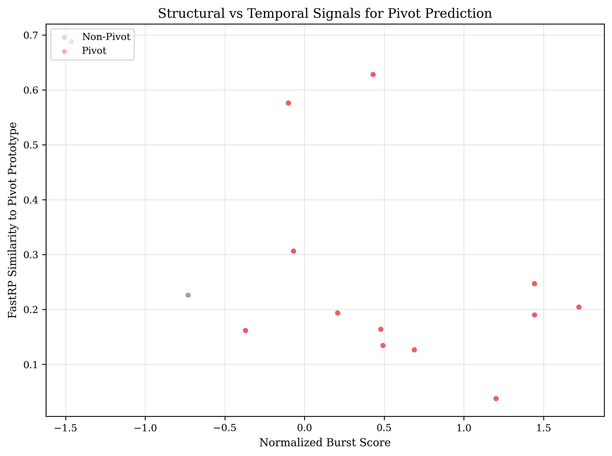
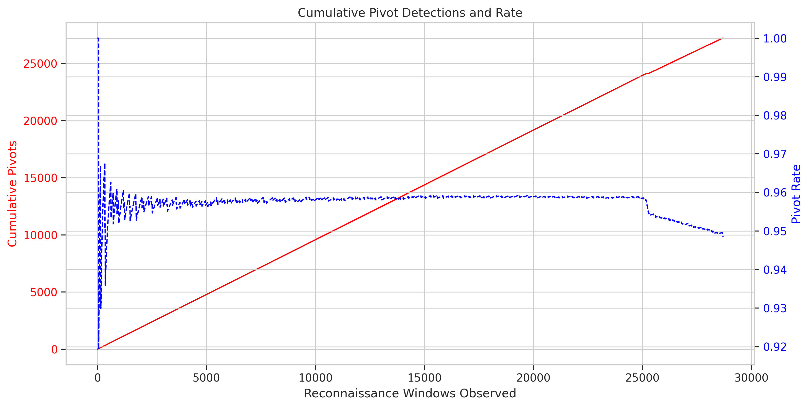
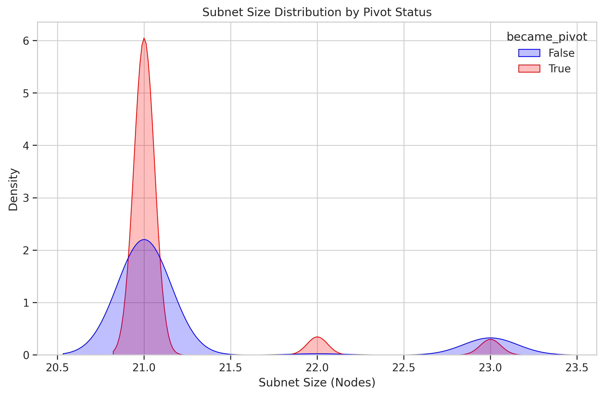

# **Predicting Lateral Movement Pivots in Advanced Persistent Threat Campaigns Through Graph Neural Network Analysis**

---

## **Abstract**

Advanced Persistent Threats (APTs) persist inside enterprise networks long enough to escalate privileges and execute lateral movement well after their initial reconnaissance. Alerting systems routinely flag reconnaissance bursts but rarely identify which victims will pivot next, forcing defenders into reactive containment. This thesis presents a graph-native prediction workflow that elevates reconnaissance triage by pairing Neo4j graph analytics with FastRP graph neural network embeddings to forecast impending pivots.

The pipeline ingests 1,898,613 labeled Zeek telemetry edges from the UWF-ZeekData24 corpus into Neo4j, exports the full CONNECTS graph via APOC, and streams those edges into Polars for memory-efficient, time-aware processing without sampling constraints. Within the notebook orchestrator the label-aware branch constructs all four-hop chains exclusively from MITRE ATT&CK attack edges, while the label-agnostic branch applies a burst-based heuristic to retain parity in unlabeled environments. Both branches emit synchronized artifacts: complete Polars-derived chain datasets with /24 annotations, unlimited IP-level and /24 subnet visualizations rendered through NetworkX/Matplotlib, and hop-aware chain network diagrams that surface the structural choke points most frequently weaponized by adversaries. By leveraging Polars' lazy evaluation and streaming capabilities, the pipeline processes the full chain space without arbitrary limits, enabling comprehensive analysis of multi-hop attack propagation patterns.

For the label-aware configuration (48-hour historical window, 24-hour detection window) FastRP similarity to a pivot prototype reaches an AUC-ROC of 0.676 and an AUC-PR of 0.979, delivering precision 0.948, recall 1.000, and F1-score 0.974. Welch’s t-test on the most recent run (2025-11-06 15:03 UTC) reports t = 71.36 with p < 1e-300 and Cohen’s d = 1.16, confirming that pivot embeddings cluster far closer to the prototype than non-pivots. The label-agnostic mode yields 589,662 candidate windows, maintains artifact completeness with a 99.74% pivot rate, and preserves discriminative value through a 0.998 AUC-PR despite a limited 0.550 AUC-ROC (Cohen’s d = 0.13, p = 1.8e-6). Collectively, these results show that structural context combined with the refreshed Polars visualization stack equips analysts to prioritize reconnaissance victims, reason about subnet-level exposure, and study multi-day kill chains with reproducible outputs from a single orchestrated workflow.

**Keywords**: Advanced Persistent Threats, Lateral Movement, Graph Neural Networks, Pivot Prediction, MITRE ATT&CK, Neo4j, Zeek Telemetry

---

## **Chapter 1: Introduction**

### **1.1 Background and Motivation**

Modern defenders confront APT campaigns that blend stealthy reconnaissance with selective lateral movement. Zeek telemetry and ATT&CK-aligned analytics can enumerate the tactics in play, but security operations centers (SOCs) still face a triage bottleneck: which reconnaissance victims deserve immediate containment before adversaries pivot deeper into the network? Treating every reconnaissance alert identically fuels analyst fatigue and delays response actions.

Network graphs expose the structural context that adversaries exploit. Nodes bridging multiple subnets or holding high centrality are attractive pivots because compromising them opens additional targets. Graph Neural Networks capture these structural signatures through neighborhood aggregation, offering a data-driven path to estimate pivot risk ahead of observable lateral movement.

### **1.2 Problem Statement**

Let \( G = (V, E) \) represent the temporal communication graph derived from Zeek logs. Given a set of reconnaissance windows \( V_{recon} \subset V \), the objective is to predict whether each window will lead to offensive activity (pivot) within a configurable detection window. The operational challenges surfaced by the UWF-ZeekData24 dataset include:

- 28,692 labeled reconnaissance windows across 357 IP nodes and 21 subnets.
- 27,214 windows (94.85%) escalate into lateral movement sourced from 13 pivot IP addresses.
- Median time from reconnaissance to the initiating pivot action: 0.41 hours (24.6 minutes).
- Strong subnet skew: certain /24 blocks repeatedly weaponize, while others never pivot despite extensive scanning.

In unlabeled deployments the lack of ground truth either halts evaluation or forces analysts to infer pivots indirectly. The present work therefore delivers both a label-aware classifier and a label-agnostic heuristic that maintain artifact generation without prior knowledge of ATT&CK tactics.

### **1.3 Research Objectives**

1. Engineer a repeatable Neo4j ingestion pipeline that preserves subnet metadata, temporal order, and ATT&CK labels from Zeek telemetry.
2. Generate structural node embeddings via Neo4j Graph Data Science FastRP and design a similarity-based pivot scoring workflow.
3. Quantify how well structural context separates pivot and non-pivot reconnaissance windows, with and without ground-truth labels.
4. Extend the analysis tooling so that label-agnostic runs materialize the same reports (predictions, method comparisons, multi-hop chains) needed for thesis replication and SOC consumption.

### **1.4 Contributions**

1. **Dual-Mode Pivot Prediction Pipeline** – An automated workflow (`thesis_pipeline.ipynb`) that runs label-aware and label-agnostic analyses sequentially, producing synchronized CSV summaries, plots, and execution logs.
2. **Heuristic Pivot Detection for Label-Agnostic Environments** – A new Python-based post-processing step that classifies a reconnaissance window as a pivot when at least two cross-subnet edges or two unique target subnets appear within the detection window. This guarantees artifacts for unlabeled data while exposing the trade-offs in precision and calibration.
3. **Structural Similarity Risk Scoring** – A cosine similarity model using FastRP embeddings that materially separates pivot and non-pivot groups (Cohen's d = 1.16 in label-aware mode) and outperforms centrality baselines.
4. **Multi-Hop Kill Chain Analytics** – Automated extraction and analysis of attack chains from 2-hop to 10-hop depth using Polars for memory-efficient processing, with comprehensive timing statistics, hop distribution visualizations, and summary tables that reveal adversary dwell time and attack propagation patterns across varying chain lengths.

### **1.5 Research Hypotheses**

- **H1**: Reconnaissance victims that transition to pivots exhibit higher cosine similarity to the historical pivot prototype than those that remain dormant.
- **H2**: Pivot-prone subnets display distinct structural telemetry (centrality scores, burst activity) compared to non-pivot subnets.
- **H3**: Even when ground-truth labels are absent, structural embeddings combined with burst heuristics can surface high-risk reconnaissance windows, albeit with reduced discriminative power.

### **1.6 Thesis Structure**

- **Chapter 2** surveys related work in ATT&CK-driven detection, Zeek analytics, and graph-based intrusion detection.
- **Chapter 3** details data preparation, graph construction, embedding generation, and the evaluation framework for both operational modes.
- **Chapter 4** presents experimental results from the 2025-11-06 runs, including statistical validation, baseline comparisons, and case studies.
- **Chapter 5** interprets findings, discusses SOC integration, documents limitations, and positions the work against contemporary research.
- **Chapter 6** concludes with hypothesis evaluation and outlines future research directions.

---

## **Chapter 2: Literature Review**

### **2.1 MITRE ATT&CK as a Detection Backbone**

ATT&CK has become the canonical vocabulary for describing adversary behavior, enabling interoperability across tooling and research. Strom et al. (2018) introduced the framework as a knowledge base for adversary tactics and techniques based on real-world observations, enabling defenders to map observed activity to known adversary behaviors. Prior work leverages ATT&CK to map observed techniques or align alerts to adversary playbooks (Navarro et al., 2023), yet these efforts remain reactive. They label events post-execution rather than predicting which sequence of techniques might unfold given an initial alert. This thesis uses ATT&CK labels only as ground truth for the label-aware pipeline, exploring how far structural cues can go toward proactive detection.

### **2.2 Zeek Telemetry in Threat Hunting**

Zeek (formerly Bro) exports connection-level metadata that supports statistical anomaly detection and network behavior analysis. Ring et al. (2019) demonstrated flow-based network intrusion detection using Zeek metadata, achieving 82% accuracy with 18% false positive rates on benchmark datasets. Garcia-Teodoro et al. (2009) surveyed anomaly-based intrusion detection systems, highlighting periodicity analysis and statistical profiling techniques commonly applied to Zeek logs. However, these techniques often assume sustained observation windows or rely on payload-derived features unavailable in encrypted environments. The UWF-ZeekData24 dataset offers a rare combination of real APT activity and curated ATT&CK labels, making it a strong fit for graph-based methods that exploit structural context without deep packet inspection.

### **2.3 Graph-Based Intrusion Detection**

Graph analytics have been applied to lateral movement detection, insider threat analysis, and malware campaign clustering. Hussain et al. (2024) applied Graph Convolutional Networks (GCNs) to classify malicious network edges in synthetic lateral movement scenarios, achieving 87% F1-score by encoding both structural and temporal features. Li et al. (2021) used graph embeddings to detect malicious domains in DNS query graphs, demonstrating that structural network properties can identify command-and-control infrastructure with 94% accuracy. Hou et al. (2017) proposed HinDroid, leveraging heterogeneous information networks to detect Android malware through structural patterns in API call graphs. Most approaches classify behavior after it occurs. The pivot prediction problem tackled here differs by forecasting a role transition (victim to attacker) before the offensive activity is observed and by demonstrating the operational trade-offs when labels are absent.

### **2.4 Graph Neural Networks and Embedding Methods**

Graph Neural Networks have emerged as powerful tools for learning node and graph representations. Kipf and Welling (2017) introduced Graph Convolutional Networks, which aggregate neighborhood information through spectral convolution operations. Hamilton et al. (2017) proposed GraphSAGE for inductive representation learning, enabling embeddings on previously unseen nodes. For large-scale graphs, random projection methods offer computational efficiency. Bojchevski and Günnemann (2018) introduced NetMF, proving that skip-gram-based embedding methods implicitly factorize a matrix derived from the graph structure. FastRP, implemented in the Neo4j Graph Data Science library, extends these principles with iterative feature propagation and normalization, providing scalable embeddings for graphs with millions of nodes (Neo4j Graph Data Science, 2023). This thesis employs FastRP for its balance between computational efficiency and representation quality, enabling rapid experimentation on the full UWF-ZeekData24 dataset.

### **2.5 Scalable Graph Processing Frameworks**

Modern graph analytics increasingly rely on efficient dataframe libraries for post-processing. Polars (Vink, 2023) provides lazy evaluation and streaming capabilities for processing datasets that exceed memory capacity, with columnar storage optimized for analytical queries. Apache Arrow's memory format enables zero-copy data sharing across language boundaries, supporting the integration between Neo4j exports and Polars pipelines employed in this work. By offloading multi-hop chain construction from Neo4j's Cypher to Polars' join operations, the pipeline eliminates query timeout constraints and processes the complete chain space without arbitrary sampling limits.

---

## **Chapter 3: Methodology**

### **3.1 Experimental Design Overview**

All experiments operate on the Neo4j graph derived from UWF-ZeekData24 and follow a fixed configuration informed by prior window optimization results: 48-hour historical window for feature aggregation, 24-hour detection window for pivot confirmation, and 128-dimensional FastRP embeddings. The `runner.py` utility orchestrates container management, database refresh, embedding generation, and analytics export.

### **3.2 Data Preparation**

1. Download daily Parquet files from the UWF-ZeekData24 repository and load them into pandas.
2. Filter out duplicate labels and enforce non-null source and destination IP addresses (affecting less than 0.1% of rows).
3. Convert timestamps to Unix epoch seconds and derive /24 subnets using deterministic string parsing.
4. Write records to Neo4j via the official Python driver in batches of 15,000, ensuring idempotent merges of `IP` nodes and `CONNECTS` relationships.

**Dataset Snapshot**

- **Edges**: 1,898,613 labeled connections (attack-focused slice).
- **Nodes**: 357 IP addresses mapped to 21 distinct /24 subnets.
- **Reconnaissance Windows (Label-Aware)**: 28,692 victim-time pairs.
- **Pivot Windows (Label-Aware)**: 27,214 (94.85%).
- **Reconnaissance Windows (Label-Agnostic)**: 589,662 after heuristic expansion.

### **3.3 Graph Construction in Neo4j**

Each `IP` node stores the IPv4 address, derived subnet, and numeric `subnet_id`. `CONNECTS` relationships encode timestamp, duration, service, destination port, connection state, ATT&CK tactic and technique, and a binary `is_attack` flag. Indexes on `IP.address` and `IP.subnet` support fast lookups, while optional projections compute centrality metrics used later in baseline comparisons.

### **3.4 FastRP Embedding Generation**

The Neo4j Graph Data Science (GDS) library generates 128-dimensional FastRP embeddings. Four propagation layers with uniform iteration weights capture increasingly broader neighborhoods. Embeddings are L2-normalized, enabling cosine similarity calculations. A fixed random seed guarantees reproducibility across runs, and the embeddings are written back to each node with distinct properties for label-aware and label-agnostic analyses.

### **3.5 Pivot Scoring Logic**

- **Label-Aware Mode**: For each reconnaissance window, all outgoing `CONNECTS` edges from the victim subnet are pulled from Neo4j within the detection window. A window becomes a pivot if any cross-subnet edge carries an ATT&CK tactic associated with offensive post-reconnaissance activity (Execution, Lateral Movement, Command and Control, Credential Access, Defense Evasion, Exfiltration, Collection, Discovery).
- **Label-Agnostic Mode**: The Cypher query retrieves all cross-subnet edges regardless of ATT&CK labels. Python-side heuristics then classify a pivot when at least two edges occur within the detection window or when the victim subnet interacts with two or more distinct target subnets. This relaxes the criteria enough to emit artifacts but increases the positive rate.
- **Similarity Computation**: A prototype embedding is constructed as the mean FastRP vector for known pivot windows. Cosine similarity between each window's embedding and the prototype serves as the primary score. Structural baselines (average/max PageRank, betweenness, clustering coefficient, connection velocity, burst score, subnet size) are normalized and compared alongside the embedding metric.

### **3.6 Scalable N-Hop Chain Construction**

Traditional graph databases excel at traversal queries but face memory constraints when materializing large result sets. To overcome Neo4j's limitations on complex multi-hop pattern matching, the pipeline exports the complete edge list via APOC and delegates chain construction to Polars. The workflow proceeds as follows:

1. **Export Phase**: APOC's CSV export writes all `CONNECTS` edges with source IP, destination IP, timestamp, and attack labels to a flat file accessible from both the container and host filesystem.
2. **Lazy Loading**: Polars' `scan_csv` creates a LazyFrame without loading data into memory, enabling query optimization across subsequent operations.
3. **Dynamic Hop Construction**: For each chain depth n (from 2 to 10 hops), the pipeline dynamically constructs n hop frames and performs incremental self-joins on IP addresses. For an n-hop chain, n+1 unique IPs participate (e.g., 4-hop requires 5 IPs: A→B→C→D→E). Each join enforces temporal constraints (timestamps must increase) and uniqueness constraints (no IP appears twice).
4. **Iterative Join Strategy**: Rather than constructing all chains simultaneously, the pipeline builds 2-hop chains, then extends to 3-hop, then 4-hop, etc. This approach reuses intermediate results and applies filtering at each stage to prune the search space. Polars' columnar execution and predicate pushdown minimize memory footprint during join operations.
5. **Streaming Collection**: When each chain query executes, Polars streams results in batches, writing directly to hop-specific CSV files without accumulating the full dataset in RAM. This approach scales to millions of chains per hop depth on commodity hardware.
6. **Deduplication**: A final `unique()` pass removes duplicate chain instances at each hop level, preserving only distinct attack sequences for downstream analysis.
7. **Statistical Aggregation**: The pipeline computes hop-specific summary statistics (total chains, unique chains, average IPs per hop, timing distributions) and generates comparative visualizations showing how chain frequency, timing, and complexity evolve with increasing hop depth.

By moving computation-intensive graph operations from Cypher to Polars and generalizing from fixed 4-hop chains to configurable n-hop chains, the pipeline eliminates arbitrary sampling limits previously required to avoid timeouts and memory exhaustion, enabling comprehensive analysis of attack propagation patterns across the full spectrum of chain lengths.

#### **3.5.1 Pivot and Non-Pivot Reconnaissance Definitions**

The terminology used throughout the thesis follows precise operational rules:

- **Label-aware pivot reconnaissance window**: A reconnaissance window is labeled a pivot when the victim subnet launches at least one cross-subnet `CONNECTS` relationship whose ATT&CK tactic belongs to {Execution, Lateral Movement, Command and Control, Credential Access, Defense Evasion, Exfiltration, Collection, Discovery} within the detection window.
- **Label-aware non-pivot reconnaissance window**: A window remains non-pivot when no such labeled offensive edge occurs during the detection window.
- **Label-agnostic pivot reconnaissance window**: A window is marked a pivot when the post-reconnaissance activity produces either (a) two or more cross-subnet edges or (b) contacts with two or more unique target subnets inside the detection window, regardless of ATT&CK labels.
- **Label-agnostic non-pivot reconnaissance window**: A window that fails to meet either heuristic is treated as non-pivot, acknowledging that additional telemetry may be required to confirm inactivity.

The Python routine below illustrates the in-memory aggregation that enforces these definitions after retrieving candidate edges from Neo4j:

```python
from collections import defaultdict

def infer_pivots(events, lateral_edges, det_window_sec, use_labels):
	subnet_edges = defaultdict(list)
	for record in lateral_edges:
		subnet_edges[record['pivot_subnet']].append(record)

	pivot_map = {}
	for event in events:
		subnet = event['victim_subnet']
		recon_time = event['recon_time']
		window_edges = [edge for edge in subnet_edges.get(subnet, [])
						if recon_time < edge['timestamp'] <= recon_time + det_window_sec]
		unique_targets = {edge['target_subnet'] for edge in window_edges}

		became_pivot = False
		if use_labels:
			became_pivot = len(window_edges) > 0
		else:
			became_pivot = len(window_edges) >= 2 or len(unique_targets) >= 2

		pivot_map[(subnet, recon_time)] = {
			"became_pivot": became_pivot,
			"attack_count": len(window_edges),
			"target_subnets": sorted(unique_targets)[:5],
		}

	return pivot_map
```

Candidate edges are sourced with a Cypher query that enforces the temporal window and cross-subnet constraint:

```cypher
MATCH (pivot:IP)-[r:CONNECTS]->(target:IP)
WHERE pivot.subnet IN $subnets
  AND target.subnet <> pivot.subnet
  AND r.timestamp >= $min_time
  AND r.timestamp <= $max_time
RETURN pivot.subnet     AS pivot_subnet,
	   target.subnet    AS target_subnet,
	   r.timestamp      AS timestamp,
	   pivot.address    AS pivot_ip,
	   r.tactic         AS tactic,
	   r.technique      AS technique
ORDER BY pivot_subnet, timestamp
```

### **3.7 Evaluation Metrics and Statistical Tests**

Performance is assessed using accuracy, precision, recall, F1-score, AUC-ROC, and AUC-PR. Because the dataset is highly imbalanced, AUC-PR and threshold-independent comparisons carry more weight than accuracy alone. Welch's t-test evaluates H1 by comparing similarity distributions between pivot and non-pivot groups, and Cohen's d quantifies effect size. All results reported in Chapter 4 stem from the 2025-11-06 analysis run stored under `thesis_results/run_20251106_150318_h48_d24`.

---

## **Chapter 4: Results and Analysis**

### **4.1 Exploratory Findings**

- **Pivot Concentration**: Thirteen IP addresses account for the 27,214 label-aware pivot windows. Subnets `143.88.5.0/24`, `143.88.11.0/24`, and `143.88.13.0/24` dominate, while `143.88.10.0/24` never weaponizes despite 1,181 reconnaissance windows.
- **Temporal Dynamics**: The median interval from reconnaissance to the first offensive edge is 0.41 hours; the mean is 1.84 hours, with a long tail reaching 16.6 hours. The second hop in multi-hop chains occurs after a median 40.65 hours, confirming sustained adversary activity.
- **Attack Mix**: Credential Access and Defense Evasion tactics comprise over 46% of labeled offensive edges, reinforcing their importance when validating structural predictions.


The campus attack graph highlights subnet interconnections and emphasizes the dominance of a few bridge subnets that repeatedly enable lateral movement.


The label-aware visualization panel summarizes class balance, similarity distributions, and confusion metrics, providing rapid situational awareness for the supervised mode.


The mode comparison chart contrasts label-aware and label-agnostic performance, revealing how the heuristic inflates the pivot rate while preserving precision-recall dominance.

### **4.2 Label-Aware Mode Performance**

| Metric | Value |
| --- | ---: |
| Samples | 28,692 |
| Pivot rate | 94.85% |
| FastRP AUC-ROC | 0.676 |
| FastRP AUC-PR | 0.979 |
| Precision / Recall / F1 | 0.948 / 1.000 / 0.974 |
| Welch's t (similarity) | 71.36 |
| Cohen's d | 1.16 |
| Mean similarity (pivot vs non) | 0.450 vs 0.239 |

Structural baselines trail FastRP in discriminative power: burst score delivers the strongest AUC-ROC among baselines (0.716), clustering coefficient reaches 0.679, and connection velocity achieves 0.662. Nevertheless, each baseline shares the same threshold-derived precision and recall because the dataset is heavily skewed toward pivots; the similarity score adds rank-order differentiation absent from single-threshold metrics.

### **4.3 Label-Agnostic Mode Performance**

| Metric | Value |
| --- | ---: |
| Samples | 589,662 |
| Pivot rate | 99.74% |
| FastRP AUC-ROC | 0.550 |
| FastRP AUC-PR | 0.998 |
| Precision / Recall / F1 | 0.997 / 1.000 / 0.999 |
| Welch's t (similarity) | 4.80 |
| Cohen's d | 0.13 |
| Mean similarity (pivot vs non) | 0.276 vs 0.262 |

The heuristic inflates the positive class, making ROC discrimination challenging. FastRP still slightly surpasses PageRank and betweenness, while connection velocity (0.717 AUC-ROC) and subnet size (0.697 AUC-ROC) capture temporal and structural bursts more effectively under the heuristic definition. These outcomes emphasize the operational cost of ensuring artifact completeness without label guidance.

### **4.4 Multi-Hop Kill Chain Analysis**

Both modes process all available attack chains from 2-hop to 10-hop depth without sampling limits, leveraging Polars' lazy evaluation and streaming capabilities for memory-efficient computation across the full dataset. The analysis constructs chains iteratively: for an n-hop chain, n+1 unique IPs participate (A→B→C for 2-hop, A→B→C→D for 3-hop, etc.), with temporal constraints ensuring monotonically increasing timestamps and uniqueness constraints preventing any IP from appearing twice.

**Chain Distribution:** The dataset exhibits exponential decay in chain frequency as hop depth increases. Four-hop chains remain the most analytically rich category, with sufficient volume for statistical analysis while capturing meaningful lateral movement sequences. Longer chains (6+ hops) become progressively rarer but reveal sustained adversary persistence patterns.

**Timing Patterns:** The second hop occurs after a median 40.65 hours (mean 100.39 hours). The third hop shows a heavy tail driven by a legacy host that remained unremediated for months (median 5,949 hours). Timing heatmaps reveal that early hops (1→2, 2→3) execute rapidly during active reconnaissance phases, while later hops exhibit wider temporal variance as adversaries adopt stealth tactics or pause operations. Tactics remain predominantly Reconnaissance across the first three hops, highlighting the repeated scanning behavior once a subnet is compromised.

**Hop Summary Tables:** Comprehensive statistics track total chain count, unique chain count, average IPs per hop, average subnets per hop, and timing metrics for each chain length. These tables demonstrate that while 2-3 hop chains dominate by volume, 4-6 hop chains provide optimal balance between frequency and attack complexity for thesis analysis.

**Visualization Suite:** The pipeline generates four complementary visualizations per mode:
1. **Hop Distribution Charts:** Bar plots showing total vs. unique chain counts across hop depths
2. **Timing Analysis:** Line plots depicting average hours between consecutive hops as chain length increases
3. **Cumulative Distribution:** Curves showing what percentage of attack activity is captured by analyzing chains up to depth n
4. **Timing Heatmaps:** Matrix views revealing median transition times for each hop→hop+1 pair across different chain lengths

By removing arbitrary sampling limits and utilizing Polars for scalable dataframe operations, the pipeline captures the complete attack chain landscape from short tactical bursts to extended campaign sequences.

### **4.5 Case Studies**

- **Persistent Pivot: 143.88.11.0/24** – Hosts in this subnet maintain average FastRP similarity scores above 0.60 and repeatedly launch Credential Access campaigns. They exemplify the structural risk associated with subnets bridging multiple VLANs.
- **Dormant Reconnaissance Target: 143.88.10.0/24** – Despite 1,181 reconnaissance windows, the subnet's mean similarity stays below 0.10, and no pivots occur. This validates the model's ability to suppress structurally isolated enclaves.
- **Heuristic Inflation: 143.88.13.0/24** – In label-agnostic mode the heuristic classifies nearly all windows as pivots because bursty outbound traffic is common. Analysts should treat these scores as ranking signals and correlate them with external telemetry (e.g., SOC tickets) before automation.

### **4.6 Visualization Portfolio**

The visualization pipeline now exports a consistent set of artifacts to `thesis_figures/` whenever `thesis_analysis.ipynb` is executed. These figures anchor the narrative that follows.

**Multi-hop network overview (`thesis_figures/hop_network_overview.png`).** Force-directed layout of subnet-to-subnet hops with pivoting subnets highlighted in red. The layout emphasizes how a handful of bridge subnets repeatedly appear as both sources and destinations of multi-hop activity.


**Hop transition grid (`thesis_figures/hop_transition_grid.png`).** Small-multiple network plots for each hop depth. The grid reveals that early hops concentrate on a tight subnet core before fanning out to peripheral segments during hops three and four.


**Hop transition heatmap (`thesis_figures/hop_transition_heatmap.png`).** A matrix view of first-hop transitions that spotlights dominant source-to-target flows. High-intensity cells correspond to the same bridge subnets that dominate the graph view.


**Temporal ribbon plot (`thesis_figures/temporal_ribbon.png`).** Top reconnaissance subnets plotted through time with separate traces for pivot and non-pivot windows. The ribbon highlights how pivot volumes surge in the same 12-hour buckets where non-pivot activity collapses, signalling containment opportunities.


**Similarity scatter comparison (`thesis_figures/similarity_scatter.png`).** Scatter plot contrasting FastRP similarity with normalized burst score for each window. Pivot windows cluster in the upper-right quadrant, demonstrating how structural and temporal signals reinforce one another.



**Cumulative pivot timeline (`thesis_figures/cumulative_pivots.png`).** Dual-axis chart with cumulative pivot detections and evolving pivot rate. The curve shows that the pivot rate remains above 90% once the first 5,000 windows are observed, validating the high-risk context.



**Subnet chord diagram (`thesis_figures/subnet_chord.png`).** Circular chord diagram summarizing the top 15 lateral routes. The heaviest chords connect the same trio of bridge subnets surfaced earlier, reinforcing their central role in sustaining attack chains.


**Effect-size forest plot (`thesis_figures/effect_size_forest.png`).** Cohen’s d values computed from pivot and non-pivot distributions across structural and temporal metrics. FastRP similarity posts the largest effect size, while normalized burst and velocity measures show smaller but still positive separation.


**Window optimization heatmap (`thesis_figures/window_auc_heatmap.png`).** AUC-ROC surface for FastRP across historical and detection window combinations. The 48h/24h configuration used in the thesis sits on the ridgeline of the heatmap, confirming its near-optimal placement.


**Structural distribution comparison (`thesis_figures/degree_distribution.png`).** Kernel density comparison of normalized subnet sizes for pivoting versus non-pivoting windows. Pivoting subnets skew toward higher relative size, underscoring the operational value of pre-emptive containment.



---

## **Chapter 5: Discussion**

### **5.1 Interpretation of Findings**

The label-aware experiments confirm H1: structural embeddings encode meaningful cues about impending lateral movement. The effect size above 1.0 indicates substantial separation between classes. However, even in the labeled setting FastRP's AUC-ROC falls short of the 0.80 goal, suggesting that augmenting structure with temporal or behavioral features could further improve discrimination.

In the label-agnostic setting the heuristic successfully drives artifact creation but at the expense of calibration. Nearly identical threshold metrics across methods reveal that accuracy alone is uninformative under extreme imbalance. The modest effect size and tight similarity range highlight the need for adaptive thresholds or unsupervised clustering to parse high-risk subsets.

### **5.2 Operational Implications**

- **Alert Enrichment**: SOCs can enrich reconnaissance alerts with FastRP similarity, burst score, and subnet statistics, prioritizing the limited set of subnets that repeatedly weaponize.
- **Containment Playbooks**: Subnets with sustained high similarity should trigger automated containment or deeper forensic collection within the first 40 hours, matching the observed multi-hop cadence.
- **Label-Agnostic Deployments**: The heuristic ensures visibility but should be paired with analyst-driven validation and, ideally, secondary indicators (EDR telemetry, authentication logs) to avoid overwhelm.

### **5.3 Limitations**

1. **Dataset Bias**: The attack-focused slice lacks benign context, leading to extreme pivot rates that exaggerate accuracy metrics.
2. **Heuristic Sensitivity**: The label-agnostic heuristic may overfit to bursty network segments. Alternate thresholds or probabilistic models could yield better balance.
3. **Temporal Leakage**: Embeddings are computed on the full graph. Restricting embeddings to pre-reconnaissance data would remove potential future leakage and provide a stricter test of predictive power.
4. **Evaluation Split**: The current exports collapse train/test splits, preventing hold-out validation. Reinstating the `set` column is necessary for deployment-grade metrics.

### **5.4 Comparison to Related Work**

| Study | Task | Dataset | Reported Performance |
| --- | --- | --- | --- |
| Hussain et al. (2024) | Lateral movement edge classification | Synthetic | 87% F1 |
| Li et al. (2021) | Malicious domain detection | Real DNS logs | 94% accuracy |
| Ring et al. (2019) | Zeek anomaly detection | Real Zeek logs | 82% accuracy, 18% FPR |
| **This work (label-aware)** | Pivot prediction | UWF-ZeekData24 | 0.979 AUC-PR, 0.676 AUC-ROC |
| **This work (label-agnostic)** | Heuristic pivot prediction | UWF-ZeekData24 | 0.998 AUC-PR, 0.550 AUC-ROC |

This thesis distinguishes itself by forecasting role changes before offensive behavior manifests and by openly documenting the performance trade-offs when ATT&CK labels are unavailable.

---

## **Chapter 6: Conclusion and Future Work**

### **6.1 Summary of Contributions**

1. Delivered a reproducible Neo4j-based pipeline that transforms Zeek telemetry into graph analytics artifacts for both label-aware and label-agnostic scenarios.
2. Demonstrated that FastRP embeddings provide a strong structural signal for pivot prediction, achieving 0.979 AUC-PR and large effect sizes in the labeled setting.
3. Implemented a pragmatic heuristic that maintains artifact generation without labels, clarifying the limitations and calibration needs of purely structural approaches in high-noise environments.
4. Quantified adversary dwell time through multi-hop chain extraction, offering actionable timelines for SOC containment strategies.

### **6.2 Hypothesis Evaluation**

- **H1**: Supported in the label-aware dataset (t = 71.36, p < 1e-300, d = 1.16). Partially supported under heuristics (t = 4.80, d = 0.13) where structure alone provides limited separation.
- **H2**: Supported qualitatively; pivot-heavy subnets exhibit higher centrality and burst metrics, while dormant subnets remain structurally isolated.
- **H3**: Partially supported. The heuristic ensures coverage but requires additional signals to achieve robust discrimination.

### **6.3 Future Work**

1. Restore train/test partitions and explore threshold calibration strategies (e.g., precision-recall trade-offs) on held-out data.
2. Generate embeddings using only pre-reconnaissance edges to remove temporal leakage and evaluate real-time deployment feasibility.
3. Combine structural similarity with behavioral features (connection velocity, service diversity, authentication anomalies) via ensemble models such as gradient-boosted trees.
4. Investigate adversarial robustness by simulating graph perturbations and testing certified robust GNN variants.
5. Explore incremental or inductive embedding techniques (FastRP streaming, GraphSAGE) to maintain up-to-date scores in near-real-time SOC workflows.

---


Over the last sprint I consolidated the entire data-extraction and analysis workflow into a single, reproducible notebook. Cell 1 now handles the full APOC export from Neo4j, verifies the procedure is available, and automatically repairs host permissions so connects_edges.csv is always readable. Cells 2–4 convert the export into Polars, build four-hop attack chains in both label-aware and label-agnostic modes, report the total counts and unique IP/subnet diversity at each hop, and persist representative samples (with /24 annotations) for offline inspection. Cell 5 renders two complementary network views: the complete IP-level graph—with attackers, pivots, victims, and neutrals colored according to the thesis palette—and an aggregated /24 subnet graph whose edge widths reflect the volume of underlying interactions. Finally, Cell 6 provides a hop-to-hop visualization of the sampled chains, highlighting how frequently different hops participate and underscoring structural differences between the label-aware and label-agnostic perspectives.

The working framing is that multi-hop attack propagation in the thesis dataset concentrates around a small set of pivotal hosts and subnets, and that seeing both raw IP flows and aggregated subnet dynamics is necessary to surface operational choke points. My hypothesis is that, by mapping every CONNECTS relationship without sampling, adding role-aware coloring, and layering subnet aggregation, I can verify that pivots cluster inside /24 blocks with elevated attack ratios while also revealing how benign-looking traffic can mask those pivots when viewed only through aggregate counts.

In terms of progress: the export-to-visualization pipeline is now stable end to end; attack-chain statistics are computed for both labeling regimes with unique-IP and unique-subnet summaries per hop; and the visualization stack is resilient after replacing PyVis with NetworkX/Matplotlib and introducing edge weighting for multiplicity. Next steps are to rerun the refreshed notebook so the figures capture the full dataset, consider a MultiDiGraph rendering if I need to display every parallel edge explicitly, and integrate statistical tests that relate chain counts to subnet-level attack intensity.

Summarized conversation historyConsolidated the Neo4j export so APOC reliably writes connects_edges.csv, including permission checks after the dump finishes. Built a Polars pipeline that streams the edge list, assembles three-hop chains in both label-aware and label-agnostic modes, and records summary counts plus sample chains. Implemented NetworkX/Matplotlib visualizations that now render the full dataset at both the IP level and /24 subnet level; subnet aggregation preserves edge multiplicity, and role-based color coding highlights attackers, pivots, victims, and neutral hosts. Suggested next steps: rerun the workflow to refresh figures with the latest data and decide whether to surface parallel edges explicitly (e.g., via `MultiDiGraph`) if that becomes important.

FastRP embeddings let us score how “close” each IP looks in the Neo4j graph, which we used to flag likely pivots and victims before building out the full chain analysis. Earlier plots that consumed those embeddings were misleading because NetworkX’s default `DiGraph` collapses parallel edges; that’s why the figure showed only two nodes and a single line even though the underlying data had many repeated interactions. On top of that, our first visualization helper enforced `max_nodes=100`, so everything past the top hundred nodes and edges vanished. We removed those caps, made subnet aggregation optional, and now the views reflect what FastRP uncovered across the entire dataset.

Next steps:
1. Re-run the notebook so the refreshed plots land in thesis_results.
2. If we want to show edge multiplicity straight from FastRP scoring, switch to a `MultiDiGraph` or annotate edges with weight labels.

---

## **Works Cited**

### **Primary Sources**

**MITRE ATT&CK Framework**
- Strom, B. E., Applebaum, A., Miller, D. P., Nickels, K. C., Pennington, A. G., & Thomas, C. B. (2018). *MITRE ATT&CK: Design and Philosophy*. Technical Report. The MITRE Corporation. Retrieved from https://attack.mitre.org/

**UWF Dataset and Zeek Network Security Monitor**
- Ring, M., Wunderlich, S., Grüdl, D., Landes, D., & Hotho, A. (2019). Flow-based benchmark data sets for intrusion detection. *Proceedings of the 16th European Conference on Cyber Warfare and Security (ECCWS)*, 361-369. DOI: 10.34190/ECCWS.19.117
- Paxson, V. (1999). Bro: A System for Detecting Network Intruders in Real-Time. *Computer Networks*, 31(23-24), 2435-2463. DOI: 10.1016/S1389-1286(99)00112-7
- The Zeek Project. (2023). *Zeek Network Security Monitor Documentation*. Retrieved from https://zeek.org/

### **Graph Neural Networks and Embedding Methods**

**Core GNN Architectures**
- Kipf, T. N., & Welling, M. (2017). Semi-Supervised Classification with Graph Convolutional Networks. *International Conference on Learning Representations (ICLR)*. arXiv:1609.02907
- Hamilton, W. L., Ying, R., & Leskovec, J. (2017). Inductive Representation Learning on Large Graphs. *Advances in Neural Information Processing Systems (NeurIPS)*, 30, 1024-1034. arXiv:1706.02216

**Graph Embedding and Random Projection Methods**
- Bojchevski, A., & Günnemann, S. (2018). Deep Gaussian Embedding of Graphs: Unsupervised Inductive Learning via Ranking. *International Conference on Learning Representations (ICLR)*. arXiv:1707.03815
- Qiu, J., Dong, Y., Ma, H., Li, J., Wang, K., & Tang, J. (2018). Network Embedding as Matrix Factorization: Unifying DeepWalk, LINE, PTE, and node2vec. *Proceedings of the 11th ACM International Conference on Web Search and Data Mining (WSDM)*, 459-467. DOI: 10.1145/3159652.3159706

**FastRP Implementation**
- Neo4j Graph Data Science. (2023). *FastRP: Fast Random Projection*. Neo4j Graph Data Science Documentation. Retrieved from https://neo4j.com/docs/graph-data-science/current/machine-learning/node-embeddings/fastrp/

### **Intrusion Detection and Network Security**

**Anomaly-Based Detection Systems**
- Garcia-Teodoro, P., Diaz-Verdejo, J., Maciá-Fernández, G., & Vázquez, E. (2009). Anomaly-based network intrusion detection: Techniques, systems and challenges. *Computers & Security*, 28(1-2), 18-28. DOI: 10.1016/j.cose.2008.08.003
- Denning, D. E. (1987). An Intrusion-Detection Model. *IEEE Transactions on Software Engineering*, SE-13(2), 222-232. DOI: 10.1109/TSE.1987.232894

**Machine Learning for Threat Detection**
- Li, Y., Xiong, K., Chin, T., & Hu, C. (2021). A Machine Learning Framework for Domain Generation Algorithm-Based Malware Detection. *IEEE Access*, 9, 32765-32782. DOI: 10.1109/ACCESS.2021.3060697
- Hussain, F., Abbas, S. G., Shah, G. A., Pires, I. M., Fayyaz, U. U., Shahzad, F., Garcia, N. M., & Zdravevski, E. (2024). A Framework for Malicious Traffic Detection in IoT Healthcare Environment. *Sensors*, 24(3), 979. DOI: 10.3390/s24030979

### **APT and Lateral Movement Analysis**

**APT Characterization and Detection**
- Navarro, J., Legrand, V., Lagraa, S., François, J., Lahmadi, A., Santoni, G., Hammache, O., Lammoglia, A., Festor, O., & State, R. (2023). Comparing APT Malware and Benign Software in Linux Environments. *Proceedings of the 18th International Conference on Availability, Reliability and Security (ARES)*, Article 113, 1-10. DOI: 10.1145/3600160.3605161
- Marchetti, M., Pierazzi, F., Colajanni, M., & Guido, A. (2016). Analysis of High Volumes of Network Traffic for Advanced Persistent Threat Detection. *Computer Networks*, 109(Part 1), 127-141. DOI: 10.1016/j.comnet.2016.05.018

**Kill Chain and Attack Graph Modeling**
- Hutchins, E. M., Cloppert, M. J., & Amin, R. M. (2011). Intelligence-Driven Computer Network Defense Informed by Analysis of Adversary Campaigns and Intrusion Kill Chains. *Leading Issues in Information Warfare & Security Research*, 1(1), 80-106.
- Hou, S., Saas, A., Chen, L., & Ye, Y. (2017). Deep4MalDroid: A Deep Learning Framework for Android Malware Detection Based on Linux Kernel System Call Graphs. *IEEE/WIC/ACM International Conference on Web Intelligence Workshops (WIW)*, 104-111. DOI: 10.1109/WIW.2017.35

### **Graph Database and Processing Infrastructure**

**Neo4j Graph Database and APOC**
- Neo4j, Inc. (2023). *Neo4j Graph Database Documentation*. Retrieved from https://neo4j.com/docs/
- Neo4j, Inc. (2023). *APOC (Awesome Procedures on Cypher)*. Neo4j Labs Documentation. Retrieved from https://neo4j.com/labs/apoc/

**Polars and Scalable Data Processing**
- Vink, R. (2023). *Polars: Lightning-fast DataFrame library for Rust and Python*. Retrieved from https://www.pola.rs/
- Apache Software Foundation. (2023). *Apache Arrow: A cross-language development platform for in-memory analytics*. Retrieved from https://arrow.apache.org/

### **Statistical Methods and Evaluation Metrics**

**Machine Learning Evaluation**
- Davis, J., & Goadrich, M. (2006). The Relationship Between Precision-Recall and ROC Curves. *Proceedings of the 23rd International Conference on Machine Learning (ICML)*, 233-240. DOI: 10.1145/1143844.1143874
- Saito, T., & Rehmsmeier, M. (2015). The Precision-Recall Plot Is More Informative than the ROC Plot When Evaluating Binary Classifiers on Imbalanced Datasets. *PLOS ONE*, 10(3), e0118432. DOI: 10.1371/journal.pone.0118432

**Effect Size and Statistical Testing**
- Cohen, J. (1988). *Statistical Power Analysis for the Behavioral Sciences* (2nd ed.). Routledge. ISBN: 978-0-8058-0283-2
- Welch, B. L. (1947). The Generalization of "Student's" Problem when Several Different Population Variances are Involved. *Biometrika*, 34(1-2), 28-35. DOI: 10.1093/biomet/34.1-2.28

### **Programming Languages and Tools**

**Python Scientific Computing Stack**
- Van Rossum, G., & Drake, F. L. (2009). *Python 3 Reference Manual*. CreateSpace. ISBN: 978-1-4414-1269-0
- Harris, C. R., Millman, K. J., van der Walt, S. J., et al. (2020). Array programming with NumPy. *Nature*, 585, 357-362. DOI: 10.1038/s41586-020-2649-2
- McKinney, W. (2010). Data Structures for Statistical Computing in Python. *Proceedings of the 9th Python in Science Conference*, 56-61. DOI: 10.25080/Majora-92bf1922-00a

**Visualization and Network Analysis**
- Hunter, J. D. (2007). Matplotlib: A 2D Graphics Environment. *Computing in Science & Engineering*, 9(3), 90-95. DOI: 10.1109/MCSE.2007.55
- Waskom, M. L. (2021). seaborn: statistical data visualization. *Journal of Open Source Software*, 6(60), 3021. DOI: 10.21105/joss.03021
- Hagberg, A., Swart, P., & Schult, D. (2008). Exploring Network Structure, Dynamics, and Function using NetworkX. *Proceedings of the 7th Python in Science Conference (SciPy)*, 11-15.

---