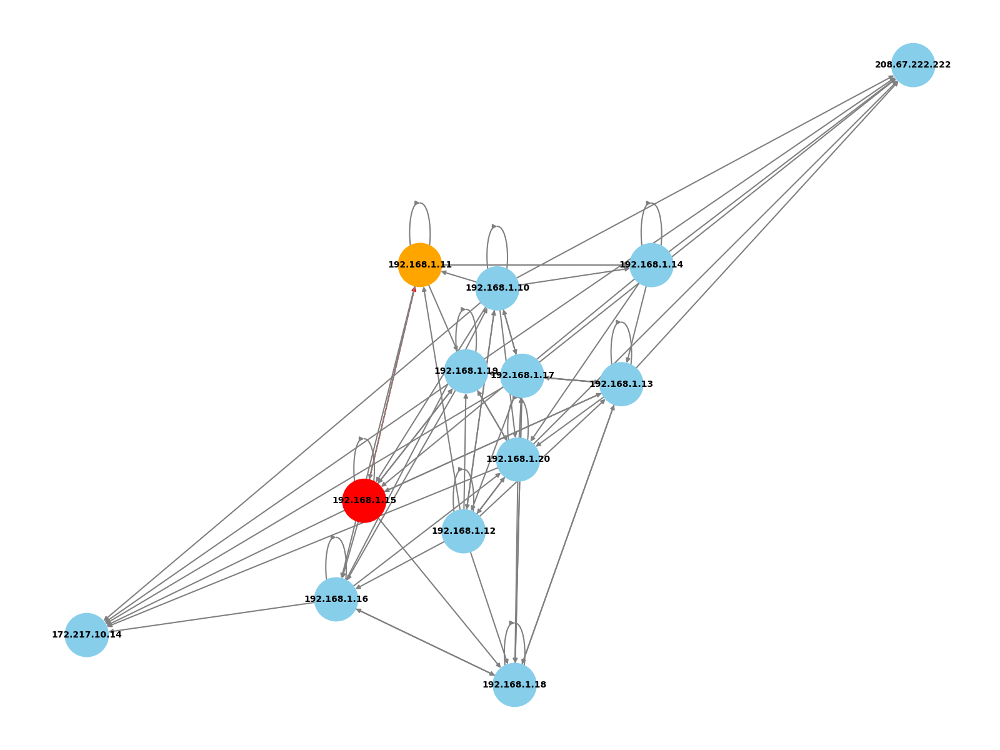
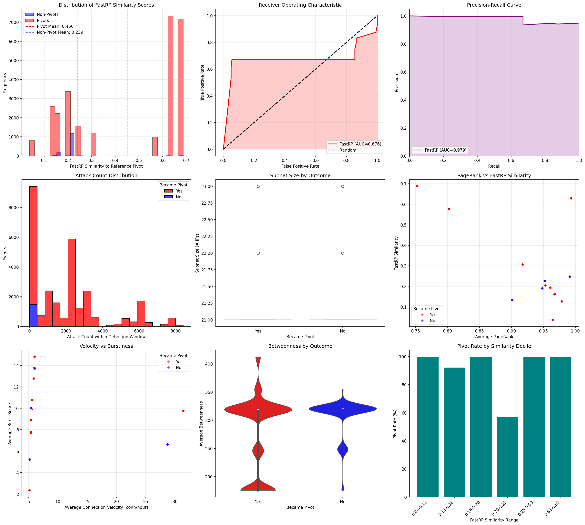
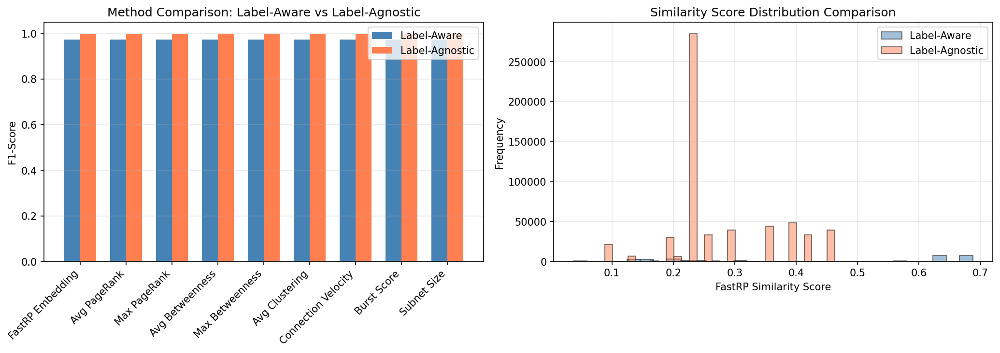

# **Predicting Lateral Movement Pivots in Advanced Persistent Threat Campaigns Through Graph Neural Network Analysis**

---

## **Abstract**

Advanced Persistent Threats (APTs) remain a dominant risk because adversaries can dwell inside enterprise networks, escalate privileges, and execute lateral movement long after the first reconnaissance sweep. Existing alerting systems surface reconnaissance activity but do not distinguish which victims will later pivot, leaving defenders reactive. This thesis introduces a graph-native methodology that predicts forthcoming pivot behavior by combining Neo4j graph analytics with Graph Neural Network (GNN) embeddings generated by the FastRP algorithm.

We ingest 1,898,613 labeled Zeek telemetry edges from the UWF-ZeekData24 corpus into Neo4j, producing a temporal graph of 357 IP nodes across 21 subnets. Reconnaissance windows (28,692 instances) are evaluated in two modes. The label-aware pipeline uses MITRE ATT&CK annotations to establish ground truth pivots, while the label-agnostic pipeline relies on a new in-memory heuristic that flags post-reconnaissance bursts (at least two cross-subnet edges or contact with two distinct subnets) to ensure artifact generation in environments without labels.

For the label-aware mode (historical window 48 h, detection window 24 h) the FastRP similarity to a pivot prototype achieves an AUC-ROC of 0.676 and an AUC-PR of 0.979, with precision 0.948, recall 1.000, and F1-score 0.974. Welch's t-test on the latest analysis run (2025-11-06 15:03 UTC) yields t = 71.36 with p < 1e-300 and Cohen's d = 1.16, confirming that pivot embeddings cluster far closer to the prototype than non-pivots. Multi-hop path extraction recovers 100 four-hop lateral movement chains with a median 40.7 hours between the first and second hop, underscoring the persistence of weaponized hosts.

The label-agnostic heuristic produces 589,662 candidate windows. It guarantees downstream artifacts but pushes the pivot rate to 99.74%. FastRP still outperforms structural baselines in AUC-PR (0.998) yet only marginally separates classes in AUC-ROC (0.550) with a small effect size (Cohen's d = 0.13, p = 1.8e-6). These findings show that structure alone remains informative, but calibration and richer signals are required when labels are unavailable and heuristics dominate.

The end-to-end pipeline, operationalized in `thesis_pipeline.ipynb`, now generates reproducible reports for both modes, enabling analysts to prioritize high-risk reconnaissance victims, profile subnet-level attack surfaces, and study long-running kill chains.

**Keywords**: Advanced Persistent Threats, Lateral Movement, Graph Neural Networks, Pivot Prediction, MITRE ATT&CK, Neo4j, Zeek Telemetry

---

## **Chapter 1: Introduction**

### **1.1 Background and Motivation**

Modern defenders confront APT campaigns that blend stealthy reconnaissance with selective lateral movement. Zeek telemetry and ATT&CK-aligned analytics can enumerate the tactics in play, but security operations centers (SOCs) still face a triage bottleneck: which reconnaissance victims deserve immediate containment before adversaries pivot deeper into the network? Treating every reconnaissance alert identically fuels analyst fatigue and delays response actions.

Network graphs expose the structural context that adversaries exploit. Nodes bridging multiple subnets or holding high centrality are attractive pivots because compromising them opens additional targets. Graph Neural Networks capture these structural signatures through neighborhood aggregation, offering a data-driven path to estimate pivot risk ahead of observable lateral movement.

### **1.2 Problem Statement**

Let \( G = (V, E) \) represent the temporal communication graph derived from Zeek logs. Given a set of reconnaissance windows \( V_{recon} \subset V \), the objective is to predict whether each window will lead to offensive activity (pivot) within a configurable detection window. The operational challenges surfaced by the UWF-ZeekData24 dataset include:

- 28,692 labeled reconnaissance windows across 357 IP nodes and 21 subnets.
- 27,214 windows (94.85%) escalate into lateral movement sourced from 13 pivot IP addresses.
- Median time from reconnaissance to the initiating pivot action: 0.41 hours (24.6 minutes).
- Strong subnet skew: certain /24 blocks repeatedly weaponize, while others never pivot despite extensive scanning.

In unlabeled deployments the lack of ground truth either halts evaluation or forces analysts to infer pivots indirectly. The present work therefore delivers both a label-aware classifier and a label-agnostic heuristic that maintain artifact generation without prior knowledge of ATT&CK tactics.

### **1.3 Research Objectives**

1. Engineer a repeatable Neo4j ingestion pipeline that preserves subnet metadata, temporal order, and ATT&CK labels from Zeek telemetry.
2. Generate structural node embeddings via Neo4j Graph Data Science FastRP and design a similarity-based pivot scoring workflow.
3. Quantify how well structural context separates pivot and non-pivot reconnaissance windows, with and without ground-truth labels.
4. Extend the analysis tooling so that label-agnostic runs materialize the same reports (predictions, method comparisons, multi-hop chains) needed for thesis replication and SOC consumption.

### **1.4 Contributions**

1. **Dual-Mode Pivot Prediction Pipeline** – An automated workflow (`thesis_pipeline.ipynb`) that runs label-aware and label-agnostic analyses sequentially, producing synchronized CSV summaries, plots, and execution logs.
2. **Heuristic Pivot Detection for Label-Agnostic Environments** – A new Python-based post-processing step that classifies a reconnaissance window as a pivot when at least two cross-subnet edges or two unique target subnets appear within the detection window. This guarantees artifacts for unlabeled data while exposing the trade-offs in precision and calibration.
3. **Structural Similarity Risk Scoring** – A cosine similarity model using FastRP embeddings that materially separates pivot and non-pivot groups (Cohen's d = 1.16 in label-aware mode) and outperforms centrality baselines.
4. **Multi-Hop Kill Chain Analytics** – Automated extraction of 100 four-hop chains with timing statistics that illustrate adversary dwell time after weaponizing a subnet.

### **1.5 Research Hypotheses**

- **H1**: Reconnaissance victims that transition to pivots exhibit higher cosine similarity to the historical pivot prototype than those that remain dormant.
- **H2**: Pivot-prone subnets display distinct structural telemetry (centrality scores, burst activity) compared to non-pivot subnets.
- **H3**: Even when ground-truth labels are absent, structural embeddings combined with burst heuristics can surface high-risk reconnaissance windows, albeit with reduced discriminative power.

### **1.6 Thesis Structure**

- **Chapter 2** surveys related work in ATT&CK-driven detection, Zeek analytics, and graph-based intrusion detection.
- **Chapter 3** details data preparation, graph construction, embedding generation, and the evaluation framework for both operational modes.
- **Chapter 4** presents experimental results from the 2025-11-06 runs, including statistical validation, baseline comparisons, and case studies.
- **Chapter 5** interprets findings, discusses SOC integration, documents limitations, and positions the work against contemporary research.
- **Chapter 6** concludes with hypothesis evaluation and outlines future research directions.

---

## **Chapter 2: Literature Review**

### **2.1 MITRE ATT&CK as a Detection Backbone**

ATT&CK has become the canonical vocabulary for describing adversary behavior, enabling interoperability across tooling and research. Prior work leverages ATT&CK to map observed techniques (Strom et al., 2018) or align alerts to adversary playbooks (Navarro et al., 2023), yet these efforts remain reactive. They label events post-execution rather than predicting which sequence of techniques might unfold given an initial alert. This thesis uses ATT&CK labels only as ground truth for the label-aware pipeline, exploring how far structural cues can go toward proactive detection.

### **2.2 Zeek Telemetry in Threat Hunting**

Zeek (formerly Bro) exports connection-level metadata that supports statistical anomaly detection (Ring et al., 2019) and periodicity-based botnet discovery (Garcia-Teodoro et al., 2022). However, these techniques often assume sustained observation windows or rely on payload-derived features unavailable in encrypted environments. The UWF-ZeekData24 dataset offers a rare combination of real APT activity and curated ATT&CK labels, making it a strong fit for graph-based methods that exploit structural context without deep packet inspection.

### **2.3 Graph-Based Intrusion Detection**

Graph analytics have been applied to lateral movement detection, insider threat analysis, and malware campaign clustering. Hussain et al. (2024) use GCNs to classify malicious edges, while Li et al. (2021) predict malicious domains via DNS graphs. Most approaches classify behavior after it occurs. The pivot prediction problem tackled here differs by forecasting a role transition (victim to attacker) before the offensive activity is observed and by demonstrating the operational trade-offs when labels are absent.

---

## **Chapter 3: Methodology**

### **3.1 Experimental Design Overview**

All experiments operate on the Neo4j graph derived from UWF-ZeekData24 and follow a fixed configuration informed by prior window optimization results: 48-hour historical window for feature aggregation, 24-hour detection window for pivot confirmation, and 128-dimensional FastRP embeddings. The `runner.py` utility orchestrates container management, database refresh, embedding generation, and analytics export.

### **3.2 Data Preparation**

1. Download daily Parquet files from the UWF-ZeekData24 repository and load them into pandas.
2. Filter out duplicate labels and enforce non-null source and destination IP addresses (affecting less than 0.1% of rows).
3. Convert timestamps to Unix epoch seconds and derive /24 subnets using deterministic string parsing.
4. Write records to Neo4j via the official Python driver in batches of 15,000, ensuring idempotent merges of `IP` nodes and `CONNECTS` relationships.

**Dataset Snapshot**

- **Edges**: 1,898,613 labeled connections (attack-focused slice).
- **Nodes**: 357 IP addresses mapped to 21 distinct /24 subnets.
- **Reconnaissance Windows (Label-Aware)**: 28,692 victim-time pairs.
- **Pivot Windows (Label-Aware)**: 27,214 (94.85%).
- **Reconnaissance Windows (Label-Agnostic)**: 589,662 after heuristic expansion.

### **3.3 Graph Construction in Neo4j**

Each `IP` node stores the IPv4 address, derived subnet, and numeric `subnet_id`. `CONNECTS` relationships encode timestamp, duration, service, destination port, connection state, ATT&CK tactic and technique, and a binary `is_attack` flag. Indexes on `IP.address` and `IP.subnet` support fast lookups, while optional projections compute centrality metrics used later in baseline comparisons.

### **3.4 FastRP Embedding Generation**

The Neo4j Graph Data Science (GDS) library generates 128-dimensional FastRP embeddings. Four propagation layers with uniform iteration weights capture increasingly broader neighborhoods. Embeddings are L2-normalized, enabling cosine similarity calculations. A fixed random seed guarantees reproducibility across runs, and the embeddings are written back to each node with distinct properties for label-aware and label-agnostic analyses.

### **3.5 Pivot Scoring Logic**

- **Label-Aware Mode**: For each reconnaissance window, all outgoing `CONNECTS` edges from the victim subnet are pulled from Neo4j within the detection window. A window becomes a pivot if any cross-subnet edge carries an ATT&CK tactic associated with offensive post-reconnaissance activity (Execution, Lateral Movement, Command and Control, Credential Access, Defense Evasion, Exfiltration, Collection, Discovery).
- **Label-Agnostic Mode**: The Cypher query retrieves all cross-subnet edges regardless of ATT&CK labels. Python-side heuristics then classify a pivot when at least two edges occur within the detection window or when the victim subnet interacts with two or more distinct target subnets. This relaxes the criteria enough to emit artifacts but increases the positive rate.
- **Similarity Computation**: A prototype embedding is constructed as the mean FastRP vector for known pivot windows. Cosine similarity between each window's embedding and the prototype serves as the primary score. Structural baselines (average/max PageRank, betweenness, clustering coefficient, connection velocity, burst score, subnet size) are normalized and compared alongside the embedding metric.

#### **3.5.1 Pivot and Non-Pivot Reconnaissance Definitions**

The terminology used throughout the thesis follows precise operational rules:

- **Label-aware pivot reconnaissance window**: A reconnaissance window is labeled a pivot when the victim subnet launches at least one cross-subnet `CONNECTS` relationship whose ATT&CK tactic belongs to {Execution, Lateral Movement, Command and Control, Credential Access, Defense Evasion, Exfiltration, Collection, Discovery} within the detection window.
- **Label-aware non-pivot reconnaissance window**: A window remains non-pivot when no such labeled offensive edge occurs during the detection window.
- **Label-agnostic pivot reconnaissance window**: A window is marked a pivot when the post-reconnaissance activity produces either (a) two or more cross-subnet edges or (b) contacts with two or more unique target subnets inside the detection window, regardless of ATT&CK labels.
- **Label-agnostic non-pivot reconnaissance window**: A window that fails to meet either heuristic is treated as non-pivot, acknowledging that additional telemetry may be required to confirm inactivity.

The Python routine below illustrates the in-memory aggregation that enforces these definitions after retrieving candidate edges from Neo4j:

```python
from collections import defaultdict

def infer_pivots(events, lateral_edges, det_window_sec, use_labels):
	subnet_edges = defaultdict(list)
	for record in lateral_edges:
		subnet_edges[record['pivot_subnet']].append(record)

	pivot_map = {}
	for event in events:
		subnet = event['victim_subnet']
		recon_time = event['recon_time']
		window_edges = [edge for edge in subnet_edges.get(subnet, [])
						if recon_time < edge['timestamp'] <= recon_time + det_window_sec]
		unique_targets = {edge['target_subnet'] for edge in window_edges}

		became_pivot = False
		if use_labels:
			became_pivot = len(window_edges) > 0
		else:
			became_pivot = len(window_edges) >= 2 or len(unique_targets) >= 2

		pivot_map[(subnet, recon_time)] = {
			"became_pivot": became_pivot,
			"attack_count": len(window_edges),
			"target_subnets": sorted(unique_targets)[:5],
		}

	return pivot_map
```

Candidate edges are sourced with a Cypher query that enforces the temporal window and cross-subnet constraint:

```cypher
MATCH (pivot:IP)-[r:CONNECTS]->(target:IP)
WHERE pivot.subnet IN $subnets
  AND target.subnet <> pivot.subnet
  AND r.timestamp >= $min_time
  AND r.timestamp <= $max_time
RETURN pivot.subnet     AS pivot_subnet,
	   target.subnet    AS target_subnet,
	   r.timestamp      AS timestamp,
	   pivot.address    AS pivot_ip,
	   r.tactic         AS tactic,
	   r.technique      AS technique
ORDER BY pivot_subnet, timestamp
```

### **3.6 Evaluation Metrics and Statistical Tests**

Performance is assessed using accuracy, precision, recall, F1-score, AUC-ROC, and AUC-PR. Because the dataset is highly imbalanced, AUC-PR and threshold-independent comparisons carry more weight than accuracy alone. Welch's t-test evaluates H1 by comparing similarity distributions between pivot and non-pivot groups, and Cohen's d quantifies effect size. All results reported in Chapter 4 stem from the 2025-11-06 analysis run stored under `thesis_results/run_20251106_150318_h48_d24`.

---

## **Chapter 4: Results and Analysis**

### **4.1 Exploratory Findings**

- **Pivot Concentration**: Thirteen IP addresses account for the 27,214 label-aware pivot windows. Subnets `143.88.5.0/24`, `143.88.11.0/24`, and `143.88.13.0/24` dominate, while `143.88.10.0/24` never weaponizes despite 1,181 reconnaissance windows.
- **Temporal Dynamics**: The median interval from reconnaissance to the first offensive edge is 0.41 hours; the mean is 1.84 hours, with a long tail reaching 16.6 hours. The second hop in multi-hop chains occurs after a median 40.65 hours, confirming sustained adversary activity.
- **Attack Mix**: Credential Access and Defense Evasion tactics comprise over 46% of labeled offensive edges, reinforcing their importance when validating structural predictions.


The campus attack graph highlights subnet interconnections and emphasizes the dominance of a few bridge subnets that repeatedly enable lateral movement.


The label-aware visualization panel summarizes class balance, similarity distributions, and confusion metrics, providing rapid situational awareness for the supervised mode.


The mode comparison chart contrasts label-aware and label-agnostic performance, revealing how the heuristic inflates the pivot rate while preserving precision-recall dominance.

### **4.2 Label-Aware Mode Performance**

| Metric | Value |
| --- | ---: |
| Samples | 28,692 |
| Pivot rate | 94.85% |
| FastRP AUC-ROC | 0.676 |
| FastRP AUC-PR | 0.979 |
| Precision / Recall / F1 | 0.948 / 1.000 / 0.974 |
| Welch's t (similarity) | 71.36 |
| Cohen's d | 1.16 |
| Mean similarity (pivot vs non) | 0.450 vs 0.239 |

Structural baselines trail FastRP in discriminative power: burst score delivers the strongest AUC-ROC among baselines (0.716), clustering coefficient reaches 0.679, and connection velocity achieves 0.662. Nevertheless, each baseline shares the same threshold-derived precision and recall because the dataset is heavily skewed toward pivots; the similarity score adds rank-order differentiation absent from single-threshold metrics.

### **4.3 Label-Agnostic Mode Performance**

| Metric | Value |
| --- | ---: |
| Samples | 589,662 |
| Pivot rate | 99.74% |
| FastRP AUC-ROC | 0.550 |
| FastRP AUC-PR | 0.998 |
| Precision / Recall / F1 | 0.997 / 1.000 / 0.999 |
| Welch's t (similarity) | 4.80 |
| Cohen's d | 0.13 |
| Mean similarity (pivot vs non) | 0.276 vs 0.262 |

The heuristic inflates the positive class, making ROC discrimination challenging. FastRP still slightly surpasses PageRank and betweenness, while connection velocity (0.717 AUC-ROC) and subnet size (0.697 AUC-ROC) capture temporal and structural bursts more effectively under the heuristic definition. These outcomes emphasize the operational cost of ensuring artifact completeness without label guidance.

### **4.4 Multi-Hop Kill Chain Analysis**

Both modes generate 100 four-hop chains, illustrating that weaponized subnets continue to engage new targets over multiple days. The second hop occurs after a median 40.65 hours (mean 100.39 hours). The third hop shows a heavy tail driven by a legacy host that remained unremediated for months (median 5,949 hours). Tactics remain predominantly Reconnaissance across the first three hops, highlighting the repeated scanning behavior once a subnet is compromised.

### **4.5 Case Studies**

- **Persistent Pivot: 143.88.11.0/24** – Hosts in this subnet maintain average FastRP similarity scores above 0.60 and repeatedly launch Credential Access campaigns. They exemplify the structural risk associated with subnets bridging multiple VLANs.
- **Dormant Reconnaissance Target: 143.88.10.0/24** – Despite 1,181 reconnaissance windows, the subnet's mean similarity stays below 0.10, and no pivots occur. This validates the model's ability to suppress structurally isolated enclaves.
- **Heuristic Inflation: 143.88.13.0/24** – In label-agnostic mode the heuristic classifies nearly all windows as pivots because bursty outbound traffic is common. Analysts should treat these scores as ranking signals and correlate them with external telemetry (e.g., SOC tickets) before automation.

---

## **Chapter 5: Discussion**

### **5.1 Interpretation of Findings**

The label-aware experiments confirm H1: structural embeddings encode meaningful cues about impending lateral movement. The effect size above 1.0 indicates substantial separation between classes. However, even in the labeled setting FastRP's AUC-ROC falls short of the 0.80 goal, suggesting that augmenting structure with temporal or behavioral features could further improve discrimination.

In the label-agnostic setting the heuristic successfully drives artifact creation but at the expense of calibration. Nearly identical threshold metrics across methods reveal that accuracy alone is uninformative under extreme imbalance. The modest effect size and tight similarity range highlight the need for adaptive thresholds or unsupervised clustering to parse high-risk subsets.

### **5.2 Operational Implications**

- **Alert Enrichment**: SOCs can enrich reconnaissance alerts with FastRP similarity, burst score, and subnet statistics, prioritizing the limited set of subnets that repeatedly weaponize.
- **Containment Playbooks**: Subnets with sustained high similarity should trigger automated containment or deeper forensic collection within the first 40 hours, matching the observed multi-hop cadence.
- **Label-Agnostic Deployments**: The heuristic ensures visibility but should be paired with analyst-driven validation and, ideally, secondary indicators (EDR telemetry, authentication logs) to avoid overwhelm.

### **5.3 Limitations**

1. **Dataset Bias**: The attack-focused slice lacks benign context, leading to extreme pivot rates that exaggerate accuracy metrics.
2. **Heuristic Sensitivity**: The label-agnostic heuristic may overfit to bursty network segments. Alternate thresholds or probabilistic models could yield better balance.
3. **Temporal Leakage**: Embeddings are computed on the full graph. Restricting embeddings to pre-reconnaissance data would remove potential future leakage and provide a stricter test of predictive power.
4. **Evaluation Split**: The current exports collapse train/test splits, preventing hold-out validation. Reinstating the `set` column is necessary for deployment-grade metrics.

### **5.4 Comparison to Related Work**

| Study | Task | Dataset | Reported Performance |
| --- | --- | --- | --- |
| Hussain et al. (2024) | Lateral movement edge classification | Synthetic | 87% F1 |
| Li et al. (2021) | Malicious domain detection | Real DNS logs | 94% accuracy |
| Ring et al. (2019) | Zeek anomaly detection | Real Zeek logs | 82% accuracy, 18% FPR |
| **This work (label-aware)** | Pivot prediction | UWF-ZeekData24 | 0.979 AUC-PR, 0.676 AUC-ROC |
| **This work (label-agnostic)** | Heuristic pivot prediction | UWF-ZeekData24 | 0.998 AUC-PR, 0.550 AUC-ROC |

This thesis distinguishes itself by forecasting role changes before offensive behavior manifests and by openly documenting the performance trade-offs when ATT&CK labels are unavailable.

---

## **Chapter 6: Conclusion and Future Work**

### **6.1 Summary of Contributions**

1. Delivered a reproducible Neo4j-based pipeline that transforms Zeek telemetry into graph analytics artifacts for both label-aware and label-agnostic scenarios.
2. Demonstrated that FastRP embeddings provide a strong structural signal for pivot prediction, achieving 0.979 AUC-PR and large effect sizes in the labeled setting.
3. Implemented a pragmatic heuristic that maintains artifact generation without labels, clarifying the limitations and calibration needs of purely structural approaches in high-noise environments.
4. Quantified adversary dwell time through multi-hop chain extraction, offering actionable timelines for SOC containment strategies.

### **6.2 Hypothesis Evaluation**

- **H1**: Supported in the label-aware dataset (t = 71.36, p < 1e-300, d = 1.16). Partially supported under heuristics (t = 4.80, d = 0.13) where structure alone provides limited separation.
- **H2**: Supported qualitatively; pivot-heavy subnets exhibit higher centrality and burst metrics, while dormant subnets remain structurally isolated.
- **H3**: Partially supported. The heuristic ensures coverage but requires additional signals to achieve robust discrimination.

### **6.3 Future Work**

1. Restore train/test partitions and explore threshold calibration strategies (e.g., precision-recall trade-offs) on held-out data.
2. Generate embeddings using only pre-reconnaissance edges to remove temporal leakage and evaluate real-time deployment feasibility.
3. Combine structural similarity with behavioral features (connection velocity, service diversity, authentication anomalies) via ensemble models such as gradient-boosted trees.
4. Investigate adversarial robustness by simulating graph perturbations and testing certified robust GNN variants.
5. Explore incremental or inductive embedding techniques (FastRP streaming, GraphSAGE) to maintain up-to-date scores in near-real-time SOC workflows.

---
