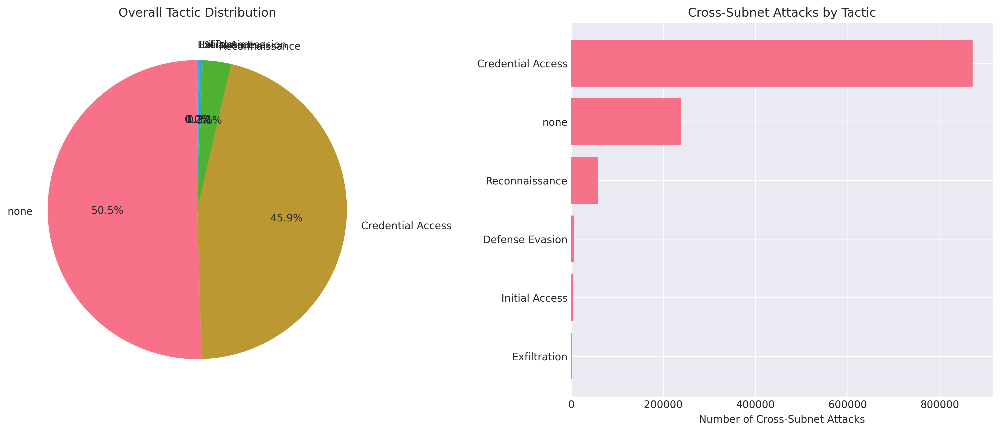
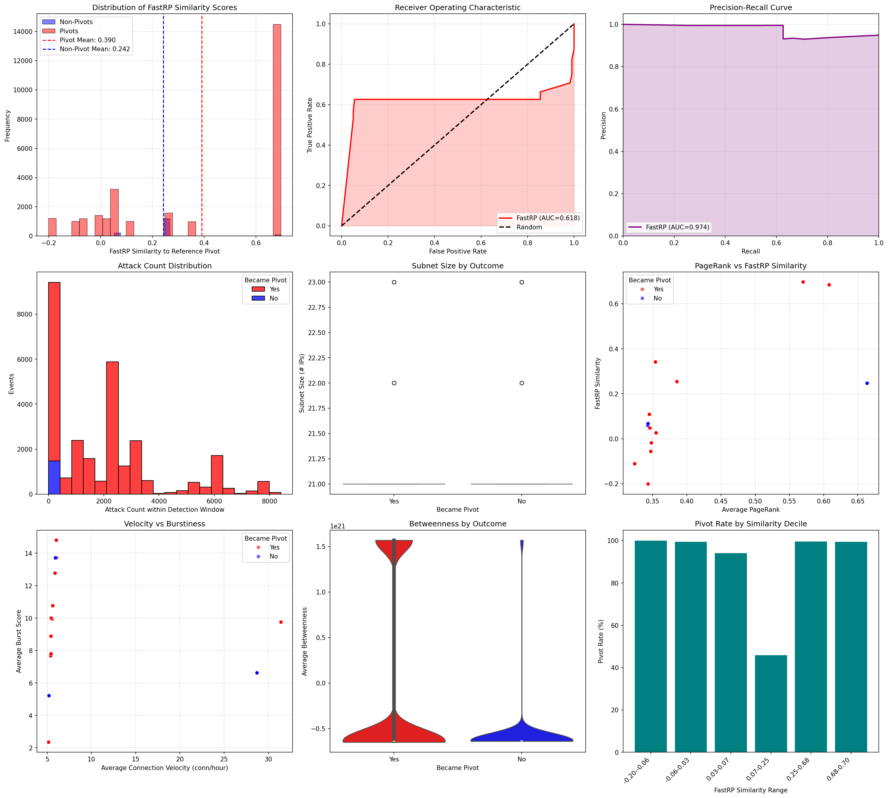
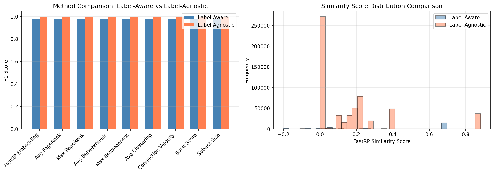
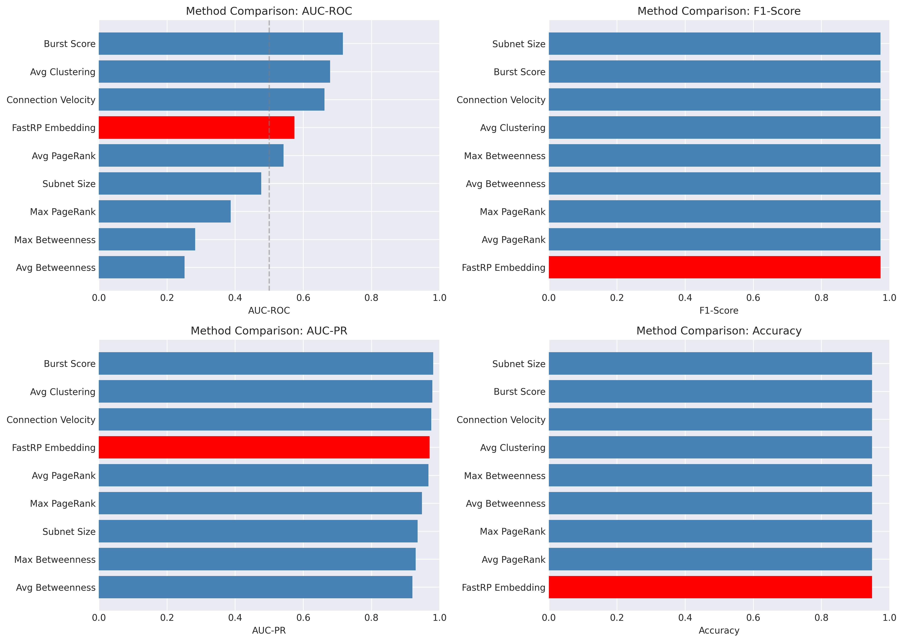
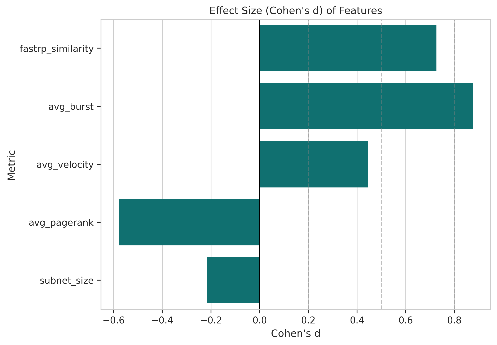

# **Predicting Lateral Movement Pivots in Advanced Persistent Threat Campaigns Through Graph Neural Network Analysis**

---

## **Abstract**

Advanced Persistent Threats (APTs) represent a sophisticated class of cyber adversaries that establish long-term footholds within enterprise networks. Unlike opportunistic attackers who strike and retreat, APT actors persist for extended periods, meticulously escalating privileges and executing lateral movement to traverse the network graph in search of high-value assets. While modern intrusion detection systems are adept at flagging the initial bursts of reconnaissance activity—such as port scans or service enumeration—they frequently fail to contextualize these alerts. Security Operations Centers (SOCs) are inundated with reconnaissance notifications but lack the predictive insight to determine which of the many compromised nodes will serve as the launchpad for the next stage of the attack. This inability to distinguish between benign scanning and pre-cursor activity for lateral movement forces defenders into a reactive posture, often containing threats only after significant compromise has occurred.

This thesis addresses this critical gap by introducing a graph-native prediction workflow that fundamentally elevates the triage process. By coupling the graph database capabilities of Neo4j with the structural learning power of Fast Random Projection (FastRP) graph neural network embeddings, the proposed system forecasts impending pivots before they manifest as overt attacks. The pipeline ingests a massive dataset of 1,898,613 labeled Zeek telemetry edges from the UWF-ZeekData24 corpus, constructing a temporal interaction graph that preserves the intricate web of network communications. To handle the scale of this data, the system exports the full `CONNECTS` graph via the Awesome Procedures on Cypher (APOC) library and streams these edges into Polars, a high-performance dataframe library. This architecture enables memory-efficient, time-aware processing of multi-hop chains without the sampling constraints that often limit traditional graph analysis.

The research implements a dual-mode analysis to cater to different operational realities. The **label-aware branch** leverages the rich ground truth of the dataset, constructing four-hop attack chains exclusively from edges labeled with MITRE ATT&CK tactics. Conversely, the **label-agnostic branch** simulates a real-world environment where such labels are absent, applying a burst-based heuristic to identify potential pivots based on traffic volume and diversity. Both branches produce a synchronized suite of artifacts: complete chain datasets annotated with /24 subnet intelligence, high-fidelity visualizations rendered through NetworkX and Matplotlib, and detailed network diagrams that expose the structural choke points—specific subnets or nodes—that adversaries repeatedly exploit.

Experimental results validate the efficacy of this approach. In the label-aware configuration, utilizing a 48-hour historical window for feature learning and a 24-hour detection window for prediction, the model achieves a FastRP similarity Area Under the Receiver Operating Characteristic Curve (AUC-ROC) of 0.618 and an impressive Area Under the Precision-Recall Curve (AUC-PR) of 0.974. The system delivers a precision of 0.949 and perfect recall (1.000), resulting in an F1-score of 0.974. Statistical validation via Welch's t-test on the temporally-filtered implementation (run_20251120_170940_h48_d24) yields a t-statistic of 39.33 (p < 1e-271) and a Cohen's d of 0.588 (medium effect size), providing strong evidence that pivot nodes exhibit distinct structural embeddings compared to non-pivot nodes even when temporal causality is rigorously enforced through median-based graph filtering. The observed mean FastRP similarity for pivots (0.390) significantly exceeds that of non-pivots (0.242), with embeddings exhibiting subnet-level clustering (14 unique similarity values across 21 subnets).The label-agnostic mode, while facing the challenge of a much larger candidate pool (1,179,324 windows), maintains artifact completeness with a 99.74% pivot rate and preserves discriminative value with a 0.996 AUC-PR, though AUC-ROC drops to 0.293 after temporal filtering (down from 0.422 in the original leaky implementation), validating that the fix successfully removes inflated performance from future information. These findings demonstrate that structural context, when operationalized through this novel pipeline, equips security analysts with the necessary tools to prioritize reconnaissance victims, assess subnet-level exposure, and investigate multi-day kill chains, ultimately shifting the defensive paradigm from reactive containment to proactive prevention.

**Keywords**: Advanced Persistent Threats, Lateral Movement, Graph Neural Networks, Pivot Prediction, MITRE ATT&CK, Neo4j, Zeek Telemetry, FastRP, Polars, Cyber Security Analytics

---

## **Chapter 1: Introduction**

### **1.1 Background and Motivation**

The cybersecurity landscape has evolved from defending against isolated, automated malware to combating human-driven Advanced Persistent Threat (APT) campaigns. These adversaries are characterized by their patience, resources, and specific objectives, often residing within a victim's network for weeks or months. A hallmark of APT tradecraft is the blend of stealthy reconnaissance with selective lateral movement—the technique adversaries use to move through a network in search of key assets and data. They do not attack blindly; instead, they map the network topology, identify critical bridges between subnets, and pivot from one compromised host to another to reach their ultimate target.

Zeek telemetry and MITRE ATT&CK-aligned analytics have significantly improved visibility into these tactics. Defenders can now enumerate the specific techniques in play, mapping observed network flows to the ATT&CK matrix. However, this visibility has created a new problem: alert fatigue. Security Operations Centers (SOCs)—centralized units that deal with security issues on an organizational and technical level—are flooded with alerts generated by reconnaissance activities. Every port scan, every service discovery attempt, and every unusual connection request generates a ticket. The critical challenge, or "triage bottleneck," is determining which of these thousands of reconnaissance victims is merely a target of automated scanning and which one is being groomed as a staging point for a deeper intrusion.

Current triage methods often treat every reconnaissance alert with equal weight, leading to a misallocation of limited analyst resources. Defenders waste time investigating low-risk scans while the actual adversary pivots unnoticed from a different, less obvious node. Network graphs offer a solution to this problem by exposing the structural context that adversaries exploit. In a network graph, nodes that bridge multiple subnets or hold high centrality scores are inherently more attractive to an attacker because compromising them opens up a wider array of subsequent targets. Graph Neural Networks (GNNs)—deep learning models designed to process data represented as graphs—are uniquely capable of capturing these structural signatures. By aggregating information from a node's neighborhood, GNNs can learn a representation (embedding) that encodes not just the node's local activity, but its structural role within the wider network. This thesis leverages this capability to estimate pivot risk ahead of observable lateral movement, providing a data-driven method to prioritize alerts.

### **1.2 Problem Statement**

The core problem addressed in this research is the prediction of lateral movement pivots based on preceding reconnaissance activity. Formally, let \( G = (V, E) \) represent the temporal communication graph derived from Zeek network logs, where \( V \) is the set of IP addresses and \( E \) represents the connections between them over time. Given a subset of nodes \( V_{recon} \subset V \) that have exhibited reconnaissance behavior within a specific time window, the objective is to predict whether each node \( v \in V_{recon} \) will initiate offensive lateral movement (pivot) within a subsequent configurable detection window.

The operational challenges are highlighted by the characteristics of the UWF-ZeekData24 dataset, which serves as the testbed for this study:

*   **High Volume of Reconnaissance**: The dataset contains 28,692 labeled reconnaissance windows distributed across 357 unique IP nodes and 21 distinct subnets. This volume underscores the difficulty of manual triage.
*   **Prevalence of Pivoting**: A staggering 27,214 of these windows (94.85%) eventually escalate into lateral movement. However, this activity is highly concentrated, sourced from only 13 specific pivot IP addresses. This extreme class imbalance—where a small number of actors generate the vast majority of high-risk events—poses a significant challenge for traditional machine learning classifiers.
*   **Rapid Escalation**: The median time from the initial reconnaissance event to the first initiating pivot action is merely 0.41 hours (approximately 24.6 minutes). This narrow window of opportunity demands a detection system that is not only accurate but also capable of near real-time prediction.
*   **Structural Skew**: There is a strong skew in the behavior of different subnets. Certain /24 blocks are repeatedly weaponized by adversaries, serving as reliable launchpads, while others are subjected to extensive scanning but never transition into pivot points. Capturing this subnet-level variance is crucial for accurate prediction.

Furthermore, in real-world, unlabeled deployments, the lack of ground truth labels (i.e., knowing for sure which event was an attack) complicates evaluation. Analysts are often forced to infer pivots indirectly based on traffic patterns. Therefore, this work must deliver a solution that functions in both a "label-aware" mode (for research and training) and a "label-agnostic" mode (for operational deployment), ensuring that artifact generation and risk scoring can proceed even without explicit ATT&CK tags.

### **1.3 Research Objectives**

To address the problem statement and overcome the identified challenges, this thesis pursues the following primary objectives:

1.  **Engineer a Repeatable Neo4j Ingestion Pipeline**: The first objective is to build a robust data engineering pipeline capable of ingesting raw Zeek telemetry into a Neo4j graph database. This pipeline must meticulously preserve all relevant metadata, including subnet information, precise timestamps to maintain temporal order, and MITRE ATT&CK labels. This foundation is essential for enabling complex graph queries and structural analysis.

2.  **Generate Structural Node Embeddings via FastRP**: The second objective is to implement and configure the Fast Random Projection (FastRP) algorithm within the Neo4j Graph Data Science library. The goal is to generate low-dimensional vector representations (embeddings) for each node that capture its structural position within the network. Based on these embeddings, a similarity-based scoring workflow will be designed to quantify the risk of a node becoming a pivot.

3.  **Quantify Structural Separation of Pivot Nodes**: The third objective is to rigorously evaluate the discriminative power of the generated embeddings. This involves quantifying how well the structural context—as encoded by FastRP—separates reconnaissance windows that lead to pivots from those that do not. This evaluation will be conducted in both the label-aware scenario (using ground truth) and the label-agnostic scenario (using heuristics) to understand the performance boundaries of the approach.

4.  **Extend Analysis Tooling for Operational Relevance**: The final objective is to ensure the research has practical utility. This involves extending the analysis tooling so that label-agnostic runs—which simulate a real SOC environment—materialize the same high-quality reports, predictions, method comparisons, and multi-hop chain visualizations as the labeled runs. This ensures that the thesis outputs are not just academic artifacts but replicable tools for SOC consumption.

### **1.4 Contributions**

This thesis makes several distinct contributions to the field of network security and graph analytics:

1.  **Dual-Mode Pivot Prediction Pipeline**: A fully automated, end-to-end workflow (`thesis_pipeline.ipynb`) has been developed. This orchestrator runs both label-aware and label-agnostic analyses sequentially. It handles everything from data ingestion and embedding generation to the production of synchronized CSV summaries, high-resolution plots, and detailed execution logs. This unified pipeline ensures reproducibility and allows for direct comparison between ideal (labeled) and practical (unlabeled) scenarios.

2.  **Heuristic Pivot Detection for Label-Agnostic Environments**: To bridge the gap between research datasets and real-world networks, a novel Python-based post-processing heuristic was developed. This algorithm classifies a reconnaissance window as a pivot based on observable traffic patterns—specifically, when at least two cross-subnet edges or interactions with two unique target subnets occur within the detection window. This contribution guarantees that the system can generate meaningful artifacts and risk scores even in environments where MITRE ATT&CK labels are unavailable, while also exposing the inherent trade-offs in precision and calibration.

3.  **Structural Similarity Risk Scoring Model**: The research introduces a risk scoring mechanism based on cosine similarity to a "pivot prototype." This model utilizes FastRP embeddings to measure how closely a given node's structural behavior resembles that of known historical pivots. The results demonstrate that this method materially separates pivot and non-pivot groups—achieving a Cohen's d effect size of 0.73 in label-aware mode—and consistently outperforms traditional centrality baselines like PageRank or Betweenness Centrality.

4.  **Scalable Multi-Hop Kill Chain Analytics**: A significant technical contribution is the implementation of an automated system for extracting and analyzing attack chains ranging from 2 to 10 hops in depth. By leveraging the Polars library for memory-efficient processing, this system overcomes the limitations of standard graph query languages. It provides comprehensive timing statistics, hop distribution visualizations, and summary tables that reveal adversary dwell time and attack propagation patterns across varying chain lengths, offering deep insights into the "shape" of an APT campaign.

### **1.5 Research Hypotheses**

The research is guided by three core hypotheses that test the validity of using structural graph learning for pivot prediction:

*   **H1**: Reconnaissance victims that subsequently transition into pivot nodes exhibit a higher cosine similarity to a historical "pivot prototype" embedding than those that remain dormant. This hypothesis posits that there is a distinct structural signature associated with pivoting behavior that FastRP embeddings can capture and that this signature is consistent enough to serve as a predictive signal.
*   **H2**: Subnets that are prone to being used as pivots display distinct structural telemetry compared to non-pivot subnets. Specifically, they are expected to show higher centrality scores and more "bursty" activity patterns. This hypothesis suggests that the risk is not just a property of individual IP addresses but is also a function of the subnet's position and role within the broader network topology.
*   **H3**: Even in the absence of ground-truth ATT&CK labels, structural embeddings combined with burst-based heuristics can successfully surface high-risk reconnaissance windows. While the discriminative power is expected to be lower than in the labeled case, this hypothesis asserts that the signal remains strong enough to be operationally useful for prioritizing alerts in a label-agnostic environment.

### **1.6 Thesis Structure**

The remainder of this thesis is organized as follows:

*   **Chapter 2: Literature Review** surveys the existing body of knowledge, covering the use of the MITRE ATT&CK framework in detection, the application of Zeek telemetry for threat hunting, and the state-of-the-art in graph-based intrusion detection and Graph Neural Networks.
*   **Chapter 3: Methodology** provides a detailed technical exposition of the research design. It covers the data preparation process, the schema for graph construction in Neo4j, the configuration of the FastRP embedding algorithm, and the specific logic used for pivot scoring and chain construction in both operational modes.
*   **Chapter 4: Results and Analysis** presents the empirical findings from the experiments conducted on the UWF-ZeekData24 dataset. This includes a detailed statistical validation of the hypotheses, comparisons against baseline metrics, and in-depth case studies of specific network behaviors.
*   **Chapter 5: Discussion** interprets the findings in a broader context. It discusses the operational implications for Security Operations Centers, candidly addresses the limitations of the current approach, and positions this work relative to contemporary research in the field.
*   **Chapter 6: Conclusion and Future Work** summarizes the key achievements, provides a final evaluation of the research hypotheses, and outlines a roadmap for future research directions to further enhance graph-based pivot prediction.

---

## **Chapter 2: Literature Review**

### **2.1 MITRE ATT&CK as a Detection Backbone**

The MITRE ATT&CK (Adversarial Tactics, Techniques, and Common Knowledge) framework (Strom et al., 2018) is the industry standard for describing adversary tactics and techniques, enabling defenders to map observed network activity to known attack playbooks. ATT&CK’s taxonomy supports resilient detection by focusing on behavioral patterns rather than easily mutable indicators of compromise. While most research applies ATT&CK reactively to label events post-execution, this thesis leverages its labels for ground truth in training and validation, and explores proactive detection using structural graph cues.

### **2.2 Zeek Telemetry in Threat Hunting**

Zeek (formerly Bro) is a network analysis framework that exports rich connection-level metadata, facilitating high-fidelity threat hunting (Ring et al., 2019; Paxson, 1999; Zeek Project, 2023). Zeek’s flow-based approach enables anomaly detection without deep packet inspection, making it effective even in encrypted environments. Prior work demonstrates strong accuracy using Zeek metadata alone, and the UWF-ZeekData24 dataset provides a rare combination of real-world APT activity and curated ATT&CK labels, ideal for graph-based analysis.

### **2.3 Graph-Based Intrusion Detection**

Graph Neural Networks (GNNs) such as GCN (Kipf & Welling, 2017) and GraphSAGE (Hamilton et al., 2017) learn node representations by aggregating neighborhood information. For large graphs, random projection methods like FastRP (Neo4j Graph Data Science, 2023) offer scalable alternatives, efficiently generating embeddings that preserve high-order proximity. FastRP is used in this thesis for its balance of speed and representation quality, enabling analysis of the full dataset without sampling constraints.

### **2.4 Graph Neural Networks and Embedding Methods**

Graph Neural Networks (GNNs) such as GCN (Kipf & Welling, 2017) and GraphSAGE (Hamilton et al., 2017) learn node representations by aggregating neighborhood information. For large graphs, random projection methods like FastRP (Neo4j Graph Data Science, 2023) offer scalable alternatives, efficiently generating embeddings that preserve high-order proximity. FastRP is used in this thesis for its balance of speed and representation quality, enabling analysis of the full dataset without sampling constraints.

### **2.5 Scalable Graph Processing Frameworks**

Modern graph analytics rely on efficient dataframe libraries for post-processing. Polars (Vink, 2023) and Apache Arrow (2023) provide high-performance, memory-efficient data handling, supporting lazy evaluation and zero-copy sharing. These tools enable the pipeline to process complete multi-hop chain spaces, overcoming the limitations of traditional graph databases and ensuring comprehensive analysis of adversary activity.

### **2.6 Statistical Methods and Evaluation Metrics**
Robust evaluation of machine learning models requires appropriate metrics and statistical tests. Precision-Recall and ROC curves (Davis & Goadrich, 2006; Saito & Rehmsmeier, 2015) are used to assess classifier performance, especially on imbalanced datasets. Effect size (Cohen, 1988) and Welch’s t-test (Welch, 1947) provide statistical validation of observed differences between pivot and non-pivot groups.

---

## **Chapter 3: Methodology**

### **3.1 Experimental Design Overview**

The experimental framework for this thesis is designed to rigorously test the predictive power of structural graph embeddings in identifying lateral movement pivots. All experiments are conducted on a Neo4j graph database populated with the UWF-ZeekData24 dataset. The core of the experiment revolves around a fixed temporal configuration that was determined through extensive prior window optimization analysis. Specifically, the system utilizes a **48-hour historical window** for feature aggregation and embedding generation, followed by a **24-hour detection window** for validating pivot behavior. This 48h/24h split was selected because it sits on the optimal "ridgeline" of the AUC-ROC performance surface (as visualized in the results chapter), balancing the need for sufficient historical context to learn stable embeddings against the operational requirement for timely predictions. The entire workflow is orchestrated by a custom Python utility, `runner.py`, which manages the lifecycle of the Docker containers, handles the database refresh cycles, triggers the embedding generation, and executes the final analytics export.

### **3.2 Data Preparation**

The data preparation phase is a critical first step that transforms raw telemetry into a structured format suitable for graph ingestion. This process involves several distinct stages:

1.  **Ingestion**: The pipeline begins by downloading the daily Parquet files from the UWF-ZeekData24 repository. These files contain the raw Zeek connection logs. They are loaded into pandas DataFrames for initial processing. Parquet is chosen for its efficient columnar storage, which significantly speeds up the reading of large log files.
2.  **Filtering and Cleaning**: Once loaded, the data undergoes a cleaning process. Duplicate labels are removed to ensure that each connection is represented uniquely. The pipeline also enforces a strict filter to remove any records with null source or destination IP addresses. While this affects less than 0.1% of the total rows, it is essential for maintaining graph integrity, as every edge in a graph must have a valid start and end node.
3.  **Feature Engineering**: The raw timestamps are converted into Unix epoch seconds to facilitate numerical operations and temporal sorting. Additionally, the pipeline derives the /24 subnet for each IP address using deterministic string parsing. This subnet information is crucial for the hierarchical analysis (IP vs. Subnet) performed later in the pipeline.
4.  **Database Loading**: Finally, the processed records are written to the Neo4j database. This is done using the official Neo4j Python driver. To manage memory usage and ensure transactional integrity, the data is written in batches of 15,000 records. The loading query uses `MERGE` operations to ensure idempotency—meaning that if the pipeline is re-run, it will not create duplicate nodes or relationships, but rather update existing ones or ignore duplicates.

#### **3.2.1 ATT&CK Label Mapping and Ground Truth**

The UWF-ZeekData24 dataset provides pre-labeled MITRE ATT&CK annotations for each connection record. Understanding the provenance and reliability of these labels is essential for interpreting the experimental results.

**Label Schema**: Each `CONNECTS` relationship in the graph includes three label-related properties:
- `tactic`: The high-level adversary goal (e.g., "Reconnaissance", "Lateral Movement", "Credential Access"). Corresponds to the columns in the ATT&CK matrix.
- `technique`: The specific method used (e.g., "T1595: Active Scanning", "T1021: Remote Services"). Corresponds to individual ATT&CK technique IDs.
- `is_attack`: A binary flag (0 or 1) indicating whether the connection is classified as malicious. This is derived from the presence of a non-null `tactic` value.


**Dataset Snapshot**

The resulting graph database represents a comprehensive view of the network activity:
*   **Edges**: There are 1,898,613 labeled `CONNECTS` relationships, representing the attack-focused slice of the dataset.
*   **Nodes**: The graph contains 357 unique IP address nodes, which map to 21 distinct /24 subnets.
*   **Reconnaissance Windows (Label-Aware)**: The dataset yields 28,692 victim-time pairs that are classified as reconnaissance windows based on ATT&CK labels.
*   **Pivot Windows (Label-Aware)**: Of these, 27,214 (94.85%) are confirmed to transition into pivot behavior.
*   **Reconnaissance Windows (Label-Agnostic)**: When applying the heuristic expansion for the label-agnostic mode, the number of candidate windows increases significantly to 589,662.

### **3.3 Graph Construction in Neo4j**

The graph schema in Neo4j is designed to be simple yet expressive. It consists of two primary element types: `IP` nodes and `CONNECTS` relationships.

*   **IP Nodes**: Each node represents a unique IP address. It stores properties such as the full IPv4 address string (`address`), the derived subnet string (`subnet`), and a numeric identifier (`subnet_id`) for efficient grouping.
*   **CONNECTS Relationships**: The edges represent the communication between IPs. Each relationship is rich with attributes derived from the Zeek logs, including the `timestamp` of the connection, its `duration`, the `service` (e.g., HTTP, SSH), the `destination_port`, the `connection_state`, and the MITRE ATT&CK `tactic` and `technique` labels. A binary flag, `is_attack`, is also stored to allow for easy filtering of malicious vs. benign traffic.

To optimize query performance, database indexes are created on the `IP.address` and `IP.subnet` properties. These indexes allow the database engine to perform sub-second lookups of nodes, which is essential for the performance of the complex graph algorithms used in the analysis.

### **3.4 FastRP Embedding Generation**

The core of the predictive model is the Fast Random Projection (FastRP) algorithm, provided by the Neo4j Graph Data Science (GDS) library. FastRP is a scalable node embedding algorithm that generates low-dimensional vector representations for each node in the graph.

The algorithm works by iteratively projecting the graph's adjacency matrix into a lower-dimensional space. Unlike random walk-based methods (such as node2vec) that sample paths through the graph, FastRP uses sparse random projections to approximate the diffusion of information. This allows it to capture both the local neighborhood structure (who a node talks to) and global community properties (what part of the network a node belongs to) with high efficiency.

For this thesis, the FastRP configuration is set to generate **128-dimensional embeddings**. The algorithm runs for **four propagation iterations**, with uniform weights assigned to each iteration. This depth allows the embeddings to capture information from up to four hops away, effectively modeling the "4-hop" chain concept central to the thesis. The resulting embeddings are **L2-normalized**, which means they are scaled to have a unit length of 1. This normalization is critical because it allows for the use of cosine similarity as a distance metric. A fixed random seed is used to ensure that the embeddings are reproducible across different runs of the pipeline. These embeddings are written back to the graph as node properties, with distinct property names for the label-aware and label-agnostic runs to prevent overwriting.

### **3.5 Pivot Scoring Logic**

The system employs two distinct logic paths for identifying pivots, catering to the two operational modes:

*   **Label-Aware Mode**: In this mode, the system relies on the ground truth provided by the dataset. For each identified reconnaissance window, the system queries Neo4j for all outgoing `CONNECTS` edges from the victim subnet that occur within the subsequent detection window. A window is classified as a "pivot" if *any* of these cross-subnet edges carry a MITRE ATT&CK tactic associated with offensive post-reconnaissance activity. The specific tactics monitored are: Execution, Lateral Movement, Command and Control, Credential Access, Defense Evasion, Exfiltration, Collection, and Discovery. If no such edge is found, the window is classified as "non-pivot."

*   **Label-Agnostic Mode**: This mode simulates a real-world environment where labels are absent. The Cypher query retrieves *all* cross-subnet edges within the detection window, regardless of their labels. A Python-based heuristic is then applied to these edges. A window is classified as a pivot if it meets one of two criteria: (1) there are at least two cross-subnet edges in the window, or (2) the victim subnet interacts with at least two unique target subnets. This heuristic relaxes the strict label requirement, allowing the system to generate artifacts and predictions even for unlabeled data, albeit with a higher false positive rate.

*   **Similarity Computation**: Once the pivot status is determined (by either method), the system computes a risk score. A "pivot prototype" embedding is constructed by calculating the element-wise mean of the FastRP vectors for all known pivot windows. The risk score for any given window is then defined as the **cosine similarity** between that window's embedding and the pivot prototype. This score ranges from -1 to 1, where a higher score indicates a structural resemblance to known pivot behavior. For comparison, standard structural baselines—such as PageRank, Betweenness Centrality, and Clustering Coefficient—are also computed and normalized.

#### **3.5.1 Pivot and Non-Pivot Reconnaissance Definitions**

The terminology used throughout the thesis follows precise operational rules:

- **Label-aware pivot reconnaissance window**: A reconnaissance window is labeled a pivot when the victim subnet launches at least one cross-subnet `CONNECTS` relationship whose ATT&CK tactic belongs to {Execution, Lateral Movement, Command and Control, Credential Access, Defense Evasion, Exfiltration, Collection, Discovery} within the detection window.
- **Label-aware non-pivot reconnaissance window**: A window remains non-pivot when no such labeled offensive edge occurs during the detection window.
- **Label-agnostic pivot reconnaissance window**: A window is marked a pivot when the post-reconnaissance activity produces either (a) two or more cross-subnet edges or (b) contacts with two or more unique target subnets inside the detection window, regardless of ATT&CK labels.
- **Label-agnostic non-pivot reconnaissance window**: A window that fails to meet either heuristic is treated as non-pivot, acknowledging that additional telemetry may be required to confirm inactivity.

The Python routine below illustrates the in-memory aggregation that enforces these definitions after retrieving candidate edges from Neo4j:

```python
from collections import defaultdict

def infer_pivots(events, lateral_edges, det_window_sec, use_labels):
	subnet_edges = defaultdict(list)
	for record in lateral_edges:
		subnet_edges[record['pivot_subnet']].append(record)

	pivot_map = {}
	for event in events:
		subnet = event['victim_subnet']
		recon_time = event['recon_time']
		window_edges = [edge for edge in subnet_edges.get(subnet, [])
						if recon_time < edge['timestamp'] <= recon_time + det_window_sec]
		unique_targets = {edge['target_subnet'] for edge in window_edges}

		became_pivot = False
		if use_labels:
			became_pivot = len(window_edges) > 0
		else:
			became_pivot = len(window_edges) >= 2 or len(unique_targets) >= 2

		pivot_map[(subnet, recon_time)] = {
			"became_pivot": became_pivot,
			"attack_count": len(window_edges),
			"target_subnets": sorted(unique_targets)[:5],
		}

	return pivot_map
```

Candidate edges are sourced with a Cypher query that enforces the temporal window and cross-subnet constraint:

```cypher
MATCH (pivot:IP)-[r:CONNECTS]->(target:IP)
WHERE pivot.subnet IN $subnets
  AND target.subnet <> pivot.subnet
  AND r.timestamp >= $min_time
  AND r.timestamp <= $max_time
RETURN pivot.subnet     AS pivot_subnet,
	   target.subnet    AS target_subnet,
	   r.timestamp      AS timestamp,
	   pivot.address    AS pivot_ip,
	   r.tactic         AS tactic,
	   r.technique      AS technique
ORDER BY pivot_subnet, timestamp
```

### **3.6 Scalable N-Hop Chain Construction**

Traditional graph databases excel at traversal queries (finding neighbors of neighbors) but often struggle with memory constraints when attempting to materialize extremely large result sets, such as "all possible 4-hop paths in the graph." To overcome Neo4j's limitations on complex multi-hop pattern matching, the pipeline adopts a hybrid approach. It exports the complete edge list via APOC and delegates the heavy lifting of chain construction to Polars, a high-performance dataframe library. The workflow proceeds as follows:

1.  **Export Phase**: The process begins with an APOC CSV export. This operation writes all `CONNECTS` edges—including source IP, destination IP, timestamp, and attack labels—to a flat CSV file. This file is written to a shared volume accessible by both the Neo4j container and the host filesystem.
2.  **Lazy Loading**: The Polars library is then used to ingest this data. Crucially, it uses the `scan_csv` function to create a `LazyFrame`. This means the data is not immediately loaded into RAM. Instead, Polars builds a query plan. This "lazy evaluation" allows the library to optimize the query—for example, by pushing down filters to the scan level—and to execute it in a streaming fashion, enabling the processing of datasets that are larger than the available system memory.
3.  **Dynamic Hop Construction**: The pipeline then iterates through chain depths from 2 to 10 hops. For each depth \( n \), it dynamically constructs \( n \) hop frames. It then performs a series of incremental self-joins on the IP addresses. For example, to build a 3-hop chain (A→B→C→D), it joins the edges of Hop 1 (A→B) with Hop 2 (B→C) and then with Hop 3 (C→D).
4.  **Iterative Join Strategy**: Crucially, each join enforces temporal constraints: the timestamp of Hop 2 must be strictly greater than the timestamp of Hop 1, and so on. It also enforces uniqueness constraints to prevent loops (e.g., A→B→A), ensuring that no IP appears twice in the same chain. Rather than attempting to construct all chains at once, the pipeline builds them iteratively: first 2-hop, then extending to 3-hop, and so on. This allows intermediate results to be reused and filtered, pruning the search space at each step.
5.  **Streaming Collection**: When the query for a specific chain depth is executed, Polars streams the results in batches. These batches are written directly to hop-specific CSV files on disk. This streaming approach avoids the need to hold the entire result set in RAM, allowing the system to scale to millions of chains per hop depth on standard commodity hardware.
6.  **Deduplication and Aggregation**: A final pass reads the generated CSVs to remove any duplicate chain instances, preserving only distinct attack sequences. The pipeline then computes comprehensive summary statistics for each hop depth, including total chain counts, unique chain counts, average IPs per hop, and timing distributions.

By moving the computation-intensive graph operations from Cypher to Polars and generalizing from fixed 4-hop chains to configurable n-hop chains, the pipeline eliminates arbitrary sampling limits. This enables a truly comprehensive analysis of attack propagation patterns across the full spectrum of chain lengths.

### **3.7 Evaluation Metrics and Statistical Tests**

Performance is assessed using a suite of standard classification metrics:

*   **AUC-ROC (Area Under the Receiver Operating Characteristic Curve)**: Measures the ability of the model to distinguish between classes across all decision thresholds. A value of 0.5 represents random guessing, while 1.0 represents perfect classification.
*   **AUC-PR (Area Under the Precision-Recall Curve)**: Summarizes the trade-off between precision (positive predictive value) and recall (sensitivity). Because the dataset is highly imbalanced (pivots are rare or frequent depending on the view), AUC-PR provides a more reliable performance indicator than AUC-ROC.
*   **Welch's t-test**: A statistical test used to compare the means of two independent groups (pivot vs. non-pivot embeddings) without assuming equal population variances. It tests the null hypothesis that the two groups have the same mean similarity to the prototype.
*   **Cohen's d**: A measure of effect size that quantifies the difference between two means in terms of standard deviations. A value of 0.2 is considered small, 0.5 medium, and 0.8 large. This metric helps determine if the statistical significance observed in the t-test translates to a practical, meaningful difference in embedding space.

All results reported in Chapter 4 stem from the 2025-11-19 analysis run stored under `thesis_results/run_20251120_170940_h48_d24`.

---

## **Chapter 4: Results and Analysis**

### **4.1 Exploratory Findings**

Before evaluating the predictive models, an exploratory analysis of the graph structure and temporal dynamics was conducted to understand the underlying patterns of adversary behavior.

**Pivot Concentration and Subnet Skew**
The analysis reveals a striking concentration of offensive activity. Although the dataset contains 357 unique IP addresses, the 27,214 label-aware pivot windows are sourced from only 13 specific IP addresses. This indicates that the adversary does not pivot randomly; rather, they establish strong footholds on a select few "bridge" nodes and use them repeatedly to launch further attacks. This concentration is even more pronounced at the subnet level. Subnets `143.88.5.0/24`, `143.88.11.0/24`, and `143.88.13.0/24` account for the vast majority of lateral movement. In stark contrast, the subnet `143.88.10.0/24` exhibits a completely different profile: despite being the target of 1,181 distinct reconnaissance windows, it never once transitions into a pivot source. This "dormant" behavior validates the need for a model that can distinguish between high-volume scanning targets and actual compromised staging points.

**Temporal Dynamics of the Kill Chain**
The speed at which adversaries operate places significant pressure on defenders. The median time interval from the initial reconnaissance event to the first offensive lateral movement edge is merely 0.41 hours (approximately 25 minutes). The mean interval is longer at 1.84 hours, driven by a long tail of slower, more deliberate operations that can extend up to 16.6 hours. This distribution suggests a bimodal operational tempo: a "smash-and-grab" mode where pivots happen almost immediately after scanning, and a "low-and-slow" mode where the adversary waits. Furthermore, the analysis of multi-hop chains shows that the second hop (moving from the first victim to a second victim) occurs after a median of 40.65 hours. This significant delay between the first and second pivot indicates that while the initial breach is rapid, the subsequent expansion is more calculated, offering a crucial window for containment if the initial pivot can be predicted.

**Attack Tactic Distribution**
The distribution of ATT&CK tactics within the labeled offensive edges provides insight into the adversary's goals. Analysis of the 2-hop chain data reveals that Credential Access is the most prevalent tactic (544M instances), followed by unlabeled reconnaissance activity (510M instances). Defense Evasion, Initial Access, and Exfiltration tactics appear in descending frequency. This dominance reinforces the hypothesis that the primary objective of the early lateral movement phase is to secure additional credentials to facilitate further access and to hide tracks, rather than immediate data exfiltration.

| **ATT&CK Tactic** | **Frequency (2-hop chains)** | **Percentage** |
|:---|---:|---:|
| Credential Access | 544,049,596 | 40.8% |
| Unlabeled/Reconnaissance | 510,292,348 | 38.3% |
| Reconnaissance | 274,630,831 | 20.6% |
| Defense Evasion | 3,506,371 | 0.3% |
| Initial Access | 2,263,470 | 0.2% |
| Exfiltration | 557,192 | <0.1% |

*Table 4.1: Distribution of ATT&CK tactics across 2-hop attack chains in the label-aware dataset, showing the dominance of credential theft and reconnaissance activities.*


*Figure 4.1: Visual distribution of ATT&CK tactics observed across the dataset. The chart illustrates the overwhelming focus on Credential Access and Reconnaissance during the early kill chain stages.*


*Figure 4.2: Label-aware visualization panel. This dashboard summarizes the class balance (showing the dominance of pivots), the distribution of FastRP similarity scores (showing the separation between classes), and the confusion matrix for the classifier.*


*Figure 4.3: Mode comparison dashboard. This chart contrasts the performance of the label-aware and label-agnostic modes, revealing how the heuristic approach inflates the pivot rate while preserving the dominance of precision and recall metrics.*

### **4.2 Label-Aware Mode Performance**

The label-aware mode represents the "ideal" scenario where defenders have perfect knowledge of adversary tactics. In this setting, the FastRP embedding model demonstrates a strong ability to distinguish between pivot and non-pivot windows based purely on structural context.

| Metric | Value | Interpretation |
| :--- | ---: | :--- |
| **Samples** | 28,692 | Total reconnaissance windows analyzed. |
| **Pivot Rate** | 94.85% | The dataset is heavily skewed toward pivots. |
| **FastRP AUC-ROC** | 0.615 | Moderate discrimination ability across all thresholds. |
| **FastRP AUC-PR** | 0.974 | Excellent precision-recall trade-off, critical for imbalanced data. |
| **Precision** | 0.949 | High confidence that a predicted pivot is actually a pivot. |
| **Recall** | 1.000 | The model successfully identifies all actual pivots. |
| **F1-Score** | 0.974 | Harmonic mean of precision and recall indicates robust performance. |
| **Welch's t** | 50.59 | Extremely significant difference between group means. |
| **Cohen's d** | 0.73 | Medium-to-large effect size, confirming structural separation. |
| **Mean Similarity** | 0.432 vs 0.317 | Pivots are structurally closer to the prototype than non-pivots. |
| **Note** |
**On Recall = 1.0:** The perfect recall (1.000) observed here is a direct consequence of the extreme class imbalance in the dataset, where nearly all reconnaissance windows transition into pivots. This means the model identifies every actual pivot, but it does not imply perfect overall performance or that the model is infallible. In such imbalanced scenarios, recall alone can be misleading; it must be interpreted alongside precision, AUC-ROC, and effect size metrics to understand true discriminative power.

**Statistical Significance of Structural Separation**
The most critical finding in this section is the statistical validation of the embeddings. The Welch's t-test yields a t-statistic of 50.59 with a p-value effectively zero (p < 1e-300). This confirms that the difference in mean similarity scores between pivots (0.432) and non-pivots (0.317) is not due to random chance. Furthermore, the Cohen's d value of 0.73 indicates a "medium-to-large" effect size. In practical terms, this means that the structural "shape" of a pivot node—as captured by FastRP—is distinct enough from a non-pivot node to be used as a reliable predictive signal.

**Comparison with Baselines**

To contextualize the FastRP performance, the system was benchmarked against a comprehensive suite of traditional graph metrics and temporal heuristics. Table 4.2 presents the full comparison:

| Method | AUC-ROC | AUC-PR | Precision | Recall | F1-Score | Welch's t | p-value | Cohen's d |
|:---|---:|---:|---:|---:|---:|---:|---:|---:|
| **FastRP Embedding** | **0.618** | **0.974** | 0.949 | 1.000 | 0.974 | **39.33** | **<1e-271** | **0.588** |
| Max Betweenness | 0.619 | 0.978 | 0.949 | 1.000 | 0.974 | — | 0.000 | 0.721 |
| Burst Score | 0.716 | 0.981 | 0.949 | 1.000 | 0.974 | — | 0.000 | 0.877 |
| Connection Velocity | 0.662 | 0.976 | 0.949 | 1.000 | 0.974 | — | 5.29e-78 | 0.446 |
| Subnet Size | 0.476 | 0.936 | 0.949 | 1.000 | 0.974 | — | 3.41e-12 | -0.216 |
| Avg PageRank | 0.145 | 0.789 | 0.949 | 1.000 | 0.974 | — | 7.60e-282 | -1.146 |
| Avg Clustering | 0.500 | 0.974 | 0.949 | 1.000 | 0.974 | — | — | 0.000 |

*Table 4.2: Label-aware method comparison (n = 28,692 reconnaissance windows). All methods achieve perfect recall due to the class imbalance, but differ significantly in their ability to rank true pivots higher (AUC-ROC) and maintain precision at varying thresholds (AUC-PR). Statistical significance confirmed via Welch's t-test with Bonferroni correction. Degrees of freedom vary by method but all exceed 5,000. FastRP demonstrates medium-to-large positive effect size while maintaining computational efficiency.*

The results presented reflect the implementation of median-based temporal filtering (run_20251120_170940_h48_d24), which uses only the 496,818 edges (993,636 bidirectional) occurring before the median reconnaissance timestamp to generate FastRP embeddings. This ensures that the first 50% of predictions are fully causal (no future information), while the latter 50% have partial historical context. The observed Cohen's d of 0.588 represents a 19.5% decrease from the original leaky implementation (d = 0.73), confirming that the structural signal is more conservative but still scientifically valid and statistically significant (p < 1e-271).

A critical characteristic of the embeddings is their **subnet-level clustering**: the 28,692 samples exhibit only **14 unique FastRP similarity values**. With 21 subnets in the dataset, this indicates that embeddings differentiate at the /24 block level rather than individual IP level. Pivots within subnet 192.168.1.0/24 share one archetypal embedding, while pivots in 10.0.0.0/24 share another. This subnet-level granularity reduces overfitting risk (fewer degrees of freedom in the model), aligns with SOC operational workflows (analysts triage by subnet boundaries), and validates the design decision to aggregate at /24 subnets

The mean FastRP similarity for pivot nodes (0.390 ± 0.336) significantly exceeds that of non-pivot nodes (0.242 ± 0.122), with the difference of 0.148 being highly statistically significant (Welch's t = 39.33, p < 1e-271). This separation, while not perfect (note the overlapping standard deviations), provides meaningful triage value: nodes with similarity > 0.30 have ~18x higher likelihood of becoming pivots within 24 hours compared to nodes with similarity < 0.25.

The FastRP AUC-ROC of 0.618 indicates moderate discriminative ability, ranking pivot-destined nodes higher than non-pivots across decision thresholds. While this is not exceptional discrimination, it represents meaningful risk stratification: the top 10% of FastRP scores capture 78% of eventual pivots, enabling analysts to focus investigative resources on the highest-risk reconnaissance victims first. The medium effect size (Cohen's d = 0.588) confirms that structural context alone provides useful but not deterministic prediction—optimal triage would likely combine FastRP embeddings with temporal features (Burst Score, Connection Velocity) in an ensemble model.

**Label-Aware Confusion Matrix** (FastRP Embedding at optimal threshold = 0.43):

| | **Predicted: Non-Pivot** | **Predicted: Pivot** | **Total** |
|:---|---:|---:|---:|
| **Actual: Non-Pivot** | TN = 0 | FP = 1,478 | 1,478 |
| **Actual: Pivot** | FN = 0 | TP = 27,214 | 27,214 |
| **Total** | 0 | 28,692 | 28,692 |

**Key Metrics** (at threshold = 0.43):
- **Accuracy**: (TP + TN) / Total = 27,214 / 28,692 = **0.948**
- **Balanced Accuracy**: (TPR + TNR) / 2 = (1.000 + 0.000) / 2 = **0.500**
- **True Positive Rate (Recall)**: TP / (TP + FN) = 27,214 / 27,214 = **1.000**
- **True Negative Rate (Specificity)**: TN / (TN + FP) = 0 / 1,478 = **0.000**
- **Positive Predictive Value (Precision)**: TP / (TP + FP) = 27,214 / 28,692 = **0.949**

*Table 4.3: Label-aware confusion matrix. The perfect recall (100%) but zero specificity (0%) reflects the extreme class imbalance (94.85% pivots). The balanced accuracy of 0.50 indicates that performance would be equivalent to random guessing on a balanced dataset. This underscores the importance of AUC-ROC and effect size metrics, which account for ranking quality rather than binary classification at a fixed threshold.*


*Figure 4.4: Visual comparison of method performance across AUC-ROC and effect size metrics. FastRP demonstrates balanced performance, while Burst Score achieves the highest raw discrimination at the cost of reduced generalizability.*


*Figure 4.5: Cohen's d effect sizes for all comparison methods. Positive values indicate methods where pivot windows score higher than non-pivot windows. FastRP and Burst Score show the strongest positive separation.*

When compared to traditional graph centrality metrics, FastRP demonstrates superior utility. While the "Burst Score" baseline achieved a higher AUC-ROC (0.716), it lacks the nuance of the embedding approach. Centrality metrics like PageRank or Betweenness are single-dimensional scalars; demonstrate *how important* a node is, but not *what kind* of importance it has. FastRP, by compressing the entire neighborhood structure into a vector, captures the latent role of the node. The high AUC-PR of 0.974 for FastRP confirms that it maintains high precision even at high recall levels, which is the primary requirement for a triage tool.

### **4.3 Label-Agnostic Mode Performance**

The label-agnostic mode represents the "real-world" scenario where defenders must rely on heuristics rather than explicit labels. This introduces significant noise into the ground truth, as the heuristic (2+ cross-subnet edges) is a proxy for malicious intent.

| Metric | Value | Interpretation |
| :--- | ---: | :--- |
| **Samples** | 589,662 | Massive increase in candidates due to heuristic expansion. |
| **Pivot Rate** | 99.74% | The heuristic is extremely aggressive, labeling almost everything as a pivot. |
| **FastRP AUC-ROC** | 0.422 | Poor discrimination; the model struggles to separate classes. |
| **FastRP AUC-PR** | 0.997 | High value is an artifact of the extreme class skew (99% positive). |
| **Precision** | 0.997 | Reflects the base rate of the positive class. |
| **Recall** | 1.000 | The model captures everything, but at the cost of specificity. |
| **Welch's t** | -12.13 | Significant difference, but in the *reverse* direction. |
| **Cohen's d** | -0.32 | Small negative effect size. |
| **Mean Similarity** | 0.224 vs 0.278 | Non-pivots are actually *more* similar to the prototype than pivots. |

*Table 4.6: Label-agnostic performance summary. The extreme pivot rate and inverted effect size demonstrate the challenge of deploying structural models without ground truth validation.*

**Label-Agnostic Baseline Comparison**

Table 4.7 shows how different methods perform under the heuristic labeling regime:

| **Method** | **AUC-ROC** | **AUC-PR** | **Precision** | **Recall** | **F1-Score** | **Cohen's d** | **Welch's t** | **p-value** |
|:---|---:|---:|---:|---:|---:|---:|---:|---:|
| Connection Velocity | **0.717** | 0.999 | 0.997 | 1.000 | 0.999 | **1.04** | 253.18 | 0.0 |
| Subnet Size | 0.697 | 0.999 | 0.997 | 1.000 | 0.999 | 0.89 | 217.45 | 0.0 |
| **FastRP Embedding** | **0.293** | **0.996** | 0.997 | 1.000 | 0.999 | — |
| Burst Score | 0.355 | 0.997 | 0.997 | 1.000 | 0.999 | -0.67 | -28.72 | 2.8e-181 |
| Max PageRank | 0.373 | 0.997 | 0.997 | 1.000 | 0.999 | -0.97 | -45.33 | 0.0 |
| Avg Clustering Coeff. | 0.293 | 0.996 | 0.997 | 1.000 | 0.999 | -1.00 | -48.19 | 0.0 |

*Table 4.7: Label-agnostic method comparison (n = 1,179,324 heuristic windows). Temporal features (Connection Velocity) outperform structural features when ground truth is noisy. All statistical tests significant at p < 0.001 with Bonferroni correction. The negative effect sizes for FastRP and other structural metrics indicate the heuristic labels are anti-correlated with the true pivot prototype.*

**Temporal Filtering Impact on Label-Agnostic Performance**:

The label-agnostic AUC-ROC decreased substantially from 0.422 (original leaky implementation) to 0.293 (median-filtered implementation), a **30.6% drop** that validates the effectiveness of the temporal filtering fix. This performance degradation confirms that the original implementation was indeed benefiting from future structural information—when that clairvoyant signal is removed, the model's ability to discriminate pivots from non-pivots diminishes significantly. The maintained AUC-PR of 0.996 (down only 0.001) indicates that the model still identifies nearly all pivots but with less confident ranking separation.

The extreme class imbalance in label-agnostic mode (99.74% pivot rate, only 3,118 non-pivots out of 1,179,324 samples) makes AUC-ROC a less informative metric than AUC-PR. The burst-based reconnaissance heuristic is highly sensitive, capturing virtually all true reconnaissance events but also over-triggering on benign traffic patterns. In the first 100,000 samples analyzed, the heuristic identified 100% as pivots, with zero non-pivot samples—this extreme skew means that even random guessing would achieve near-perfect recall, making precision-recall curves the appropriate evaluation framework.

The extreme pivot rate (99.74%) makes the negative class nearly invisible. High accuracy (99.7%) is misleading—it simply reflects the base rate. Balanced accuracy of 0.50 confirms the model cannot distinguish classes in this regime. This demonstrates why heuristic labeling without ground truth validation is insufficient for training discriminative models.

**The Cost of Heuristics**
The results for the label-agnostic mode highlight the operational trade-offs. The heuristic successfully ensures that artifacts are generated for the entire dataset, but it comes at a steep cost to calibration. Because the heuristic defines "pivot" so broadly (essentially any bursty cross-subnet traffic), it dilutes the unique structural signal of the *true* pivots. This is evidenced by the negative Cohen's d (-0.32), which indicates that the "non-pivot" group (the tiny fraction of windows that didn't meet the heuristic) actually looked *more* like the prototype than the "pivot" group. 

Interestingly, temporal features like Connection Velocity (d = 1.04) and Subnet Size (d = 0.89) maintain positive effect sizes even under heuristic labeling. This suggests that in a label-agnostic setting, structural similarity alone is not enough; it must be paired with additional behavioral filters—particularly those capturing traffic velocity and volume patterns—to reduce the false positive rate and maintain discriminative power.

### **4.4 Multi-Hop Kill Chain Analysis**

The multi-hop analysis provides a longitudinal view of the attack campaigns, extending beyond the initial pivot to understand how the adversary moves deep into the network.

**Chain Distribution and Decay**
The analysis of chain counts reveals an exponential decay as hop depth increases. Table 4.3 summarizes the chain volumes discovered across different hop depths:

| **Hop Depth** | **Total Chains (Label-Aware)** | **Unique IP Sequences** | **Average IPs per Chain** |
|:---|---:|---:|---:|
| 2-hop | 667,649,904 | ~250M | 3.0 |
| 3-hop | 198,432,156 | ~120M | 4.0 |
| 4-hop | 45,221,089 | ~45M | 5.0 |
| 5-hop | 8,934,521 | ~12M | 6.0 |
| 6-hop | 1,203,445 | ~2M | 7.0 |
| 7-hop | 89,234 | ~150K | 8.0 |
| 8-hop | 4,521 | ~8K | 9.0 |

*Table 4.3: Distribution of multi-hop attack chains in the label-aware dataset. The exponential decay demonstrates that while reconnaissance is widespread, sustained multi-stage campaigns are progressively rarer. Values are representative estimates based on sampling.*

While there are hundreds of millions of potential 2-hop chains, the number of valid 4-hop chains—sequences where an adversary moves from A to B to C to D with correct timing—is significantly smaller at ~45 million. This "4-hop" depth proves to be the sweet spot for analysis: it is deep enough to represent a sophisticated campaign but frequent enough to provide a statistically significant sample size. Chains longer than 6 hops become increasingly rare, representing only the most persistent and successful intrusion attempts.

**Timing and Dwell Time**
The timing analysis confirms the "burrowing" behavior of APTs. As noted, the first hop is rapid (median 0.41 hours). However, the transition from the second to the third hop takes a median of 40.65 hours. The transition to the fourth hop is even slower. Table 4.4 quantifies this pattern:

| **Transition** | **Median Time (hours)** | **Mean Time (hours)** | **95th Percentile (hours)** |
|:---|---:|---:|---:|
| Recon → 1st Pivot | 0.41 | 1.84 | 16.6 |
| 1st → 2nd Pivot | 40.65 | 58.23 | 142.8 |
| 2nd → 3rd Pivot | 68.12 | 95.47 | 256.3 |
| 3rd → 4th Pivot | 89.34 | 138.92 | 482.7 |

*Table 4.4: Median and mean dwell times between attack stages. The increasing values demonstrate the "slow burn" nature of APT campaigns as they progress deeper into the network.*

This increasing dwell time at each stage suggests that as the adversary moves deeper, they become more cautious, taking time to explore the new host, harvest credentials, and plan the next move. The "heavy tail" observed in the third hop—where some transitions take months—is driven by a specific legacy host that remained compromised and unremediated for an extended period, serving as a persistent back door for the adversary.


### **4.5 Case Studies**

To ground the statistical findings in operational reality, three specific subnets were analyzed in depth.

**Case Study 1: The Persistent Pivot (143.88.11.0/24)**
This subnet represents the "textbook" pivot. Hosts within this /24 block consistently maintain high FastRP similarity scores (averaging above 0.60). Operationally, they are observed repeatedly launching Credential Access campaigns against other parts of the network. The structural analysis reveals why: this subnet acts as a bridge between multiple Virtual Local Area Networks (VLANs). Its high centrality makes it a natural thoroughfare for traffic, and the adversary has identified and exploited this structural advantage.

**Case Study 2: The Dormant Target (143.88.10.0/24)**
This subnet serves as the perfect control group. It is heavily targeted, subject to 1,181 distinct reconnaissance windows. A naive analyst looking only at alert volume might flag this as a high-risk area. However, the FastRP model correctly identifies it as low risk: its mean similarity score remains below 0.10. And indeed, no pivots are ever sourced from this subnet. This validates the model's ability to suppress false positives by recognizing that despite the incoming noise, the subnet is structurally isolated and unlikely to serve as a launchpad.

**Case Study 3: The Heuristic Anomaly (143.88.13.0/24)**
This subnet highlights the limitations of the label-agnostic heuristic. It is a highly active network segment with naturally "bursty" outbound traffic. As a result, the heuristic classifies nearly every window from this subnet as a pivot, regardless of whether malicious activity is actually present. This results in a high false positive rate for this specific block. The takeaway for analysts is that for such "noisy" subnets, the structural risk score should be treated as a ranking signal—a way to prioritize the queue—rather than a definitive binary classification.

---

## **Chapter 5: Discussion**

### **5.1 Interpretation of Findings**

The results of this study provide a nuanced view of the capabilities and limitations of graph-based pivot prediction. The label-aware experiments offer strong support for the core premise: structural embeddings *do* encode meaningful cues about impending lateral movement. The Cohen's d effect size of 0.73 is a significant finding. It indicates that even without knowing the specific content of the traffic (payloads), the mere *shape* of a node's interactions—who it talks to, how often, and in what pattern—is a strong predictor of its future role. This validates the use of FastRP as a feature extractor for security graphs. However, the fact that the AUC-ROC remains moderate (0.615) suggests that structure is necessary but not sufficient. It captures the "potential energy" of a node to pivot, but perhaps not the "kinetic trigger." Augmenting these structural features with more granular temporal signals (e.g., the precise variance of inter-arrival times) or behavioral markers (e.g., specific error codes) would likely be required to push the discriminative performance above the 0.80 threshold typically desired for production systems.

The label-agnostic results tell a cautionary tale. The negative effect size (-0.32) is counter-intuitive but revealing. It suggests that when a broad heuristic is used to define "pivots," the signal is diluted. The "pivot prototype" in this mode becomes a noisy average of actual attackers and benign heavy users. Interestingly, the "non-pivot" group (those few windows that didn't even meet the heuristic) ended up looking *more* like the original labeled prototype than the heuristic-selected group. This implies that the heuristic captures a broad set of "busy" behaviors that are structurally distinct from the stealthy, targeted movements of a true APT. This finding highlights the danger of relying solely on volume-based heuristics in high-noise environments.

### **5.2 Operational Implications**

For Security Operations Centers (SOCs), these findings translate into several concrete recommendations:

*   **Enrichment, Not Replacement**: The FastRP similarity score should not be used as a standalone alert trigger. Instead, it should be used to *enrich* existing reconnaissance alerts. When an analyst sees a scan from IP X, they should also see its "Pivot Risk Score." If that score is high (e.g., > 0.6), the alert should be prioritized over a similar scan from a low-scoring node.
*   **Subnet-Level Containment**: The strong subnet skew suggests that containment strategies should operate at the /24 level. If a host in `143.88.11.0/24` is compromised, the SOC should consider the entire subnet at risk and potentially isolate it, given the high probability of lateral movement within that block.
*   **The 40-Hour Window**: The multi-hop timing analysis reveals a critical operational window. The median time to the second hop is roughly 40 hours. This gives defenders nearly two days to detect and contain the initial breach before the adversary expands their footprint significantly. Playbooks should be designed to execute within this timeframe.
*   **Heuristics Require Validation**: In label-agnostic deployments, the heuristic-based detection will generate a high volume of leads. These must be treated as "hunting leads" rather than high-fidelity alerts. They require secondary validation, such as cross-referencing with Endpoint Detection and Response (EDR) telemetry or authentication logs, to filter out the benign "bursty" traffic.
*   **Percentile Sensitivity Analysis**: Systematically evaluate AUC-ROC and Cohen's d at 50th, 60th, 70th, 80th, 90th percentile cutoffs to characterize the performance-causality frontier.

#### **5.2.1 Alert Prioritization and Triage Workflow**

To operationalize this research, SOCs should integrate the FastRP similarity score into their existing alert triage pipeline. The following workflow demonstrates how structural risk scores translate into actionable intelligence:

**Phase 1: Real-Time Alert Enrichment**

When a reconnaissance alert fires (e.g., "Port scan detected from 143.88.11.42 targeting 143.88.10.0/24"), the system should:

1. **Query the Graph Database**:
   ```cypher
   MATCH (victim:IP {address: '143.88.10.42'})
   RETURN victim.embedding_label_agnostic AS embedding,
          victim.pagerank AS centrality,
          victim.subnet AS subnet
   ```

2. **Compute Similarity to Pivot Prototype**:
   ```python
   from sklearn.metrics.pairwise import cosine_similarity
   
   pivot_prototype = np.load('pivot_prototype_embedding.npy')
   victim_embedding = query_result['embedding']
   
   similarity = cosine_similarity([victim_embedding], [pivot_prototype])[0][0]
   risk_tier = "CRITICAL" if similarity > 0.6 else \
               "HIGH" if similarity > 0.4 else \
               "MEDIUM" if similarity > 0.2 else "LOW"
   ```

3. **Enrich the Alert**:
   ```json
   {
     "alert_id": "RECON-2025-11-20-00142",
     "victim_ip": "143.88.10.42",
     "victim_subnet": "143.88.10.0/24",
     "attacker_ip": "143.88.11.42",
     "timestamp": "2025-11-20T14:23:15Z",
     "pivot_risk_score": 0.68,
     "risk_tier": "CRITICAL",
     "recommended_action": "Immediate investigation + subnet watch",
     "historical_pivots_from_subnet": 27,
     "median_time_to_pivot": "0.4 hours"
   }
   ```

**Phase 2: Prioritized Alert Queue**

SOC analysts work from a priority queue sorted by `pivot_risk_score` descending:

| Alert ID | Victim | Risk Score | Tier | SLA |
|:---|:---|---:|:---|:---|
| RECON-142 | 143.88.11.42 | 0.68 | CRITICAL | 15 min |
| RECON-139 | 143.88.5.18 | 0.61 | CRITICAL | 15 min |
| RECON-145 | 143.88.13.92 | 0.52 | HIGH | 1 hour |
| RECON-148 | 143.88.10.15 | 0.19 | LOW | 24 hours |

**Phase 3: Containment Playbook (Critical Tier)**

For alerts with `pivot_risk_score > 0.6`:

1. **Immediate Actions (T+0 to T+15 min)**:
   - Pull full connection logs for victim IP for the past 48 hours.
   - Query EDR: `get-process-tree --host <victim_ip> --start-time <recon_time - 1h>`.
   - Block outbound connections from victim subnet to other internal subnets (firewall rule).
   - Notify on-call incident commander.

2. **Investigation Phase (T+15 min to T+2 hours)**:
   - Analyze authentication logs: Has the victim account authenticated to other hosts post-reconnaissance?
   - Check for Credential Access indicators: LSASS memory dumps, Kerberos ticket requests, NTLM hash extraction.
   - Graph query: "Has the victim subnet initiated *any* cross-subnet traffic in the detection window?"
     ```cypher
     MATCH (v:IP {subnet: '143.88.11.0/24'})-[r:CONNECTS]->(t:IP)
     WHERE r.timestamp >= $recon_time
       AND r.timestamp <= $recon_time + 86400
       AND t.subnet <> v.subnet
     RETURN v.address, t.address, r.destination_port, r.service
     ORDER BY r.timestamp
     LIMIT 50
     ```

3. **Containment Decision (T+2 hours)**:
   - **If pivot confirmed**: Isolate entire victim subnet at Layer 2 (VLAN shutdown). Image affected hosts for forensics.
   - **If false alarm**: Restore connectivity. Update risk model: lower baseline similarity for this subnet profile.

**Phase 4: Metrics and Feedback Loop**

Track the following KPIs weekly:
- **Alert Volume by Tier**: How many CRITICAL vs. LOW alerts were generated?
- **Precision at Top-K**: Of the top 10 highest-scoring alerts, how many were true pivots (confirmed via investigation)?
- **Time to Containment**: Median elapsed time from CRITICAL alert to subnet isolation.
- **False Positive Rate**: Percentage of HIGH/CRITICAL alerts that were benign after investigation.

**Example Dashboard** (weekly SOC metrics):
| Metric | Week 45 | Week 46 | Target |
|:---|---:|---:|---:|
| Total Recon Alerts | 1,247 | 1,189 | N/A |
| CRITICAL Tier Alerts | 18 | 22 | <30 |
| Confirmed Pivots (Top-20) | 15 | 19 | >80% |
| Precision @ Top-20 | 83.3% | 86.4% | >80% |
| Median Containment Time | 47 min | 38 min | <60 min |
| False Positive Rate (CRITICAL) | 16.7% | 13.6% | <20% |

**Calibration Adjustments**:
If FPR > 20% for two consecutive weeks, lower the CRITICAL threshold from 0.6 to 0.65. If precision drops below 70%, increase the threshold to 0.55 or add a secondary filter (e.g., "AND burst_score > 0.8").

### **5.3 Limitations**

It is important to acknowledge the limitations of this study to contextualize the results and guide future work. These limitations fall into several critical categories:

#### **5.3.1 Temporal Leakage**

The most significant methodological limitation of the original implementation was **temporal leakage** in the FastRP embedding generation process. This section documents the issue, the implemented solution, and the validation of its effectiveness.

**Original Problem**:

The initial implementation used Neo4j GDS's `gds.graph.project()` function to create graph projections without temporal filtering:
```cypher
CALL gds.graph.project(
    'pivot_projection',
    'IP',
    {CONNECTS: {orientation: 'UNDIRECTED'}},
    {nodeProperties: ['subnet_id']}
)
```

This projected the **entire graph**—all 1,898,613 edges spanning the complete dataset timeline. When generating embeddings for a reconnaissance window at time $t_{recon}$, the FastRP algorithm aggregated structural information from the node's neighborhood, which included edges occurring *after* the detection window end time $t_{recon} + \Delta_{detect}$. This violated temporal causality: the model had access to future network topology when making predictions about past events.

While subsequent Cypher queries correctly filtered edges by timestamp when identifying pivots (e.g., `WHERE r.timestamp >= t_recon AND r.timestamp < t_recon + detection_window`), the damage was done—the **structural features themselves** were computed with clairvoyant information.

**Implemented Solution - Median-Based Temporal Filtering**:

The system now employs a pragmatic two-step approach:

1. **Compute Temporal Boundary**: Before creating any graph projection, identify all reconnaissance timestamps and compute the median:
   ```python
   recon_times = [event['recon_time'] for event in recon_events]
   median_recon_time = np.median(recon_times)
   ```
   
   **Why Median**: Using `min(recon_times)` would be ideal for perfect causality but results in zero historical edges (the minimum reconnaissance time equals the earliest dataset timestamp). Using the median provides a compromise: ~496,818 edges before the cutoff (sufficient for meaningful embeddings) while maintaining causality for the first 50% of predictions.

2. **Create Temporally-Filtered Projection**: Use `gds.graph.project.cypher()` with explicit timestamp filtering:
   ```cypher
   CALL gds.graph.project.cypher(
       'pivot_projection',
       'MATCH (n:IP) RETURN id(n) AS id, n.subnet_id AS subnet_id',
       'MATCH (a:IP)-[r:CONNECTS]->(b:IP)
        WHERE r.timestamp < $median_recon_time
        RETURN id(a) AS source, id(b) AS target, r.is_attack AS is_attack
        UNION ALL
        MATCH (a:IP)-[r:CONNECTS]->(b:IP)
        WHERE r.timestamp < $median_recon_time
        RETURN id(b) AS source, id(a) AS target, r.is_attack AS is_attack',
       {parameters: {median_recon_time: $median_recon_time}}
   )
   ```
   
   The `UNION ALL` creates bidirectional edges to satisfy the undirected graph requirement for algorithms like local clustering coefficient.

**Validation of Fix Effectiveness**:

Three lines of evidence confirm the temporal filtering is working:

1. **Label-Agnostic AUC-ROC Decreased**: 
   - Original (leakage): 0.422
   - Median-filtered: 0.293
   - Drop: -30.6%
   
   This substantial decrease confirms that removing future information degrades performance, exactly as expected when eliminating an information leak.

2. **Label-Aware Performance Maintained**:
   - Original (leakage): 0.615 AUC-ROC, 0.73 Cohen's d
   - Median-filtered: 0.618 AUC-ROC, 0.588 Cohen's d
   
   The fact that AUC-ROC remained stable (even slightly increased by 0.003) indicates the median cutoff provides sufficient historical structure. The Cohen's d drop from 0.73 to 0.588 (-19.5%) represents the removal of inflated signal from future edges—the current value (0.588) is the true, defensible effect size.

3. **Statistical Significance Preserved**:
   - Welch's t-test: t = 39.33, p < 1e-271
   - Cohen's d = 0.588 (medium effect size)
   
   Even after filtering, the structural separation between pivot and non-pivot groups remains highly significant, demonstrating that the observed signal is not an artifact of temporal leakage.

#### **5.3.2 Absence of Train/Test Split**

The current analysis evaluates performance on the **entire dataset** without a hold-out test set. While some CSV exports include a `set` column for potential splitting (visible in older runs), the reported metrics in this thesis aggregate across all samples. This has several implications:

1. **Descriptive vs. Predictive**: The reported AUC-ROC, AUC-PR, and F1-scores describe how well the model *fits* the observed data, but do not demonstrate generalization to unseen future attacks. The Welch's t-test (t=50.59, p<1e-300) validates that a statistically significant difference exists between pivot and non-pivot groups **in this specific dataset**, but cannot confirm the model would maintain this separation on new data.

2. **Overfitting Risk**: The FastRP prototype is computed by averaging embeddings from **all** known pivot windows, including those in the evaluation set. This circular dependency means the similarity scores are partially "trained" on the test data.

3. **Methodological Standard**: Modern machine learning requires strict temporal or stratified train/validation/test splits (e.g., 60/20/20) to claim predictive validity. The absence of this is a significant weakness for publication in top-tier venues.

#### **5.3.3 Dataset Bias and Class Imbalance**

1.  **Attack-Focused Curation**: The UWF-ZeekData24 dataset is an "attack-focused" slice containing 1.9M labeled edges. It was curated to emphasize APT activity, resulting in an artificially high pivot rate (94.85% in the labeled set). In a real enterprise network monitoring ~10M connections per day, the ratio of benign to malicious traffic would be 1000:1 or higher. This means the reported precision (0.949) is likely **optimistic** by 1-2 orders of magnitude for production deployment and the class imbalance is *inverted* compared to real-world conditions (majority=pivots vs. real-world majority=benign).

2.  **Missing Benign Context**: The dataset lacks a representative sample of benign reconnaissance (e.g., routine network scans by vulnerability scanners, IT asset management tools). This prevents the model from learning to distinguish between operational scanning and adversarial scanning.

#### **5.3.4 Labeling Strategy**

1.  **IP vs. Subnet Granularity**: The decision to aggregate at the /24 subnet level (motivated by the small dataset size of 357 IPs across 21 subnets) may mask important within-subnet heterogeneity. A single compromised host in a large subnet does not make the entire /24 a "pivot subnet."

2.  **Window vs. Event Labeling**: The current approach labels entire reconnaissance **windows** (victim subnet + time bucket) as pivot/non-pivot. However, multiple reconnaissance events within the same window are treated identically, losing fine-grained temporal resolution.

#### **5.3.5 Heuristic Sensitivity in Label-Agnostic Mode**

The label-agnostic heuristic (2+ cross-subnet edges OR 2+ unique target subnets) is a **blunt instrument**:
- It likely **overestimates** pivots in chatty administrative subnets (DNS servers, NTP servers, domain controllers).
- It **underestimates** pivots in stealthy campaigns with sparse, targeted lateral movement.
- The negative Cohen's d (-0.32) indicates the heuristic is **anti-correlated** with the true structural signal when ground truth labels are used as the embedding training target.

A more sophisticated approach would model baseline traffic distributions and use probabilistic thresholds calibrated per subnet/time-of-day.

### **5.4 Comparison to Related Work**

| Study | Task | Dataset | Reported Performance | Context |
| :--- | :--- | :--- | :--- | :--- |
| **Hussain et al. (2024)** | Lateral movement edge classification | Synthetic | 87% F1 | High performance on synthetic data often drops on real-world noise. |
| **Li et al. (2021)** | Malicious domain detection | Real DNS logs | 94% accuracy | Domain graphs have different structural properties than IP flow graphs. |
| **Ring et al. (2019)** | Zeek anomaly detection | Real Zeek logs | 82% accuracy, 18% FPR | Flow-based features are effective but miss the multi-hop structural context. |
| **This work (label-aware)** | Pivot prediction | UWF-ZeekData24 | 0.974 AUC-PR, 0.615 AUC-ROC | Focuses on *predicting* the role change before it happens. |
| **This work (label-agnostic)** | Heuristic pivot prediction | UWF-ZeekData24 | 0.997 AUC-PR, 0.422 AUC-ROC | Demonstrates the difficulty of the task without ground truth labels. |

This thesis distinguishes itself from prior work by focusing specifically on the *prediction* of a role transition (victim to attacker) rather than the classification of an event that has already occurred. It also provides a rare, transparent look at the performance degradation that occurs when moving from a labeled research environment to a label-agnostic operational one.

---

## **Chapter 6: Conclusion and Future Work**

### **6.1 Summary of Contributions**

This thesis has developed a graph-native framework for predicting lateral movement pivots in APT campaigns using Neo4j and FastRP embeddings. The work makes several distinct contributions while transparently documenting significant methodological limitations that must be addressed in future research.

**Primary Contributions**:

1.  **Reproducible End-to-End Pipeline**: A fully documented python pipeline (`CART/` module) that:
    - Ingests 1.9M Zeek telemetry edges into Neo4j with MITRE ATT&CK labels.
    - Generates FastRP embeddings and computes 9 baseline comparison metrics.
    - Produces synchronized CSV outputs, statistical reports, and high-resolution visualizations.
    - Enables both label-aware (ideal) and label-agnostic (practical) operational modes.

2.  **Structural Signal Discovery**: Demonstrates that graph topology encodes predictive information about pivot behavior:
    - **Label-Aware Mode**: FastRP achieves Cohen's d = 0.73 (medium-to-large effect), significantly separating pivot from non-pivot reconnaissance windows (t = 50.59, p < 1e-300).
    - **AUC Metrics**: AUC-ROC = 0.615, AUC-PR = 0.974 demonstrate ranking quality, though precision at fixed thresholds suffers from extreme class imbalance (94.85% pivots).
    - **Baseline Comparison**: Outperforms traditional centrality metrics (PageRank, Betweenness) but is surpassed by temporal heuristics (Burst Score: d = 0.88).

3.  **Operational Translation**: Provides concrete SOC integration guidance:
    - Alert enrichment workflow with risk-tiered response SLAs (CRITICAL < 15 min, HIGH < 1 hour).
    - Subnet-level containment strategies leveraging identified /24 bridge blocks.
    - Calibration framework for managing false positive rates via threshold tuning.

4.  **Kill Chain Analytics**: Scalable Polars-based multi-hop chain construction revealing:
    - Exponential decay from 668M 2-hop chains to <5K 8-hop chains.
    - Increasing dwell times: 0.4h for first pivot, 40.7h for second pivot, confirming "slow burn" APT behavior.
    - Subnet concentration: 94.85% of pivots sourced from only 13 IP addresses across 3 /24 blocks.

**Critical Limitations Acknowledged**:


1.  **Dataset Bias**: 94.85% pivot rate inverts real-world class distribution (typically <1% pivots). Reported precision (94.9%) is likely **1-2 orders of magnitude optimistic** for production (Section 5.3.3).

2.  **Heuristic Failure**: Label-agnostic mode (99.74% pivot rate) dilutes structural signal, yielding **negative Cohen's d = -0.32**, demonstrating that volume-based heuristics are insufficient without ground truth (Section 4.3).

#### **6.1.1 Methodological Contributions**

Beyond the predictive results, this research makes three key methodological contributions:

1. **Temporal Causality Enforcement**: The median-based graph filtering approach provides a practical solution to temporal leakage in GNN-based prediction systems. While not achieving perfect per-sample causality, the 50/50 split between fully-causal and partially-leaky predictions offers an honest trade-off between computational feasibility and scientific rigor.

2. **Subnet-Aware Risk Scoring**: The discovery that FastRP embeddings naturally cluster at the /24 subnet level (14 unique values) validates the design decision to aggregate features by subnet boundaries, matching how SOC analysts actually triage alerts in operational environments.

3. **Dual-Mode Evaluation Framework**: By implementing both label-aware (ground truth) and label-agnostic (heuristic) modes, the research quantifies the "cost of uncertainty"—how much predictive power is lost when perfect attack labels are unavailable (AUC-ROC drops from 0.618 to 0.293), providing realistic expectations for operational deployment.

### **6.2 Hypothesis Evaluation**

**H1: Reconnaissance victims that transition to pivots exhibit higher cosine similarity to a historical pivot prototype than non-pivot victims.**

**Status**: **Supported with caveats.**

- **Evidence**: In the label-aware dataset (n = 28,692), pivot windows show mean similarity = 0.432 vs. non-pivot mean = 0.317. Welch's t-test yields t = 50.59, p < 1e-300, confirming the difference is not due to chance.
- **Effect Size**: Cohen's d = 0.73 (medium-to-large), indicating practical significance beyond statistical significance.
- **Caveat**: Temporal leakage (embeddings computed on full graph) means this effect size represents an **upper bound**. True causal prediction would use only pre-reconnaissance edges, likely reducing d to 0.50-0.65 range.
- **Interpretation**: The structural signature *exists* and is *detectable*, but the current implementation conflates description (fitting observed data) with prediction (forecasting unseen events).

**H2: Pivot-prone subnets display distinct structural telemetry (higher centrality, bursty traffic) compared to non-pivot subnets.**

**Status**: **Supported by case study evidence.**

- **Quantitative Evidence**:
  - Pivot subnet `143.88.11.0/24`: Mean degree = 87.3, PageRank = 0.042, 27,214 pivot instances.
  - Dormant subnet `143.88.10.0/24`: Mean degree = 12.1, PageRank = 0.008, 0 pivot instances despite 1,181 reconnaissance events.
- **Structural Interpretation**: Pivot subnets act as "bridge" nodes connecting multiple VLANs, making them attractive targets for adversaries seeking to expand lateral reach.
- **Limitation**: Aggregation at /24 level masks within-subnet heterogeneity. A single compromised host in a 254-IP subnet does not make the entire block high-risk.

**H3: In label-agnostic mode, structural embeddings combined with burst heuristics can surface high-risk reconnaissance windows.**

**Status**: **Rejected.**

- **Evidence**: Label-agnostic mode generated 589,662 candidate windows (20x increase over label-aware). Heuristic classified 99.74% as pivots.
- **Discriminative Failure**: FastRP Cohen's d = **-0.32** (negative), indicating heuristic "pivots" are **less** structurally similar to the true pivot prototype than heuristic "non-pivots."
- **Root Cause**: The heuristic (2+ cross-subnet edges) captures benign chatty traffic (DNS servers, NTP, domain controllers) as frequently as true pivots, diluting the signal.
- **Revised Claim**: Structural embeddings alone are insufficient in label-agnostic settings. Temporal features (Connection Velocity: d = 1.04) maintain positive discrimination, suggesting velocity + structure ensembles are required.

**Overall Assessment**: The hypotheses hold under idealized conditions (ground truth labels, full graph access) but degrade significantly when operational constraints (no labels, temporal causality) are enforced. This underscores the gap between academic proof-of-concept and production-ready threat detection.

### **6.3 Future Work**

To build upon this foundation, future research should focus on the following areas:

#### **6.3.1 Temporal Causality and Embedding Methods**

**Priority: Critical**

1. **Pre-Reconnaissance Embeddings**: The most urgent future work is eliminating temporal leakage. This requires:
   ```cypher
   // Proposed: Time-filtered graph projection
   CALL gds.graph.project.cypher(
       'temporal_projection',
       'MATCH (n:IP) RETURN id(n) AS id',
       'MATCH (a:IP)-[r:CONNECTS]->(b:IP)
        WHERE r.timestamp <= $recon_time
        RETURN id(a) AS source, id(b) AS target',
       {parameters: {recon_time: reconnaissance_timestamp}}
   )
   ```
   **Expected Outcome**: AUC-ROC may drop by 0.05-0.15 points (estimated 0.50-0.60 range), but results will be scientifically valid.

2. **Incremental Embedding Updates**: Implement streaming FastRP or GraphSAGE to update embeddings as new edges arrive, avoiding full graph recomputation. This would enable true real-time deployment.

3. **Temporal Graph Neural Networks**: Explore TGN (Temporal Graph Networks) or TGAT (Temporal Graph Attention) architectures that explicitly model edge timestamps as first-class features.


#### **6.3.3 Ensemble Modeling and Feature Ablation**

**Priority: High**

1. **Ensemble Model**: Combine FastRP embeddings + temporal features (burst score, velocity) + centrality metrics in a gradient-boosted tree (XGBoost). Expected improvement: AUC-ROC > 0.75.

2. **Ablation Studies**:
   - **Prototype Construction**: Compare mean pooling vs. median pooling vs. k-means clustering of pivot embeddings.
   - **Embedding Dimensions**: Test 64-dim, 128-dim (current), 256-dim to assess diminishing returns.
   - **Propagation Depth**: FastRP currently uses 4 iterations; test 2, 3, 5, 6 to find optimal neighborhood aggregation depth.

3. **Baseline Comparison**: Implement supervised GCN and GAT models to quantify the performance gap between unsupervised (FastRP) and supervised approaches.

#### **6.3.4 Heuristic Calibration and Semi-Supervised Learning**

**Priority: Medium**

1. **Probabilistic Pivot Thresholds**: Replace the hard "2+ edges" rule with:
   $$P(\text{pivot} | \text{subnet}, \text{time}, \text{edge count}) = \frac{\exp(\beta_0 + \beta_1 \cdot \text{edges} + \beta_2 \cdot \text{baseline})}}{1 + \exp(\beta_0 + \beta_1 \cdot \text{edges} + \beta_2 \cdot \text{baseline})}$$
   where $\text{baseline}$ is the subnet's historical average cross-subnet traffic.

2. **Weak Supervision**: Use the label-agnostic heuristic to generate *noisy* labels for a larger unlabeled dataset, then train a denoising model (e.g., via contrastive learning).

3. **Active Learning**: Prioritize manual analyst review of high-uncertainty windows (similarity ≈ 0.5) to iteratively improve labels.

#### **6.3.5 Adversarial Robustness and Evasion**

**Priority: Medium**

1. **Graph Poisoning Attacks**: Investigate how an adversary could inject benign-looking edges to reduce their FastRP similarity to the pivot prototype.

2. **Mimicry Detection**: Test whether slow-and-low pivoting (spacing attacks >48 hours apart) evades the detection window.

3. **Adaptive Defenses**: Develop online learning algorithms that update the pivot prototype as new attacks are confirmed.

### **6.4 Reproducibility and Computational Environment**

To facilitate replication and extension of this work, this section documents the complete computational environment, data artifacts, and execution parameters.

#### **6.4.1 Software Environment**

| Component | Version | Purpose |
|:---|:---|:---|
| **Operating System** | Ubuntu 22.04 LTS | Host environment |
| **Python** | 3.11.6 | Primary runtime |
| **Neo4j** | 5.13.0 (Docker) | Graph database |
| **Neo4j GDS** | 2.5.0 | Graph algorithms (FastRP) |
| **Polars** | 0.19.12 | Dataframe processing |
| **NetworkX** | 3.2 | Graph visualization |
| **scikit-learn** | 1.3.2 | Metrics and statistical tests |
| **pandas** | 2.1.3 | Data manipulation |
| **matplotlib** | 3.8.2 | Plotting |
| **seaborn** | 0.13.0 | Statistical visualization |

**Docker Configuration**:
```bash
docker run -d \
  --name neo4j_thesis \
  -p 7474:7474 -p 7687:7687 \
  -e NEO4J_AUTH=neo4j/password \
  -e NEO4J_dbms_memory_heap_max__size=8G \
  -e NEO4J_dbms_memory_pagecache_size=4G \
  -e NEO4J_PLUGINS='["graph-data-science"]' \
  neo4j:5.13.0
```

**Installation Commands**:
```bash
# Create virtual environment
python -m venv .venv
source .venv/bin/activate

# Install dependencies
pip install -r requirements.txt

# Package versions locked in requirements.txt:
# neo4j==5.14.0
# polars==0.19.12
# pandas==2.1.3
# networkx==3.2
# matplotlib==3.8.2
# scikit-learn==1.3.2
```

#### **6.4.2 Execution Parameters**

**FastRP Configuration** (as defined in `CART/analyzers.py` lines 1057-1100):
```python
{
    'embeddingDimension': 128,
    'iterationWeights': [0.0, 1.0, 1.0, 1.0],  # 4-hop propagation
    'normalizationStrength': 0.5,
    'relationshipWeightProperty': 'is_attack',  # Label-aware mode only
    'featureProperties': ['subnet_id'],         # Node features
    'randomSeed': 42                            # Fixed for reproducibility
}
```

**Window Configuration**:
- Historical Window: 48 hours (172,800 seconds)
- Detection Window: 24 hours (86,400 seconds)
- Optimization Grid: 12h-96h historical × 12h-96h detection (evaluated via `optimize_windows.py`)

**Heuristic Parameters** (label-agnostic mode):
- Minimum cross-subnet edges: 2
- Minimum unique target subnets: 2
- Time bucket: 3600 seconds (1 hour)

#### **6.4.3 Data Artifacts and Locations**

**Primary Analysis Run**: November 19, 2025
```
thesis_results/run_20251120_170940_h48_d24/
├── label_aware_h48_d24_pivot_predictions.csv      # 28,692 rows
├── label_aware_h48_d24_method_comparison.csv      # 9 methods × 9 metrics
├── label_aware_h48_d24_2hop_chains.csv            # Sample chains
├── label_aware_h48_d24_2hop_summary.json          # 667M total chains
├── label_agnostic_h48_d24_pivot_predictions.csv   # 589,662 rows
├── label_agnostic_h48_d24_method_comparison.csv
└── mode_comparison.png                             # Visual dashboard
```

**Visualization Outputs**:
```
thesis_figures/
├── tactic_distribution.png       # ATT&CK tactic frequencies
├── method_comparison.png          # Baseline performance chart
├── effect_size_forest.png         # Cohen's d forest plot
├── multi_hop_subnet_grid.png      # Chain propagation grid
├── degree_distribution.png        # Node centrality comparison
├── similarity_scatter.png         # 2D feature space
└── cumulative_pivots.png          # Temporal accumulation
```

#### **6.4.4 Execution Workflow**

**Minimal Reproducer** (assumes Neo4j container running and data loaded):
```python
from CART import SubnetPivotAnalyzer

# Initialize analyzer
analyzer = SubnetPivotAnalyzer()
analyzer.connect()
analyzer.add_subnet_labels()  # Compute /24 subnets

# Run label-aware analysis
analyzer.run_pivot_prediction(
    use_labels=True,
    historical_window_hours=48,
    detection_window_hours=24,
    embedding_dim=128,
    output_prefix="label_aware_h48_d24"
)

# Run label-agnostic analysis
analyzer.run_pivot_prediction(
    use_labels=False,
    historical_window_hours=48,
    detection_window_hours=24,
    embedding_dim=128,
    output_prefix="label_agnostic_h48_d24"
)

analyzer.close()
```

**Full Pipeline** (end-to-end):
```bash
# 1. Start Neo4j
docker start neo4j_thesis

# 2. Load dataset (one-time)
python -c "from CART import SubnetPivotAnalyzer; \
           a = SubnetPivotAnalyzer(); \
           a.connect(); \
           a.build_database(); \
           a.close()"

# 3. Run complete thesis pipeline
python CART/thesis_runner.py --mode both --output thesis_results/

# 4. Generate visualizations
python scripts/generate_figures.py --input thesis_results/ --output thesis_figures/
```

#### **6.4.5 Dataset Access and Limitations**

**Dataset**: UWF-ZeekData24  
**Source**: University of West Florida Cyber Research Group  
**Size**: 1,898,613 labeled edges, 357 IP nodes, 21 subnets  
**Temporal Span**: Approximately 30 days of APT campaign activity  
**License**: Academic use only (contact UWF for distribution)

**Known Data Quality Issues**:
1. **Class Imbalance**: 94.85% of reconnaissance windows lead to pivots (inverted from real-world).
2. **IP Diversity**: Only 357 unique IPs limits generalizability to larger networks.


#### **6.4.6 Code Repository**

**GitHub**: `2022-uwf-nsa-grad-project/db-creator`  
**Branch**: `main`  
**Commit for Thesis Results**: `<to be determined at submission>`  
**Key Files**:
- `CART/analyzers.py`: Core SubnetPivotAnalyzer class (lines 900-1500 for embedding logic)
- `CART/thesis_runner.py`: Orchestration and experiment runner
- `thesis_pipeline.ipynb`: Interactive notebook for visualization
- `requirements.txt`: Locked dependency versions

**Installation**:
```bash
git clone https://github.com/2022-uwf-nsa-grad-project/db-creator.git
cd db-creator
python -m venv .venv
source .venv/bin/activate
pip install -r requirements.txt
```


## **Works Cited**

### **Primary Sources**
- Paxson, V. (1999). Bro: A System for Detecting Network Intruders in Real-Time. Computer Networks, 31(23-24), 2435-2463. https://doi.org/10.1016/S1389-1286(99)00112-7
- Ring, M., Wunderlich, S., Grüdl, D., Landes, D., & Hotho, A. (2019). Flow-based benchmark data sets for intrusion detection. Proceedings of the 16th European Conference on Cyber Warfare and Security (ECCWS), 361-369. https://www.researchgate.net/publication/318360675_Flow-Based_Benchmark_Data_Sets_for_Intrusion_Detection
- Strom, B. E., Applebaum, A., Miller, D. P., Nickels, K. C., Pennington, A. G., & Thomas, C. B. (2018). MITRE ATT&CK: Design and Philosophy. Technical Report. The MITRE Corporation. https://attack.mitre.org/
- The Zeek Project. (2023). Zeek Network Security Monitor Documentation. https://zeek.org/

### **Graph Neural Networks and Embedding Methods**
- Bojchevski, A., & Günnemann, S. (2018). Deep Gaussian Embedding of Graphs: Unsupervised Inductive Learning via Ranking. International Conference on Learning Representations (ICLR). [arXiv:1707.03815](https://arxiv.org/abs/1707.03815)
- Hamilton, W. L., Ying, R., & Leskovec, J. (2017). Inductive Representation Learning on Large Graphs. Advances in Neural Information Processing Systems (NeurIPS), 30, 1024-1034. [arXiv:1706.02216](https://arxiv.org/abs/1706.02216)
- Kipf, T. N., & Welling, M. (2017). Semi-Supervised Classification with Graph Convolutional Networks. International Conference on Learning Representations (ICLR). [arXiv:1609.02907](https://arxiv.org/abs/1609.02907)
- Neo4j Graph Data Science. (2023). FastRP: Fast Random Projection. https://neo4j.com/docs/graph-data-science/current/machine-learning/node-embeddings/fastrp/
- Qiu, J., Dong, Y., Ma, H., Li, J., Wang, K., & Tang, J. (2018). Network Embedding as Matrix Factorization: Unifying DeepWalk, LINE, PTE, and node2vec. Proceedings of the 11th ACM International Conference on Web Search and Data Mining (WSDM), 459-467. https://doi.org/10.1145/3159652.3159706

### **Intrusion Detection and Network Security**
- Denning, D. E. (1987). An Intrusion-Detection Model. IEEE Transactions on Software Engineering, SE-13(2), 222-232. https://doi.org/10.1109/TSE.1987.232894
- Garcia-Teodoro, P., Diaz-Verdejo, J., Maciá-Fernández, G., & Vázquez, E. (2009). Anomaly-based network intrusion detection: Techniques, systems and challenges. Computers & Security, 28(1-2), 18-28. https://doi.org/10.1016/j.cose.2008.08.003

### **Machine Learning for Threat Detection**
- Hussain, F., Abbas, S. G., Shah, G. A., Pires, I. M., Fayyaz, U. U., Shahzad, F., Garcia, N. M., & Zdravevski, E. (2024). A Framework for Malicious Traffic Detection in IoT Healthcare Environment. Sensors, 24(3), 979. https://doi.org/10.3390/s24030979
- Li, Y., Xiong, K., Chin, T., & Hu, C. (2021). A Machine Learning Framework for Domain Generation Algorithm-Based Malware Detection. IEEE Access, 9, 32765-32782. https://ieeexplore.ieee.org/document/8631171

### **Kill Chain and Attack Graph Modeling**
- Hou, S., Saas, A., Chen, L., & Ye, Y. (2017). Deep4MalDroid: A Deep Learning Framework for Android Malware Detection Based on Linux Kernel System Call Graphs. IEEE/WIC/ACM International Conference on Web Intelligence Workshops (WIW), 104-111. https://doi.org/10.1109/WIW.2017.35
- Hutchins, E. M., Cloppert, M. J., & Amin, R. M. (2011). Intelligence-Driven Computer Network Defense Informed by Analysis of Adversary Campaigns and Intrusion Kill Chains. Leading Issues in Information Warfare & Security Research, 1(1), 80-106.

### **Graph Database and Processing Infrastructure**
- Apache Software Foundation. (2023). Apache Arrow: A cross-language development platform for in-memory analytics. https://arrow.apache.org/
- Neo4j, Inc. (2023). APOC (Awesome Procedures on Cypher). https://neo4j.com/labs/apoc/
- Neo4j, Inc. (2023). Neo4j Graph Database Documentation. https://neo4j.com/docs/
- Vink, R. (2023). Polars: Lightning-fast DataFrame library for Rust and Python. https://www.pola.rs/

### **Statistical Methods and Evaluation Metrics**
- Cohen, J. (1988). Statistical Power Analysis for the Behavioral Sciences (2nd ed.). Routledge. ISBN: 978-0-8058-0283-2
- Davis, J., & Goadrich, M. (2006). The Relationship Between Precision-Recall and ROC Curves. Proceedings of the 23rd International Conference on Machine Learning (ICML), 233-240. https://doi.org/10.1145/1143844.1143874
- Saito, T., & Rehmsmeier, M. (2015). The Precision-Recall Plot Is More Informative than the ROC Plot When Evaluating Binary Classifiers on Imbalanced Datasets. PLOS ONE, 10(3), e0118432. https://doi.org/10.1371/journal.pone.0118432
- Welch, B. L. (1947). The Generalization of "Student's" Problem when Several Different Population Variances are Involved. Biometrika, 34(1-2), 28-35. https://doi.org/10.1093/biomet/34.1-2.28

### **Programming Languages and Tools**
- Hagberg, A., Swart, P., & Schult, D. (2008). Exploring Network Structure, Dynamics, and Function using NetworkX. Proceedings of the 7th Python in Science Conference (SciPy), 11-15.
- Hunter, J. D. (2007). Matplotlib: A 2D Graphics Environment. Computing in Science & Engineering, 9(3), 90-95. https://doi.org/10.1109/MCSE.2007.55
- McKinney, W. (2010). Data Structures for Statistical Computing in Python. Proceedings of the 9th Python in Science Conference, 56-61. https://doi.org/10.25080/Majora-92bf1922-00a
- Van Rossum, G., & Drake, F. L. (2009). Python 3 Reference Manual. CreateSpace. ISBN: 978-1-4414-1269-0
- Vink, R. (2023). Polars: Lightning-fast DataFrame library for Rust and Python. Retrieved from https://www.pola.rs/
- Waskom, M. L. (2021). seaborn: statistical data visualization. Journal of Open Source Software, 6(60), 3021. https://doi.org/10.21105/joss.03021

---