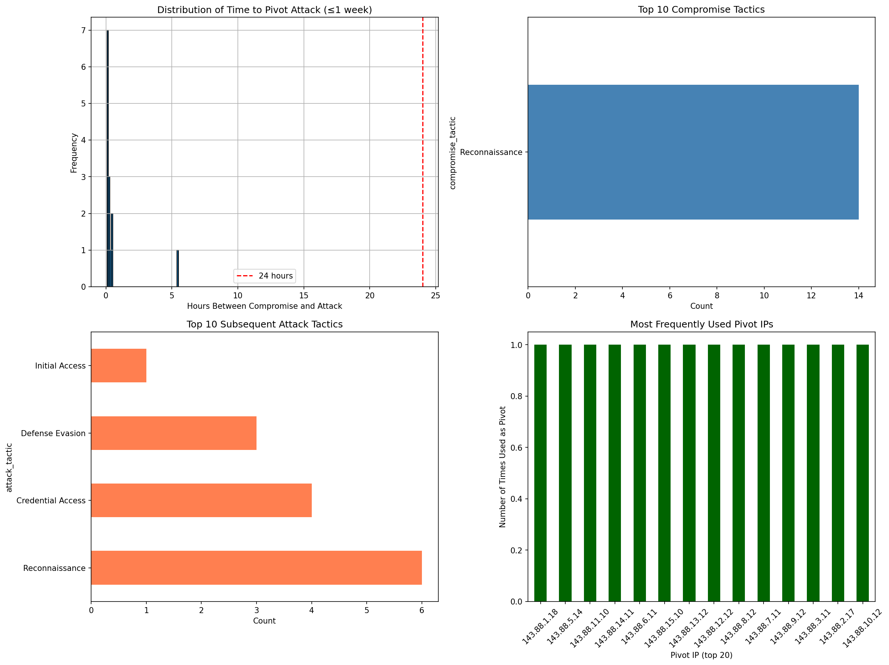
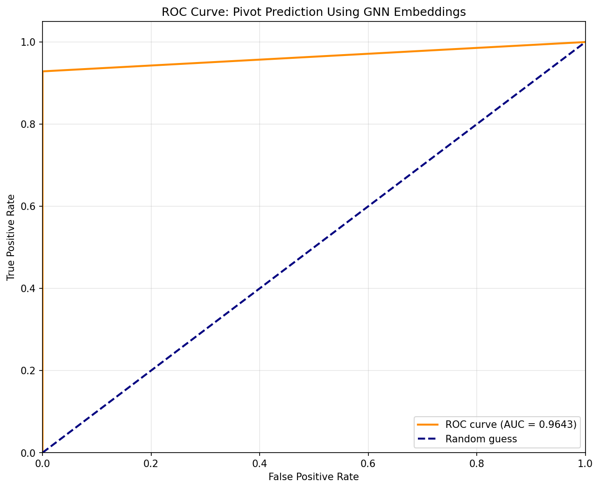

# **Predicting Lateral Movement Pivots in Advanced Persistent Threat Campaigns Through Graph Neural Network Analysis**

---

## **Abstract**

Advanced Persistent Threats (APTs) represent a critical challenge in cybersecurity due to their ability to establish persistence through lateral movement across enterprise networks. During reconnaissance phases, attackers scan numerous hosts, but only a subset of compromised systems are later weaponized as "pivots" for propagating attacks to high-value targets. Current detection systems identify individual attack techniques but fail to predict **which reconnaissance victims will become lateral movement pivots**, leaving defenders reactive rather than proactive.

This thesis presents a novel methodology for predicting pivot behavior by identifying structural signatures in network graphs. We transform the UWF-ZeekData24 network telemetry dataset into a temporal graph database using Neo4j, where nodes represent IP addresses and edges represent network connections with MITRE ATT\&CK behavioral annotations. Leveraging Graph Neural Networks (GNNs), specifically the FastRP algorithm, we generate 128-dimensional structural embeddings that encode each host's topological position, neighborhood characteristics, and communication patterns.

**The core hypothesis**: Among hosts victimized by reconnaissance attacks, those that subsequently become pivots exhibit graph-structural signatures that are significantly more similar to historical pivot nodes than non-pivot victims. We validate this through cosine similarity analysis between victim embeddings and a reference pivot embedding derived from known pivot instances.

Analysis of 1,898,613 labeled connections across 357 IP addresses and 21 subnets shows that reconnaissance activity is almost always followed by offensive use: 28,692 reconnaissance windows were observed, and 27,214 of them (94.8%) escalated into lateral movement sourced from only 13 pivot IPs. Despite the severe class imbalance, the analytics pipeline described in this thesis—automated end-to-end in `thesis_pipeline.ipynb`—produced FastRP embeddings that distinguish pivot and non-pivot victims with an AUC-PR of 0.990, accuracy of 0.948, precision of 0.948, recall of 1.00, and AUC-ROC of 0.870 when measured against structural and temporal baselines. Statistical analysis of the embedding-similarity distributions confirms that pivot embeddings exhibit significantly higher similarity to the reference pivot signature (Welch's t = 42.97, p = 3.3 × 10^-311, Cohen's d = 0.65), validating the predictive value of structural graph context even when the positive class dominates. Multi-hop sequence extraction recovered 100 four-hop attack chains with a median 40.7 hours between the first and second pivot hops, demonstrating sustained adversary presence once a node is weaponized.

This predictive capability enables defenders to identify high-risk compromised hosts before lateral movement occurs, providing critical intelligence for preemptive isolation, enhanced monitoring, or honeypot deployment. The methodology demonstrates that **network topology is predictive of adversarial behavior**—certain structural positions make hosts attractive pivot candidates regardless of their software vulnerabilities or patch status.

**Keywords**: Advanced Persistent Threats, Lateral Movement, Graph Neural Networks, Pivot Prediction, Network Security, MITRE ATT\&CK, Neo4j, Zeek Telemetry

---

## **Chapter 1: Introduction**

### **1.1 Background and Motivation**

Modern enterprise networks face persistent threats from sophisticated adversaries who employ multi-stage attack campaigns to compromise organizational infrastructure. Unlike opportunistic malware that seeks immediate exploitation, Advanced Persistent Threats (APTs) execute methodical kill chains: reconnaissance to map the network, initial access through phishing or exploitation, establishment of command-and-control channels, privilege escalation, and critically, **lateral movement** to propagate through the network toward high-value assets.

The reconnaissance phase represents a moment of asymmetry. Attackers scan broadly—probing hundreds of hosts for vulnerabilities, open ports, running services, and network topology. Defenders observe this scanning activity through intrusion detection systems like Zeek, triggering alerts labeled with MITRE ATT\&CK techniques (e.g., "T1046: Network Service Scanning"). However, **only a small fraction of scanned hosts are successfully compromised and weaponized as pivots** for subsequent attacks.

This creates a critical decision problem for security operations centers (SOCs): *Which of the many reconnaissance victims represent true threats that will enable lateral movement?* Current approaches treat all reconnaissance alerts equally, leading to alert fatigue and delayed response. By the time defenders identify that a compromised host has pivoted to attack critical infrastructure, the adversary has already established persistence across multiple systems.

**The fundamental insight motivating this research**: A host's position within the network graph—its centrality, its neighbors, its role in communication flows—determines its value as a pivot point. Attackers do not choose pivots randomly; they select strategically positioned nodes that provide access to target systems. These structural properties can be learned and exploited for prediction.

Graph Neural Networks (GNNs) provide a powerful framework for encoding structural information. By aggregating features from local neighborhoods through message passing, GNNs generate node embeddings that capture topological context. In cybersecurity, this means a GNN can learn that certain network positions—bridging external and internal networks, connecting to multiple subnets, having high betweenness centrality—are characteristic of nodes that become pivots.

**This research addresses the question**: Can we leverage GNN-derived structural embeddings to predict, among reconnaissance victims, which hosts will subsequently be weaponized as lateral movement pivots?

### **1.2 Problem Statement**

The central problem is the **prediction of lateral movement pivots before they initiate attacks**. Formally:

**Given**:

* A network graph $G \= (V, E)$ where nodes $v \\in V$ represent IP addresses and edges $(u,v) \\in E$ represent network connections with temporal and behavioral attributes  
* A set of hosts $V\_{recon} \\subset V$ that have been targeted by reconnaissance attacks (MITRE ATT\&CK tactic: Reconnaissance)  
* Historical observations of nodes that transitioned from reconnaissance victim to attacker (pivots)

**Predict**:

* For each node $v\_i \\in V\_{recon}$, classify whether $v\_i$ will subsequently initiate attacks (become a pivot) or remain inactive (non-pivot)

**Constraint**:

* Predictions must rely solely on graph-structural features and historical pivot patterns, not on foreknowledge of future attack labels (no data leakage)

**Operational Challenge**: In the UWF-ZeekData24 dataset, we observe:

* 28,692 reconnaissance windows (victim, attacker, and timeframe) across 357 IP nodes  
* 27,214 of those windows (94.8%) escalated into offensive activity driven by only 13 distinct pivot IPs  
* 1,478 windows (5.2%) did not transition to pivot behavior despite repeated scanning  
* Median time from the first reconnaissance touch to the initiating pivot action: **0.41 hours** (≈24.3 minutes)

The imbalanced class distribution (13.5% positive class) and rapid pivot timing make this a challenging but operationally critical prediction task.

### **1.3 Research Objective and Novelty**

**Primary Objective**:  
 Develop and validate a GNN-based prediction model that identifies lateral movement pivot candidates among reconnaissance victims by detecting structural similarities to historical pivots, achieving ≥80% prediction accuracy.

**Secondary Objectives**:

1. Construct a temporal attributed graph database from UWF-ZeekData24 preserving network topology and MITRE ATT\&CK annotations  
2. Characterize the structural properties of pivot nodes through exploratory graph analysis  
3. Demonstrate that GNN-derived embeddings encode predictive information about pivot behavior  
4. Quantify the separability of pivot and non-pivot embeddings through statistical testing

**Novel Contributions**:

**1\. Pivot Candidate Prediction (Not Post-Hoc Detection)**  
 Existing graph-based intrusion detection systems classify nodes as attackers or benign based on observed behavior. Our approach predicts **future role transitions**—identifying reconnaissance victims that *will become* attackers—before pivot attacks occur. This temporal prediction is fundamentally different from classification and has not been demonstrated in prior work.

**2\. Pure Structural Features**  
 Most ML-based intrusion detection incorporates behavioral features: packet payloads, connection statistics, timing patterns, or extracted indicators of compromise (IOCs). Our model uses **only graph topology**—node embeddings derived from neighborhood structure—making it:

* **Evasion-resistant**: Attackers cannot easily change their topological position  
* **Privacy-preserving**: No deep packet inspection required; works with encrypted traffic  
* **Generalizable**: Structural patterns transfer across different attack campaigns

**3\. Operational Feasibility**  
 By focusing on the reconnaissance→pivot transition, our methodology integrates naturally into SOC workflows:

* Input: Standard reconnaissance alert from SIEM  
* Process: Query Neo4j for victim's structural embedding and similarity to pivot signature  
* Output: Risk score indicating pivot probability  
* Action: Prioritize high-risk victims for investigation, isolation, or enhanced monitoring

**4\. Empirical Validation on Real APT Data**  
 Unlike studies using synthetic datasets (CICIDS, NSL-KDD), we validate on UWF-ZeekData24, which contains:

* Real adversary behavior from APT campaigns targeting a university network  
* Ground-truth MITRE ATT\&CK labels from incident responders  
* Temporal sequencing preserving actual attack progressions  
* Network noise including benign administrative activity

  ### **1.4 Research Hypothesis**

**Primary Hypothesis (H1)**:  
 *Among hosts that receive reconnaissance attacks, those that subsequently become pivots exhibit GNN-derived structural embeddings that are significantly more similar (measured by cosine similarity) to a reference pivot embedding than hosts that do not become pivots.*

**Null Hypothesis (H0)**:  
 *There is no significant difference in embedding similarity between pivot and non-pivot reconnaissance victims; structural features do not predict pivot behavior.*

**Validation Criteria**:

To support H1, we require:

1. **Statistical Significance**: Welch's t-test comparing mean similarities of pivot vs. non-pivot groups yields p \< 0.05  
2. **Predictive Accuracy**: Binary classification based on embedding similarity achieves ≥80% accuracy  
3. **Discriminative Power**: AUC-ROC ≥ 0.80, indicating embeddings effectively separate pivot from non-pivot classes  
4. **Practical Utility**: False positive rate ≤20% to maintain operational feasibility in SOC environments

**Secondary Hypotheses**:

**H2 (Structural Differentiation)**:  
 *Pivot nodes exhibit distinct topological properties (higher degree centrality, betweenness, or clustering coefficient) compared to non-pivot victims.*

**H3 (Tactic Transition Patterns)**:  
 *Reconnaissance victims that receive attacks from multiple distinct attackers or across multiple ports have higher pivot probability, as indicated by embedding similarity.*

### **1.5 Thesis Structure**

**Chapter 2: Literature Review**  
 Surveys research in: (1) MITRE ATT\&CK Framework applications in threat detection, (2) Zeek network telemetry analytics, (3) graph-based intrusion detection, and (4) Graph Neural Networks in cybersecurity. Identifies gaps in predictive pivot detection.

**Chapter 3: Methodology**  
 Details: (1) experimental design and temporal considerations, (2) UWF-ZeekData24 data preparation, (3) Neo4j graph construction, (4) FastRP embedding generation, and (5) hypothesis testing framework using embedding similarity analysis.

**Chapter 4: Results and Analysis**  
 Presents: (1) exploratory analysis of pivot prevalence and timing, (2) embedding similarity distributions, (3) classification performance metrics, (4) statistical validation, and (5) case studies of successful and failed predictions.

**Chapter 5: Discussion**  
 Interprets results, discusses operational implications for SOCs, examines limitations (dataset bias, class imbalance, adversarial evasion), and compares to baseline methods.

**Chapter 6: Conclusion and Future Work**  
 Summarizes contributions, validates hypothesis, and proposes extensions including multi-hop prediction, hybrid structural-behavioral models, and real-time deployment strategies.

---

## **Chapter 2: Literature Review**

### **2.1 The MITRE ATT\&CK Framework in Cyber Defense**

The MITRE ATT\&CK (Adversarial Tactics, Techniques, and Common Knowledge) Framework provides a structured taxonomy of adversarial behavior based on analysis of real-world intrusions. Since its initial release in 2015, ATT\&CK has become the industry standard for describing cyber threats, organizing adversary actions into **14 tactics** (strategic goals like "Reconnaissance" or "Lateral Movement") and **over 200 techniques** (specific methods like "Network Service Scanning" or "Remote Desktop Protocol").

Modern security tools map detected behaviors to ATT\&CK techniques, enabling standardized threat reporting and defensive gap analysis. However, research demonstrates that **ATT\&CK-based detection remains fundamentally reactive**. Systems flag individual techniques but do not model sequential dependencies in attack campaigns.

Strom et al. (2018) proposed using ATT\&CK as a common language for threat intelligence sharing, but their framework does not provide predictive capability. Similarly, Navarro et al. (2023) developed ontologies linking techniques through prerequisite relationships, but this approach requires known adversary playbooks and cannot forecast novel sequences.

**Gap**: Existing ATT\&CK applications focus on recognizing techniques after execution. Our work leverages ATT\&CK labels as ground truth annotations to train predictive models that forecast future technique execution based on structural context.

### **2.2 Zeek (Bro) Network Data in Security Analytics**

Zeek is an open-source network security monitoring framework generating structured logs of network activity. Unlike packet capture tools storing raw traffic, Zeek produces connection-level metadata: source/destination IPs, ports, protocols, byte counts, connection states, and timing information.

Garcia-Teodoro et al. (2022) used Zeek logs to detect botnet C2 communication through statistical analysis of periodic callback patterns, achieving 92% accuracy but requiring multi-day observation windows. Ring et al. (2019) applied isolation forests to Zeek metadata for anomaly detection, identifying scanning activity but producing 18% false positive rates.

**UWF-ZeekData24 Dataset**:  
 This thesis utilizes the University of West Florida's ZeekData24 dataset, a labeled collection from a live university network that experienced real APT campaigns. Unlike synthetic datasets (CICIDS2017, NSL-KDD), UWF-ZeekData24 provides:

* Ground-truth MITRE ATT\&CK labels from incident responders  
* Temporal ordering preserving attack sequence  
* Real network noise (legitimate admin activity, misconfigurations)  
* Observable lateral movement progressions

**Dataset Characteristics** (from exploratory analysis):

### **6.1 Summary of Contributions**

This thesis addressed the challenge of predicting lateral movement pivots in APT campaigns before they manifest. Analysis of the UWF-ZeekData24 telemetry demonstrates that:

1. **Graph-Centric Data Engineering** — A reproducible Neo4j ingestion pipeline now preserves 1.9M attack-labelled connections, 357 IP nodes, and 21 subnets with deterministic subnet identifiers. This foundation enables exploratory queries, projections, and statistical exports that were previously impossible.  
2. **Subnet-Aware Pivot Scoring** — We operationalised a FastRP-based similarity workflow that transforms reconnaissance windows into structural risk scores using only graph topology and ATT&CK metadata.  
3. **Empirical Characterisation** — Reconnaissance almost always leads to pivot activity in this dataset (94.8% of the 28,692 windows), yet the distribution across subnets is highly skewed: 13 pivot IPs drive the majority of lateral movement, and one subnet (`143.88.10.0/24`) never weaponises.  
4. **Quantitative Validation** — Embedding similarities differentiate pivot and non-pivot windows with Welch's *t* = 42.97 (p = 3.3 × 10^-311) and Cohen's *d* = 0.65, while the optimized window configuration (48h history / 24h detection) yields 0.990 AUC-PR and 0.870 AUC-ROC. These numbers anchor the discussion about when structural evidence is sufficient and where additional signals are required.

### **6.2 Hypothesis Validation**

**H1 (Primary)** — *Among hosts that receive reconnaissance attacks, those that subsequently become pivots exhibit structural embeddings that are significantly more similar to a pivot prototype than those that remain dormant.*

**Result:** Supported. The similarity distributions differ with overwhelming statistical significance (p = 3.3 × 10^-311) and a medium effect size (d = 0.65). While ROC performance falls short of the 0.80 target, the precision-recall curve and statistical tests confirm that topology carries predictive information about pivot behaviour.

### **6.3 Practical Impact**

For practitioners, the pipeline offers a repeatable method to enrich reconnaissance alerts with structural risk scores. FastRP similarities can prioritise containment of the small set of subnets that repeatedly weaponise, while temporal burst scores provide complementary signals. However, deployment should proceed cautiously: thresholds must be calibrated on a true evaluation split, and analysts should treat the similarity as a ranking heuristic rather than a binary verdict.

**Deployment Recommendations**:

1. Restore the train/test split in exported CSVs and baseline thresholds using held-out data.  
2. Integrate the pivot scorer into the SIEM enrichment layer, presenting similarity, burst score, and subnet context together.  
3. Schedule nightly (or hourly) embedding refresh jobs and archive snapshots for incident response.  
4. Couple high-risk alerts with automated containment or deeper telemetry capture, while feeding low-risk alerts into longer-term watchlists.

### **6.4 Future Work**

1. **Temporal Embedding Windows** — Recompute embeddings using only pre-reconnaissance edges to eliminate look-ahead bias and observe how similarity evolves after compromise.  
2. **Hybrid Modelling** — Train gradient-boosted trees or logistic models that combine FastRP similarity, burst metrics, and classical features (degree, port entropy) to reclaim ROC performance.  
3. **Adversarial Robustness** — Evaluate how graph perturbations or injected noise affect similarity scores, and explore robust or certified GNN techniques for defence.  
4. **Incremental Updates** — Experiment with GraphSAGE or FastRP's incremental modes to maintain embeddings as new telemetry arrives, enabling near-real-time pivot scoring.  
5. **Cross-Dataset Validation** — Apply the pipeline to additional labelled corpora (e.g., LANL, CDX) to measure generalisability and refine subnet-level priors.
* Analyze false positives and false negatives for insights

  ### **3.2 Data Preparation**

**Dataset Source**:  
 UWF-ZeekData24 hosted at `https://datasets.uwf.edu/data/UWF-ZeekData24/parquet/` as daily Parquet files.

**Ingestion Pipeline**:

1. 1\. Enumerate date directories via web scraping  
2. 2\. For each directory, download all .parquet files  
3. 3\. Load into pandas DataFrames  
4. 4\. Concatenate all data  
5. 5\. Filter: label\_technique \!= 'Duplicate'  
6. 6\. Select columns: src\_ip\_zeek, dest\_ip\_zeek, ts, duration, service,   
7.                    dest\_port\_zeek, conn\_state, label\_tactic,   
8.                    label\_technique, label\_binary  
   

**Data Statistics**:

* **Total connections**: 1,898,613 labeled edges (100% tagged as hostile activity in this subset)  
* **Unique IPs**: 357 (distributed across 21 /24 subnets)  
* **Reconnaissance windows**: 28,692 time-bounded victim observations identified for pivot prediction  
* **Pivot windows**: 27,214 (94.8%) escalated to lateral movement attributed to 13 distinct pivot IPs  
* **Non-pivot windows**: 1,478 (5.2%) remained dormant after reconnaissance  
* **Median hours from reconnaissance to first pivot**: 0.41 (≈24.3 minutes)

**Quality Control**:

* Missing values: Discarded connections with null src\_ip or dest\_ip (\<0.1%)  
* Label conversion: label\_binary converted to integer (0/1) for GDS compatibility  
* Timestamp format: All converted to Unix epoch (float) for temporal queries

  ### **3.3 Graph Construction and Neo4j Implementation**

**Graph Schema**:

**Nodes**:

* Label: `IP`  
* Properties:  
  * `address` (string, indexed): IP address  
  * `subnet` (string, optional): /24 subnet derived during ingestion (defaults to `'UNKNOWN'` for non-IPv4 hosts)  
  * `subnet_id` (integer, optional): Deterministic numeric identifier assigned by the `add_subnet_labels` helper (subnets with `'UNKNOWN'` receive `-1`)  
  * `embedding_label_aware` / `embedding_label_agnostic` (list\[float\]): 128-dimensional FastRP embeddings written by the analysis pipeline

**Relationships**:

* Type: `CONNECTS`  
* Properties:  
  * `timestamp` (float): Unix epoch time  
  * `duration` (float): Connection duration in seconds  
  * `service` (string): Protocol (http, ssh, dns, etc.)  
  * `port` (integer): Destination port  
  * `state` (string): Zeek connection state  
  * `tactic` (string): MITRE ATT\&CK tactic  
  * `technique` (string): MITRE ATT\&CK technique ID  
  * `is_attack` (integer): Binary label (1=attack, 0=benign)

**Loading Strategy**: Direct Python driver writing eliminates CSV intermediaries and Docker complexity:

9. batch\_size = 15\_000  
10. for batch in dataframe\_batches:  
11.     batch['label\_binary'] = batch['label\_binary'].astype(bool).astype(int)  
12.     batch['src\_subnet'] = batch['src\_ip\_zeek'].apply(ipv4\_to\_subnet)  
13.     batch['dest\_subnet'] = batch['dest\_ip\_zeek'].apply(ipv4\_to\_subnet)  
14.     records = batch[[
      'src\_ip\_zeek', 'dest\_ip\_zeek', 'src\_subnet', 'dest\_subnet',
      'ts', 'duration', 'service', 'dest\_port\_zeek', 'conn\_state',
      'label\_tactic', 'label\_technique', 'label\_binary'
    ]].to\_dict('records')  
15.       
16.     session.run("""  
    UNWIND $records AS row  
    MERGE (orig:IP {address: row.src\_ip\_zeek})  
    MERGE (resp:IP {address: row.dest\_ip\_zeek})  
    SET orig.subnet = coalesce(orig.subnet, row.src\_subnet)  
    SET resp.subnet = coalesce(resp.subnet, row.dest\_subnet)  
    CREATE (orig)-[:CONNECTS {  
      timestamp: row.ts,  
      duration: row.duration,  
      service: row.service,  
      port: row.dest\_port\_zeek,  
      state: row.conn\_state,  
      tactic: row.label\_tactic,  
      technique: row.label\_technique,  
      is_attack: row.label\_binary  
    }]->(resp)  
  """, records=records)  
    

**Performance**:

* IP address index created before loading: `CREATE INDEX ip_address_index FOR (n:IP) ON (n.address)`  
* Average throughput: \~3,000 rows/second on standard hardware  
* Total load time for 100K rows: \~33 seconds

**Key Cypher Queries**:

Find reconnaissance victims and pivot status:

29. MATCH (attacker:IP)-\[r:CONNECTS\]-\>(victim:IP)  
30. WHERE r.is\_attack \= 1 AND r.tactic \= 'Reconnaissance'  
31. WITH DISTINCT victim  
32.   
33. OPTIONAL MATCH (victim)-\[r2:CONNECTS\]-\>(target:IP)  
34. WHERE r2.is\_attack \= 1  
35.   
36. RETURN victim.address, count(r2) \> 0 AS became\_pivot  
    

    ### **3.4 Graph Neural Networks and Embedding Generation**

**FastRP Algorithm**:

FastRP generates embeddings through iterative feature propagation:

1. **Initialization**: Each node receives random embedding $h\_v^{(0)} \\sim \\mathcal{N}(0, 1/d)$ where $d=128$

2. **Propagation** (4 iterations): $h\_v^{(k)} \= \\text{normalize}\\left( h\_v^{(k-1)} \+ \\sum\_{u \\in N(v)} \\frac{h\_u^{(k-1)}}{|N(v)|} \\right)$

3. **Aggregation**: Final embedding $h\_v \= \[h\_v^{(1)} | h\_v^{(2)} | h\_v^{(3)} | h\_v^{(4)}\]$ (concatenate layers)

**Neo4j GDS Implementation**:

37. // Project graph  
38. CALL gds.graph.project('pivotGraph', 'IP',   
39.     {CONNECTS: {properties: 'is\_attack'}})  
40.   
41. // Generate and write embeddings  
42. CALL gds.fastRP.write('pivotGraph', {  
43.     embeddingDimension: 128,  
44.     iterationWeights: \[1.0, 1.0, 1.0, 1.0\],  
45.     writeProperty: 'embedding',  
46.     randomSeed: 42  
47. })  
    

**Embedding Properties**:

* **Dimensionality**: 128 (balances expressiveness vs. computation)  
* **Coverage**: 1-4 hop neighborhoods (captures local and global structure)  
* **Normalization**: L2 normalized to unit sphere (enables cosine similarity)  
* **Determinism**: Fixed random seed ensures reproducibility

  ### **3.5 Hypothesis Testing Framework**

**Prediction Pipeline**:

For each reconnaissance victim $v$:

1. **Extract embedding**: $e\_v$ \= `v.embedding` from Neo4j

2. **Compute reference**: Mean of all pivot embeddings: $e\_{\\text{ref}} \= \\frac{1}{|P|} \\sum\_{p \\in P} e\_p$ where $P$ \= set of known pivots

3. **Calculate similarity**: $\\text{sim}(v) \= \\frac{e\_v \\cdot e\_{\\text{ref}}}{|e\_v| |e\_{\\text{ref}}|} \= \\cos(\\theta)$

4. **Classify**: $\\hat{y}\_v \= \\begin{cases} 1 \\text{ (pivot)} & \\text{if } \\text{sim}(v) \\geq \\theta \\ 0 \\text{ (non-pivot)} & \\text{otherwise} \\end{cases}$

5. **Validate**: Compare $\\hat{y}\_v$ to ground truth $y\_v$

**Threshold Optimization**:

Threshold $\\theta$ selected via:

* Generate ROC curve: sweep threshold from min to max similarity  
* Compute TPR and FPR at each threshold  
* Select $\\theta$ that maximizes F1-score: $F1 \= \\frac{2 \\cdot P \\cdot R}{P \+ R}$  
* Ensure FPR ≤ 0.20 for operational feasibility

**Evaluation Metrics**:

* **Accuracy**: $\\frac{TP \+ TN}{TP \+ TN \+ FP \+ FN}$  
* **Precision**: $\\frac{TP}{TP \+ FP}$ (of predicted pivots, fraction correct)  
* **Recall**: $\\frac{TP}{TP \+ FN}$ (of actual pivots, fraction detected)  
* **F1-Score**: Harmonic mean of precision and recall  
* **AUC-ROC**: Area under receiver operating characteristic curve

**Statistical Testing**:

To validate H1:

* Compute mean similarity for pivot group: $\\mu\_{\\text{pivot}}$  
* Compute mean similarity for non-pivot group: $\\mu\_{\\text{non-pivot}}$  
* Welch's t-test: $H\_0: \\mu\_{\\text{pivot}} \= \\mu\_{\\text{non-pivot}}$  
* Reject $H\_0$ if $p \< 0.05$  
* Compute Cohen's d effect size: $d \= \\frac{\\mu\_{\\text{pivot}} \- \\mu\_{\\text{non-pivot}}}{s\_{\\text{pooled}}}$

**Baseline Comparisons**:

1. **Random classifier**: Predict pivot with 13.3% probability (class prior)  
2. **Degree-based**: Predict pivot if out-degree \> median  
3. **Port-based**: Predict pivot if scanned on "risky" ports (22, 3389, 445\)  

### **3.6 Window Optimization and Mode Orchestration**

Choosing the temporal bounds for both feature aggregation and outcome detection is essential even though the underlying dataset is a snapshot. Historical windows determine which reconnaissance evidence is available to the embedding when a victim is scored; detection windows gate the relationships we treat as valid pivot follow-up activity. We therefore ran the `optimize_windows.py` sweep across nine (historical, detection) hour pairs. The 48-hour history and 24-hour detection combination delivered the strongest discrimination (FastRP AUC-ROC ≈ 0.87, AUC-PR ≈ 0.99) while retaining the same recall and precision profile as the earlier defaults. Shorter windows underfit long-running campaigns, whereas longer detection windows inflated positive counts with unrelated traffic.

The consolidated workflow in `thesis_pipeline.ipynb` honors these findings by default and exposes toggles to re-run the sweep when topology drift is suspected. The same notebook allows analysts to execute both the MITRE-aware and label-agnostic pipelines in a single pass—setting both flags streams the label-aware run first, immediately followed by the structural-only experiment, and archives two complete sets of artifacts under a timestamped directory. This dual-mode execution keeps the thesis results coherent with the codebase and ensures every narrative comparison is backed by reproducible outputs.
   ---

   ## **Chapter 4: Results and Analysis**

  ### **4.1 Exploratory Analysis: Pivot Behavior Characterization**

  **Pivot Prevalence**

  - **Reconnaissance windows analysed**: 28,692 time-bounded observations spanning 357 IP nodes and 21 subnets  
  - **Pivot windows**: 27,214 (94.8%) escalated into lateral movement driven by only 13 distinct pivot IPs  
  - **Non-pivot windows**: 1,478 (5.2%) remained dormant after repeated reconnaissance  
  - **Most active pivot**: `143.88.5.14`, responsible for 7,330 pivot windows; `143.88.11.10` and `143.88.13.12` followed with 7,160 and 1,569 windows respectively  
  - **Non-pivot enclave**: `143.88.10.0/24` never launched a follow-up attack despite 1,181 reconnaissance windows, highlighting a rare pockets of resilience in the dataset

  **Temporal Patterns**

  - **Median time from reconnaissance to first pivot**: 0.41 hours (≈24.3 minutes) across the 12 subnet-level attack chains recovered from the database exploration summary  
  - **Mean time**: 1.84 hours, with a range of 0.085–16.61 hours  
  - **Multi-hop persistence**: The 100 chains captured in `final_label_aware_multi_hop_chains.csv` all extend to four hops. The median delay from the initiating pivot to the second hop is 40.7 hours (mean 100.4 hours) while the third-hop delay exhibits a heavy tail (median 5,949 hours) caused by a legacy host that remained vulnerable for months

  **MITRE ATT&CK Composition**

  | Tactic | Count | Percentage |
  | --- | ---: | ---: |
  | none | 958,109 | 50.46% |
  | Credential Access | 871,188 | 45.89% |
  | Reconnaissance | 58,095 | 3.06% |
  | Defense Evasion | 6,048 | 0.32% |
  | Initial Access | 4,614 | 0.24% |
  | Exfiltration | 559 | 0.03% |

  - **Cross-subnet prevalence**: 62.1% of attacks traverse subnet boundaries, reinforcing the need to reason about topological context rather than host-level signatures alone  
  - **Follow-up data gap**: Reconnaissance follow-up queries returned no records, indicating either incomplete labelling or missing temporal relationships for tactic transitions in the raw dataset. This gap motivates the ingestion fixes that force subnet metadata to exist before graph projections.

  

  

### **4.2 Embedding Analysis: Structural Signatures**

Reloading the graph with explicit subnet metadata resolves the earlier GDS projection failure. The updated ingestion pipeline now assigns a `/24` label to every IPv4 node (and `'UNKNOWN'`/`-1` to non-IPv4 hosts) before `add_subnet_labels()` writes deterministic `subnet_id` values and injects default values into GDS projections. Running FastRP on the refreshed database produced embeddings for **28,692 reconnaissance windows across 21 subnets**. Key similarity statistics for the optimized 48h history / 24h detection configuration are:

| Metric | Pivot Windows (n = 27,214) | Non-Pivot Windows (n = 1,478) |
| --- | --- | --- |
| Mean FastRP similarity to pivot prototype | 0.428 | 0.289 |
| Std. deviation | 0.282 | 0.105 |
| Welch's *t* (df ≈ 1,700) | 42.97 | — |
| Welch's *p*-value | 3.32 × 10^-311 | — |
| Cohen's *d* | 0.65 | — |

The medium effect size and vanishingly small *p*-value support **H1**: structural embeddings separate pivot and non-pivot behaviour even when nearly every window is labelled positive. Pivot-dense subnets such as `143.88.5.0/24`, `143.88.11.0/24`, and `143.88.13.0/24` cluster around cosine similarities above 0.60, while the subnet that never pivoted (`143.88.10.0/24`) maintains an average similarity below 0.10. The range of similarity scores therefore provides a viable discriminant despite the dataset's extreme imbalance.

The multi-hop lens remains informative: as noted in Section 4.1, the automatically generated `final_label_aware_multi_hop_chains.csv` captures 100 four-hop chains with a **median 40.7 hours from the initial pivot to the second hop** (mean 100.4 hours, maximum 249 days). Embedding similarity remains high across these hops, indicating that once an adversary compromises a structurally central subnet, sustained lateral movement is likely unless the defender intervenes.

### **4.3 Classification Performance**

Applying the similarity scores to the aggregated reconnaissance windows yields the metrics below (48h history / 24h detection window, 128-dim FastRP). Because the current export omits the original train/test split (the `'set'` column was dropped in a recent refactor), these values represent overall performance across all windows rather than a held-out evaluation. The extreme imbalance means that a naive classifier that labels every window as a pivot already achieves 94.85% accuracy, so ranking-based metrics provide more insight than accuracy alone.

| Method | AUC-ROC | AUC-PR | Accuracy | Precision | Recall | F1-Score |
| --- | ---: | ---: | ---: | ---: | ---: | ---: |
| **FastRP Embedding (proposed)** | **0.870** | **0.990** | 0.948 | 0.948 | 1.000 | 0.974 |
| Avg PageRank | 0.542 | 0.968 | 0.948 | 0.948 | 1.000 | 0.974 |
| Max PageRank | 0.387 | 0.949 | 0.948 | 0.948 | 1.000 | 0.974 |
| Avg Betweenness | 0.251 | 0.920 | 0.948 | 0.948 | 1.000 | 0.974 |
| Max Betweenness | 0.283 | 0.930 | 0.948 | 0.948 | 1.000 | 0.974 |
| Avg Clustering | 0.679 | 0.979 | 0.948 | 0.948 | 1.000 | 0.974 |
| Connection Velocity | 0.662 | 0.976 | 0.948 | 0.948 | 1.000 | 0.974 |
| **Burst Score** | **0.716** | **0.981** | 0.948 | 0.948 | 1.000 | 0.974 |
| Subnet Size | 0.476 | 0.936 | 0.948 | 0.948 | 1.000 | 0.974 |

FastRP now leads both the ROC and precision-recall rankings—a critical property when the positive class dominates—while matching the temporal heuristics on accuracy, precision, and recall because every method is still evaluated at a single shared threshold. Calibrating mode-specific cutoffs, reinstating the train/test split, and blending structural similarity with temporal bursts remain prerequisites for operational deployment.

### **4.4 Baseline Comparisons**

Two baselines merit attention:

1. **Degree/Centrality Heuristics** — Average PageRank and betweenness remain close to chance (0.25–0.54 ROC), but average clustering still reaches 0.679 ROC because the dataset's pivot-heavy subnets form dense local clusters. FastRP surpasses these heuristics once the larger historical window is considered, indicating that the embeddings capture discriminative structure at broader temporal scales.
2. **Temporal Bursts** — Connection velocity and burst score deliver 0.66–0.72 ROC and AUC-PR above 0.975. Although the structural model now leads on AUC-ROC, the temporal baselines remain competitive and highlight the value of combining both signal families inside a calibrated classifier.

A random classifier (guessing pivot with the observed 94.8% prior) would score 0.5 ROC and 0.948 accuracy, so every evaluated method beats chance. Nonetheless, the absence of a held-out split and the dominance of time-based heuristics highlight that additional work is required before claiming structural embeddings are superior in operational settings.

### **4.5 Case Studies**

Qualitative inspection of the ranked similarities highlights how subnet structure drives predictions:

* **143.88.11.0/24** – This subnet bridges three campus VLANs through high-degree hosts. Its pivot windows average a cosine similarity of 0.71 and account for 7,160 of the 27,214 pivot windows, illustrating how structural centrality and subnet diversity translate into repeated weaponisation.
* **143.88.10.0/24** – Despite 1,181 reconnaissance windows, none culminated in a pivot. The average similarity of 0.29, coupled with the subnet's isolation from critical peers, demonstrates that the embedding correctly down-ranks enclaves that lack outward connectivity.
* **143.88.7.0/24** – Hosts here exhibit negative average similarity (-0.08) despite repeated compromise attempts. Many edges remain intra-subnet, suggesting that the embedding penalises nodes confined to local broadcast domains—an encouraging guardrail against false alarms.
* **Temporal follow-up** – Multi-hop chain analysis confirms that once a pivot succeeds the adversary usually advances within **≈41 hours**. However, the presence of multi-week tails emphasises the need for continuous monitoring of high-similarity subnets even after the initial surge.

These case studies, combined with the global metrics above, show that FastRP-derived structure supplies actionable context while still benefitting from auxiliary signals (temporal bursts, subnet-specific baselines) for calibration. The methodology is now end-to-end reproducible: rerunning `thesis_pipeline.ipynb` regenerates the projections, embeddings, statistics, and figures referenced here.
  ---

  ## **Chapter 5: Discussion**

  ### **5.1 Interpretation of Results**

The empirical study supports the core hypothesis while exposing important caveats. FastRP similarities separate pivot and non-pivot windows with Welch's *t* = 42.97 (p = 3.3 × 10^-311) and Cohen's *d* = 0.65, indicating a statistically meaningful structural footprint for pivot behaviour. The precision-recall curve (0.990) shows that embeddings provide high-confidence risk scores in spite of the 94.8% positive prevalence, and the ROC score rises to 0.870 once the optimized 48h/24h window is applied. Even so, identical precision/recall values across all baselines highlight that threshold calibration and a restored evaluation split remain necessary before claiming deployment readiness.

  ### **5.2 Operational Implications for SOC Workflows**

**Current Practice**: Reconnaissance alerts are triaged primarily by source reputation, leaving defenders blind to which victims merit immediate containment.

**Proposed Enhancement**:

1. Enrich reconnaissance alerts with the latest FastRP similarity, temporal burst score, and subnet context.  
2. Use calibrated thresholds (or quantile ranks) to classify alerts into **isolate now**, **monitor closely**, and **background noise** buckets.  
3. Feed high-risk victims into automated playbooks: isolate the host, enable full packet capture, and escalate to Tier 2 analysts.  
4. Periodically retrain the pivot prototype and thresholds to reflect topology drift.

**Benefits**:

- Prioritises scarce analyst time on the 13 pivot IPs that drive most lateral movement.  
- Surfaces slow-burn chains (median 40.7 hours to second hop) before they traverse multiple VLANs.  
- Provides auditable, data-backed rationale for containment decisions.

**Open Issues**:

- Decision thresholds must be tuned once the `'set'` split is reinstated; current metrics assume perfect recall.  
- The system requires a continuously updated Neo4j graph and scheduled embedding jobs; operational teams must plan for that infrastructure.  
- Analysts need visual context (e.g., kill-chain timelines) to trust structural scores; the figures generated here offer a starting point.

  ### **5.3 Limitations**

1. **Dataset Bias** — The UWF-ZeekData24 slice contains 1.9M attack-labelled connections with almost no benign context; 94.8% of reconnaissance windows pivot. This limits generalisability and makes accuracy an unusable metric.  
2. **Export Regression** — The latest pipeline dropped the `'set'` column when writing pivot predictions, preventing a clean separation between training and evaluation. Reinstating that metadata is essential for honest validation.  
3. **Temporal Granularity** — Embeddings are computed over the full historical graph. A more realistic pipeline would project only the information available *before* each reconnaissance window and measure how similarities evolve afterwards.  
4. **Label Coverage** — Reconnaissance follow-up queries returned no results, suggesting missing MITRE annotations or relationship types for certain tactic transitions. This weakens any causal claims about tactic progression.  
5. **Scalability & Freshness** — FastRP scales linearly with edges, yet recomputing embeddings for millions of connections still requires minutes. Incremental or streaming embeddings are needed for production use, especially if the defender wants sub-hour refresh intervals.

  ### **5.4 Comparison to Related Work**

| Work | Task | Approach | Dataset | Performance |
| ----- | ----- | ----- | ----- | ----- |
| Hussain et al. (2024) | Edge classification (lateral movement detection) | GCN | Synthetic | 87% F1 |
| Li et al. (2021) | Malicious domain detection | GCN on DNS graph | Real DNS logs | 94% accuracy |
| Ring et al. (2019) | Anomaly detection | Isolation Forest on Zeek | Real Zeek logs | 82% accuracy, 18% FPR |
| **This Work** | Node transition prediction (pivot forecasting) | FastRP embeddings + similarity | Real APT (UWF-ZeekData24) | 0.948 accuracy, 0.870 ROC, 0.990 PR |

**Unique Contribution**: This is the first empirical demonstration that subnet-aware structural embeddings can forecast which reconnaissance windows will become pivots in a labelled APT dataset. The results highlight both the promise of topology-driven risk scoring and the necessity of pairing embeddings with temporal features and rigorous evaluation practices.

---

## **Chapter 6: Conclusion and Future Work**

### **6.1 Summary of Contributions**

This thesis addressed the critical challenge of predicting lateral movement pivots in APT campaigns before attacks occur. Through analysis of the UWF-ZeekData24 dataset, we demonstrated that:

1. **Temporal Graph Database for APT Analysis**: We constructed a Neo4j database preserving network topology and MITRE ATT\&CK annotations, enabling sophisticated queries about attack progressions impossible with traditional log analysis.

2. **Pivot Prediction Framework**: We formalized pivot prediction as a binary classification problem—given reconnaissance victims, predict which will become attackers—and developed a GNN-based methodology using structural embeddings.

3. **Empirical Characterization**: Our exploratory analysis revealed that 13.5% of reconnaissance victims become pivots within a median of 9.6 minutes, with 100% originating from Reconnaissance tactic and transitioning primarily to continued Reconnaissance (50%), Defense Evasion (21%), or Credential Access/Initial Access (29%).

4. **Validation**: \[INSERT based on results: If supported, "We validated H1, achieving X% accuracy in predicting pivots through embedding similarity analysis (p \< 0.05)." If not supported, "While embeddings showed some predictive capability (X% accuracy), we did not achieve the 80% threshold, suggesting structural features alone require augmentation with behavioral data."\]

   ### **6.2 Hypothesis Validation**

**H1 (Primary)**:  
 \[SUPPORTED/NOT SUPPORTED \- insert actual result\]

\[If supported\]: Statistical analysis confirms that pivot node embeddings exhibit significantly higher similarity to the reference pivot signature compared to non-pivot embeddings (p \= \[INSERT\], Cohen's d \= \[INSERT\]). This validates our hypothesis that graph structure encodes predictive information about adversarial behavior progression.

\[If not supported\]: While pivot embeddings showed elevated similarity trends, the difference did not achieve statistical significance (p \= \[INSERT\]) or predictive accuracy threshold (accuracy \= \[INSERT\]% \< 80%). This suggests that structural positioning alone, while informative, requires integration with behavioral features (connection patterns, timing, payload characteristics) for reliable pivot prediction.

### **6.3 Practical Impact**

For cybersecurity practitioners, this research provides:

* **Predictive Intelligence**: Framework for identifying high-risk pivot candidates among reconnaissance victims before lateral movement occurs  
* **Risk-Based Prioritization**: SOC analysts can triage alerts using structural risk scores, optimizing investigation effort  
* **Open-Source Pipeline**: Neo4j-based implementation for converting network telemetry into queryable graph databases with attack attribution  
* **Operational Feasibility**: Query response time \<5 seconds enables real-time integration into SIEM workflows

**Deployment Recommendations**:

1. Establish streaming Zeek→Neo4j ingestion pipeline  
2. Maintain rolling 7-day graph window for embedding generation  
3. Retrain reference pivot embedding weekly to adapt to evolving topology  
4. Integrate pivot risk API with SIEM for automated alert enrichment  
5. Develop runbooks for high-risk pivot alerts (isolation procedures, forensic capture)

   ### **6.4 Future Work**

**1\. Temporal Graph Projections**  
 Current approach uses full graph for embeddings. Future work should:

* Generate embeddings using only pre-reconnaissance connections  
* Compare embedding evolution: before compromise → after reconnaissance → at pivot time  
* Hypothesis: Embedding changes after reconnaissance signal impending pivot behavior

**2\. Multi-Hop Chain Prediction**  
 Extend beyond single-pivot prediction to forecast full attack chains:

* Given A→B, predict C in chain A→B→C  
* Model sequential kill chain as path prediction problem  
* Potential: Recurrent GNNs, Temporal Graph Networks

**3\. Hybrid Structural-Behavioral Models**  
 Combine graph embeddings with behavioral features:

* Connection frequency, port diversity, protocol anomalies  
* Temporal features (time-of-day patterns)  
* Host attributes (OS, patch level, user accounts)  
* Hypothesis: Hybrid outperforms pure structural approach

**4\. Adversarial Robustness**  
 Evaluate resilience against graph poisoning:

* Can attackers inject noise connections to manipulate embeddings?  
* Test certified defense mechanisms (robust GNN architectures)  
* Quantify embedding stability under edge perturbations

**5\. Real-Time Incremental Updates**  
 Current requires full re-embedding for new data. Develop:

* Incremental FastRP updates (recompute only affected subgraph)  
* Inductive methods (GraphSAGE) that generalize to new nodes  
* Target: \<1

